## Introduction
Influenza A is the most common type of flu. H1N1 flu is a subtype of influenza A. H1N1 flu is caused by a virus that is different from the seasonal flu that occurs each fall and winter.<br>
With COVID-19 pandemic and upcoming influenza season in the Fall, Summit Medical Association asked me to analyze existing data on individuals who got H1N1 Flu vaccine and those who didn’t.  Summit Medical  wants to increase the number of people who get the H1N1 vaccine and set goals for vulnerable groups.<br> 
I will  provide you with facts, insights, which factors had a significant impact on people deciding to get vaccine  and recommendations to increase rates.<br>
I will run models to predict whether an individual based on features will get the H1N1 vaccine or not.  This provides insights into which factors influence a person’s decision to get vaccine.<br>
Data set consist of 36 features and 26,707 rows.  The features range from income level, age, gender, employment status to education levels. Each row in the dataset represents an individual who responded to the National 2009 H1N1 Flu Survey.<br>


```python
import pandas as pd
import numpy as np
from matplotlib import  pyplot as plt
%matplotlib inline

import seaborn as sns
from sklearn.model_selection import train_test_split

#pd.set_option('display.max_rows', 10)

#plt.style.available
#plt.style.use('fivethirtyeight')
```


```python
data = pd.read_csv('h1n1_features.csv')
```


```python
data.head()
```


<div>
<style scoped>
    .dataframe tbody tr th:only-of-type {
        vertical-align: middle;
    }

    .dataframe tbody tr th {
        vertical-align: top;
    }

    .dataframe thead th {
        text-align: right;
    }
</style>
<table border="1" class="dataframe">
  <thead>
    <tr style="text-align: right;">
      <th></th>
      <th>respondent_id</th>
      <th>h1n1_concern</th>
      <th>h1n1_knowledge</th>
      <th>behavioral_antiviral_meds</th>
      <th>behavioral_avoidance</th>
      <th>behavioral_face_mask</th>
      <th>behavioral_wash_hands</th>
      <th>behavioral_large_gatherings</th>
      <th>behavioral_outside_home</th>
      <th>behavioral_touch_face</th>
      <th>...</th>
      <th>income_poverty</th>
      <th>marital_status</th>
      <th>rent_or_own</th>
      <th>employment_status</th>
      <th>hhs_geo_region</th>
      <th>census_msa</th>
      <th>household_adults</th>
      <th>household_children</th>
      <th>employment_industry</th>
      <th>employment_occupation</th>
    </tr>
  </thead>
  <tbody>
    <tr>
      <td>0</td>
      <td>0</td>
      <td>1.0</td>
      <td>0.0</td>
      <td>0.0</td>
      <td>0.0</td>
      <td>0.0</td>
      <td>0.0</td>
      <td>0.0</td>
      <td>1.0</td>
      <td>1.0</td>
      <td>...</td>
      <td>Below Poverty</td>
      <td>Not Married</td>
      <td>Own</td>
      <td>Not in Labor Force</td>
      <td>oxchjgsf</td>
      <td>Non-MSA</td>
      <td>0.0</td>
      <td>0.0</td>
      <td>NaN</td>
      <td>NaN</td>
    </tr>
    <tr>
      <td>1</td>
      <td>1</td>
      <td>3.0</td>
      <td>2.0</td>
      <td>0.0</td>
      <td>1.0</td>
      <td>0.0</td>
      <td>1.0</td>
      <td>0.0</td>
      <td>1.0</td>
      <td>1.0</td>
      <td>...</td>
      <td>Below Poverty</td>
      <td>Not Married</td>
      <td>Rent</td>
      <td>Employed</td>
      <td>bhuqouqj</td>
      <td>MSA, Not Principle  City</td>
      <td>0.0</td>
      <td>0.0</td>
      <td>pxcmvdjn</td>
      <td>xgwztkwe</td>
    </tr>
    <tr>
      <td>2</td>
      <td>2</td>
      <td>1.0</td>
      <td>1.0</td>
      <td>0.0</td>
      <td>1.0</td>
      <td>0.0</td>
      <td>0.0</td>
      <td>0.0</td>
      <td>0.0</td>
      <td>0.0</td>
      <td>...</td>
      <td>&lt;= $75,000, Above Poverty</td>
      <td>Not Married</td>
      <td>Own</td>
      <td>Employed</td>
      <td>qufhixun</td>
      <td>MSA, Not Principle  City</td>
      <td>2.0</td>
      <td>0.0</td>
      <td>rucpziij</td>
      <td>xtkaffoo</td>
    </tr>
    <tr>
      <td>3</td>
      <td>3</td>
      <td>1.0</td>
      <td>1.0</td>
      <td>0.0</td>
      <td>1.0</td>
      <td>0.0</td>
      <td>1.0</td>
      <td>1.0</td>
      <td>0.0</td>
      <td>0.0</td>
      <td>...</td>
      <td>Below Poverty</td>
      <td>Not Married</td>
      <td>Rent</td>
      <td>Not in Labor Force</td>
      <td>lrircsnp</td>
      <td>MSA, Principle City</td>
      <td>0.0</td>
      <td>0.0</td>
      <td>NaN</td>
      <td>NaN</td>
    </tr>
    <tr>
      <td>4</td>
      <td>4</td>
      <td>2.0</td>
      <td>1.0</td>
      <td>0.0</td>
      <td>1.0</td>
      <td>0.0</td>
      <td>1.0</td>
      <td>1.0</td>
      <td>0.0</td>
      <td>1.0</td>
      <td>...</td>
      <td>&lt;= $75,000, Above Poverty</td>
      <td>Married</td>
      <td>Own</td>
      <td>Employed</td>
      <td>qufhixun</td>
      <td>MSA, Not Principle  City</td>
      <td>1.0</td>
      <td>0.0</td>
      <td>wxleyezf</td>
      <td>emcorrxb</td>
    </tr>
  </tbody>
</table>
<p>5 rows × 36 columns</p>
</div>


```python
data.shape
```


    (26707, 36)


```python
labels = pd.read_csv('h1n1_labels.csv')
labels.head()
```


<div>
<style scoped>
    .dataframe tbody tr th:only-of-type {
        vertical-align: middle;
    }

    .dataframe tbody tr th {
        vertical-align: top;
    }

    .dataframe thead th {
        text-align: right;
    }
</style>
<table border="1" class="dataframe">
  <thead>
    <tr style="text-align: right;">
      <th></th>
      <th>respondent_id</th>
      <th>h1n1_vaccine</th>
      <th>seasonal_vaccine</th>
    </tr>
  </thead>
  <tbody>
    <tr>
      <td>0</td>
      <td>0</td>
      <td>0</td>
      <td>0</td>
    </tr>
    <tr>
      <td>1</td>
      <td>1</td>
      <td>0</td>
      <td>1</td>
    </tr>
    <tr>
      <td>2</td>
      <td>2</td>
      <td>0</td>
      <td>0</td>
    </tr>
    <tr>
      <td>3</td>
      <td>3</td>
      <td>0</td>
      <td>1</td>
    </tr>
    <tr>
      <td>4</td>
      <td>4</td>
      <td>0</td>
      <td>0</td>
    </tr>
  </tbody>
</table>
</div>


```python
data_df = pd.concat([data, labels], axis=1)
data_df.drop('respondent_id',axis=1, inplace=True)
```


```python
pd.set_option('display.max_columns', None)
data_df.head()
```


<div>
<style scoped>
    .dataframe tbody tr th:only-of-type {
        vertical-align: middle;
    }

    .dataframe tbody tr th {
        vertical-align: top;
    }

    .dataframe thead th {
        text-align: right;
    }
</style>
<table border="1" class="dataframe">
  <thead>
    <tr style="text-align: right;">
      <th></th>
      <th>h1n1_concern</th>
      <th>h1n1_knowledge</th>
      <th>behavioral_antiviral_meds</th>
      <th>behavioral_avoidance</th>
      <th>behavioral_face_mask</th>
      <th>behavioral_wash_hands</th>
      <th>behavioral_large_gatherings</th>
      <th>behavioral_outside_home</th>
      <th>behavioral_touch_face</th>
      <th>doctor_recc_h1n1</th>
      <th>doctor_recc_seasonal</th>
      <th>chronic_med_condition</th>
      <th>child_under_6_months</th>
      <th>health_worker</th>
      <th>health_insurance</th>
      <th>opinion_h1n1_vacc_effective</th>
      <th>opinion_h1n1_risk</th>
      <th>opinion_h1n1_sick_from_vacc</th>
      <th>opinion_seas_vacc_effective</th>
      <th>opinion_seas_risk</th>
      <th>opinion_seas_sick_from_vacc</th>
      <th>age_group</th>
      <th>education</th>
      <th>race</th>
      <th>sex</th>
      <th>income_poverty</th>
      <th>marital_status</th>
      <th>rent_or_own</th>
      <th>employment_status</th>
      <th>hhs_geo_region</th>
      <th>census_msa</th>
      <th>household_adults</th>
      <th>household_children</th>
      <th>employment_industry</th>
      <th>employment_occupation</th>
      <th>h1n1_vaccine</th>
      <th>seasonal_vaccine</th>
    </tr>
  </thead>
  <tbody>
    <tr>
      <td>0</td>
      <td>1.0</td>
      <td>0.0</td>
      <td>0.0</td>
      <td>0.0</td>
      <td>0.0</td>
      <td>0.0</td>
      <td>0.0</td>
      <td>1.0</td>
      <td>1.0</td>
      <td>0.0</td>
      <td>0.0</td>
      <td>0.0</td>
      <td>0.0</td>
      <td>0.0</td>
      <td>1.0</td>
      <td>3.0</td>
      <td>1.0</td>
      <td>2.0</td>
      <td>2.0</td>
      <td>1.0</td>
      <td>2.0</td>
      <td>55 - 64 Years</td>
      <td>&lt; 12 Years</td>
      <td>White</td>
      <td>Female</td>
      <td>Below Poverty</td>
      <td>Not Married</td>
      <td>Own</td>
      <td>Not in Labor Force</td>
      <td>oxchjgsf</td>
      <td>Non-MSA</td>
      <td>0.0</td>
      <td>0.0</td>
      <td>NaN</td>
      <td>NaN</td>
      <td>0</td>
      <td>0</td>
    </tr>
    <tr>
      <td>1</td>
      <td>3.0</td>
      <td>2.0</td>
      <td>0.0</td>
      <td>1.0</td>
      <td>0.0</td>
      <td>1.0</td>
      <td>0.0</td>
      <td>1.0</td>
      <td>1.0</td>
      <td>0.0</td>
      <td>0.0</td>
      <td>0.0</td>
      <td>0.0</td>
      <td>0.0</td>
      <td>1.0</td>
      <td>5.0</td>
      <td>4.0</td>
      <td>4.0</td>
      <td>4.0</td>
      <td>2.0</td>
      <td>4.0</td>
      <td>35 - 44 Years</td>
      <td>12 Years</td>
      <td>White</td>
      <td>Male</td>
      <td>Below Poverty</td>
      <td>Not Married</td>
      <td>Rent</td>
      <td>Employed</td>
      <td>bhuqouqj</td>
      <td>MSA, Not Principle  City</td>
      <td>0.0</td>
      <td>0.0</td>
      <td>pxcmvdjn</td>
      <td>xgwztkwe</td>
      <td>0</td>
      <td>1</td>
    </tr>
    <tr>
      <td>2</td>
      <td>1.0</td>
      <td>1.0</td>
      <td>0.0</td>
      <td>1.0</td>
      <td>0.0</td>
      <td>0.0</td>
      <td>0.0</td>
      <td>0.0</td>
      <td>0.0</td>
      <td>NaN</td>
      <td>NaN</td>
      <td>1.0</td>
      <td>0.0</td>
      <td>0.0</td>
      <td>NaN</td>
      <td>3.0</td>
      <td>1.0</td>
      <td>1.0</td>
      <td>4.0</td>
      <td>1.0</td>
      <td>2.0</td>
      <td>18 - 34 Years</td>
      <td>College Graduate</td>
      <td>White</td>
      <td>Male</td>
      <td>&lt;= $75,000, Above Poverty</td>
      <td>Not Married</td>
      <td>Own</td>
      <td>Employed</td>
      <td>qufhixun</td>
      <td>MSA, Not Principle  City</td>
      <td>2.0</td>
      <td>0.0</td>
      <td>rucpziij</td>
      <td>xtkaffoo</td>
      <td>0</td>
      <td>0</td>
    </tr>
    <tr>
      <td>3</td>
      <td>1.0</td>
      <td>1.0</td>
      <td>0.0</td>
      <td>1.0</td>
      <td>0.0</td>
      <td>1.0</td>
      <td>1.0</td>
      <td>0.0</td>
      <td>0.0</td>
      <td>0.0</td>
      <td>1.0</td>
      <td>1.0</td>
      <td>0.0</td>
      <td>0.0</td>
      <td>NaN</td>
      <td>3.0</td>
      <td>3.0</td>
      <td>5.0</td>
      <td>5.0</td>
      <td>4.0</td>
      <td>1.0</td>
      <td>65+ Years</td>
      <td>12 Years</td>
      <td>White</td>
      <td>Female</td>
      <td>Below Poverty</td>
      <td>Not Married</td>
      <td>Rent</td>
      <td>Not in Labor Force</td>
      <td>lrircsnp</td>
      <td>MSA, Principle City</td>
      <td>0.0</td>
      <td>0.0</td>
      <td>NaN</td>
      <td>NaN</td>
      <td>0</td>
      <td>1</td>
    </tr>
    <tr>
      <td>4</td>
      <td>2.0</td>
      <td>1.0</td>
      <td>0.0</td>
      <td>1.0</td>
      <td>0.0</td>
      <td>1.0</td>
      <td>1.0</td>
      <td>0.0</td>
      <td>1.0</td>
      <td>0.0</td>
      <td>0.0</td>
      <td>0.0</td>
      <td>0.0</td>
      <td>0.0</td>
      <td>NaN</td>
      <td>3.0</td>
      <td>3.0</td>
      <td>2.0</td>
      <td>3.0</td>
      <td>1.0</td>
      <td>4.0</td>
      <td>45 - 54 Years</td>
      <td>Some College</td>
      <td>White</td>
      <td>Female</td>
      <td>&lt;= $75,000, Above Poverty</td>
      <td>Married</td>
      <td>Own</td>
      <td>Employed</td>
      <td>qufhixun</td>
      <td>MSA, Not Principle  City</td>
      <td>1.0</td>
      <td>0.0</td>
      <td>wxleyezf</td>
      <td>emcorrxb</td>
      <td>0</td>
      <td>0</td>
    </tr>
  </tbody>
</table>
</div>


```python
data_df.shape
```


    (26707, 37)


```python
data_df.info()
```

    <class 'pandas.core.frame.DataFrame'>
    RangeIndex: 26707 entries, 0 to 26706
    Data columns (total 37 columns):
    h1n1_concern                   26615 non-null float64
    h1n1_knowledge                 26591 non-null float64
    behavioral_antiviral_meds      26636 non-null float64
    behavioral_avoidance           26499 non-null float64
    behavioral_face_mask           26688 non-null float64
    behavioral_wash_hands          26665 non-null float64
    behavioral_large_gatherings    26620 non-null float64
    behavioral_outside_home        26625 non-null float64
    behavioral_touch_face          26579 non-null float64
    doctor_recc_h1n1               24547 non-null float64
    doctor_recc_seasonal           24547 non-null float64
    chronic_med_condition          25736 non-null float64
    child_under_6_months           25887 non-null float64
    health_worker                  25903 non-null float64
    health_insurance               14433 non-null float64
    opinion_h1n1_vacc_effective    26316 non-null float64
    opinion_h1n1_risk              26319 non-null float64
    opinion_h1n1_sick_from_vacc    26312 non-null float64
    opinion_seas_vacc_effective    26245 non-null float64
    opinion_seas_risk              26193 non-null float64
    opinion_seas_sick_from_vacc    26170 non-null float64
    age_group                      26707 non-null object
    education                      25300 non-null object
    race                           26707 non-null object
    sex                            26707 non-null object
    income_poverty                 22284 non-null object
    marital_status                 25299 non-null object
    rent_or_own                    24665 non-null object
    employment_status              25244 non-null object
    hhs_geo_region                 26707 non-null object
    census_msa                     26707 non-null object
    household_adults               26458 non-null float64
    household_children             26458 non-null float64
    employment_industry            13377 non-null object
    employment_occupation          13237 non-null object
    h1n1_vaccine                   26707 non-null int64
    seasonal_vaccine               26707 non-null int64
    dtypes: float64(23), int64(2), object(12)
    memory usage: 7.5+ MB


```python
data_df.dtypes.value_counts()
```


    float64    23
    object     12
    int64       2
    dtype: int64


## Exploratory Data Analysis 

### Missing Values


```python
data_df.isna().sum()
```


    h1n1_concern                      92
    h1n1_knowledge                   116
    behavioral_antiviral_meds         71
    behavioral_avoidance             208
    behavioral_face_mask              19
    behavioral_wash_hands             42
    behavioral_large_gatherings       87
    behavioral_outside_home           82
    behavioral_touch_face            128
    doctor_recc_h1n1                2160
    doctor_recc_seasonal            2160
    chronic_med_condition            971
    child_under_6_months             820
    health_worker                    804
    health_insurance               12274
    opinion_h1n1_vacc_effective      391
    opinion_h1n1_risk                388
    opinion_h1n1_sick_from_vacc      395
    opinion_seas_vacc_effective      462
    opinion_seas_risk                514
    opinion_seas_sick_from_vacc      537
    age_group                          0
    education                       1407
    race                               0
    sex                                0
    income_poverty                  4423
    marital_status                  1408
    rent_or_own                     2042
    employment_status               1463
    hhs_geo_region                     0
    census_msa                         0
    household_adults                 249
    household_children               249
    employment_industry            13330
    employment_occupation          13470
    h1n1_vaccine                       0
    seasonal_vaccine                   0
    dtype: int64


```python
def missing_values_table(df):
    """
    df: data set
    """
    #find, sum and sort missing values
    null_sum = data_df.isnull().sum()
    total = null_sum.sort_values(ascending=False)
    percent = (((null_sum / len(data_df))*100).round(2)).sort_values(ascending=False)

    # concatenate along the columns 
    df_Null = pd.concat([total, percent], axis=1, keys=['Number of NaN', 'Percent NaN'])
    
    mis_val_columns = df_Null[df_Null.iloc[:,1] != 0]
    #return mis_val_columns
    print ("The dataframe has " + str(data_df.shape[1]) + " columns.\n"      
        "There are " + str(mis_val_columns.shape[0]) +" columns that have missing values.")

    return df_Null
```


```python
missing_values_table(data_df)
```

    The dataframe has 37 columns.
    There are 30 columns that have missing values.


<div>
<style scoped>
    .dataframe tbody tr th:only-of-type {
        vertical-align: middle;
    }

    .dataframe tbody tr th {
        vertical-align: top;
    }

    .dataframe thead th {
        text-align: right;
    }
</style>
<table border="1" class="dataframe">
  <thead>
    <tr style="text-align: right;">
      <th></th>
      <th>Number of NaN</th>
      <th>Percent NaN</th>
    </tr>
  </thead>
  <tbody>
    <tr>
      <td>employment_occupation</td>
      <td>13470</td>
      <td>50.44</td>
    </tr>
    <tr>
      <td>employment_industry</td>
      <td>13330</td>
      <td>49.91</td>
    </tr>
    <tr>
      <td>health_insurance</td>
      <td>12274</td>
      <td>45.96</td>
    </tr>
    <tr>
      <td>income_poverty</td>
      <td>4423</td>
      <td>16.56</td>
    </tr>
    <tr>
      <td>doctor_recc_seasonal</td>
      <td>2160</td>
      <td>8.09</td>
    </tr>
    <tr>
      <td>doctor_recc_h1n1</td>
      <td>2160</td>
      <td>8.09</td>
    </tr>
    <tr>
      <td>rent_or_own</td>
      <td>2042</td>
      <td>7.65</td>
    </tr>
    <tr>
      <td>employment_status</td>
      <td>1463</td>
      <td>5.48</td>
    </tr>
    <tr>
      <td>marital_status</td>
      <td>1408</td>
      <td>5.27</td>
    </tr>
    <tr>
      <td>education</td>
      <td>1407</td>
      <td>5.27</td>
    </tr>
    <tr>
      <td>chronic_med_condition</td>
      <td>971</td>
      <td>3.64</td>
    </tr>
    <tr>
      <td>child_under_6_months</td>
      <td>820</td>
      <td>3.07</td>
    </tr>
    <tr>
      <td>health_worker</td>
      <td>804</td>
      <td>3.01</td>
    </tr>
    <tr>
      <td>opinion_seas_sick_from_vacc</td>
      <td>537</td>
      <td>2.01</td>
    </tr>
    <tr>
      <td>opinion_seas_risk</td>
      <td>514</td>
      <td>1.92</td>
    </tr>
    <tr>
      <td>opinion_seas_vacc_effective</td>
      <td>462</td>
      <td>1.73</td>
    </tr>
    <tr>
      <td>opinion_h1n1_sick_from_vacc</td>
      <td>395</td>
      <td>1.48</td>
    </tr>
    <tr>
      <td>opinion_h1n1_vacc_effective</td>
      <td>391</td>
      <td>1.46</td>
    </tr>
    <tr>
      <td>opinion_h1n1_risk</td>
      <td>388</td>
      <td>1.45</td>
    </tr>
    <tr>
      <td>household_adults</td>
      <td>249</td>
      <td>0.93</td>
    </tr>
    <tr>
      <td>household_children</td>
      <td>249</td>
      <td>0.93</td>
    </tr>
    <tr>
      <td>behavioral_avoidance</td>
      <td>208</td>
      <td>0.78</td>
    </tr>
    <tr>
      <td>behavioral_touch_face</td>
      <td>128</td>
      <td>0.48</td>
    </tr>
    <tr>
      <td>h1n1_knowledge</td>
      <td>116</td>
      <td>0.43</td>
    </tr>
    <tr>
      <td>h1n1_concern</td>
      <td>92</td>
      <td>0.34</td>
    </tr>
    <tr>
      <td>behavioral_large_gatherings</td>
      <td>87</td>
      <td>0.33</td>
    </tr>
    <tr>
      <td>behavioral_outside_home</td>
      <td>82</td>
      <td>0.31</td>
    </tr>
    <tr>
      <td>behavioral_antiviral_meds</td>
      <td>71</td>
      <td>0.27</td>
    </tr>
    <tr>
      <td>behavioral_wash_hands</td>
      <td>42</td>
      <td>0.16</td>
    </tr>
    <tr>
      <td>behavioral_face_mask</td>
      <td>19</td>
      <td>0.07</td>
    </tr>
    <tr>
      <td>h1n1_vaccine</td>
      <td>0</td>
      <td>0.00</td>
    </tr>
    <tr>
      <td>age_group</td>
      <td>0</td>
      <td>0.00</td>
    </tr>
    <tr>
      <td>race</td>
      <td>0</td>
      <td>0.00</td>
    </tr>
    <tr>
      <td>sex</td>
      <td>0</td>
      <td>0.00</td>
    </tr>
    <tr>
      <td>hhs_geo_region</td>
      <td>0</td>
      <td>0.00</td>
    </tr>
    <tr>
      <td>census_msa</td>
      <td>0</td>
      <td>0.00</td>
    </tr>
    <tr>
      <td>seasonal_vaccine</td>
      <td>0</td>
      <td>0.00</td>
    </tr>
  </tbody>
</table>
</div>


#### employment_occupation


```python
#employment_occupation
data_df['employment_occupation'].value_counts(dropna=False)
```


    NaN         13470
    xtkaffoo     1778
    mxkfnird     1509
    emcorrxb     1270
    cmhcxjea     1247
    xgwztkwe     1082
    hfxkjkmi      766
    qxajmpny      548
    xqwwgdyp      485
    kldqjyjy      469
    uqqtjvyb      452
    tfqavkke      388
    ukymxvdu      372
    vlluhbov      354
    oijqvulv      344
    ccgxvspp      341
    bxpfxfdn      331
    haliazsg      296
    rcertsgn      276
    xzmlyyjv      248
    dlvbwzss      227
    hodpvpew      208
    dcjcmpih      148
    pvmttkik       98
    Name: employment_occupation, dtype: int64


```python
data_df[['employment_occupation','employment_status','employment_industry']]
```


<div>
<style scoped>
    .dataframe tbody tr th:only-of-type {
        vertical-align: middle;
    }

    .dataframe tbody tr th {
        vertical-align: top;
    }

    .dataframe thead th {
        text-align: right;
    }
</style>
<table border="1" class="dataframe">
  <thead>
    <tr style="text-align: right;">
      <th></th>
      <th>employment_occupation</th>
      <th>employment_status</th>
      <th>employment_industry</th>
    </tr>
  </thead>
  <tbody>
    <tr>
      <td>0</td>
      <td>NaN</td>
      <td>Not in Labor Force</td>
      <td>NaN</td>
    </tr>
    <tr>
      <td>1</td>
      <td>xgwztkwe</td>
      <td>Employed</td>
      <td>pxcmvdjn</td>
    </tr>
    <tr>
      <td>2</td>
      <td>xtkaffoo</td>
      <td>Employed</td>
      <td>rucpziij</td>
    </tr>
    <tr>
      <td>3</td>
      <td>NaN</td>
      <td>Not in Labor Force</td>
      <td>NaN</td>
    </tr>
    <tr>
      <td>4</td>
      <td>emcorrxb</td>
      <td>Employed</td>
      <td>wxleyezf</td>
    </tr>
    <tr>
      <td>...</td>
      <td>...</td>
      <td>...</td>
      <td>...</td>
    </tr>
    <tr>
      <td>26702</td>
      <td>NaN</td>
      <td>Not in Labor Force</td>
      <td>NaN</td>
    </tr>
    <tr>
      <td>26703</td>
      <td>cmhcxjea</td>
      <td>Employed</td>
      <td>fcxhlnwr</td>
    </tr>
    <tr>
      <td>26704</td>
      <td>NaN</td>
      <td>NaN</td>
      <td>NaN</td>
    </tr>
    <tr>
      <td>26705</td>
      <td>haliazsg</td>
      <td>Employed</td>
      <td>fcxhlnwr</td>
    </tr>
    <tr>
      <td>26706</td>
      <td>NaN</td>
      <td>Not in Labor Force</td>
      <td>NaN</td>
    </tr>
  </tbody>
</table>
<p>26707 rows × 3 columns</p>
</div>


```python
#table[(table.column_name == some_value) | (table.column_name2 == some_value2)]
#df_employ_null = data_df[(data_df['employment_occupation'] == np.NaN) | (data_df['employment_status'] == 'Not in Labor Force')]
df_employ_null = data_df[data_df['employment_status'] == 'Not in Labor Force']
df_employ_null.head()
```


<div>
<style scoped>
    .dataframe tbody tr th:only-of-type {
        vertical-align: middle;
    }

    .dataframe tbody tr th {
        vertical-align: top;
    }

    .dataframe thead th {
        text-align: right;
    }
</style>
<table border="1" class="dataframe">
  <thead>
    <tr style="text-align: right;">
      <th></th>
      <th>h1n1_concern</th>
      <th>h1n1_knowledge</th>
      <th>behavioral_antiviral_meds</th>
      <th>behavioral_avoidance</th>
      <th>behavioral_face_mask</th>
      <th>behavioral_wash_hands</th>
      <th>behavioral_large_gatherings</th>
      <th>behavioral_outside_home</th>
      <th>behavioral_touch_face</th>
      <th>doctor_recc_h1n1</th>
      <th>doctor_recc_seasonal</th>
      <th>chronic_med_condition</th>
      <th>child_under_6_months</th>
      <th>health_worker</th>
      <th>health_insurance</th>
      <th>opinion_h1n1_vacc_effective</th>
      <th>opinion_h1n1_risk</th>
      <th>opinion_h1n1_sick_from_vacc</th>
      <th>opinion_seas_vacc_effective</th>
      <th>opinion_seas_risk</th>
      <th>opinion_seas_sick_from_vacc</th>
      <th>age_group</th>
      <th>education</th>
      <th>race</th>
      <th>sex</th>
      <th>income_poverty</th>
      <th>marital_status</th>
      <th>rent_or_own</th>
      <th>employment_status</th>
      <th>hhs_geo_region</th>
      <th>census_msa</th>
      <th>household_adults</th>
      <th>household_children</th>
      <th>employment_industry</th>
      <th>employment_occupation</th>
      <th>h1n1_vaccine</th>
      <th>seasonal_vaccine</th>
    </tr>
  </thead>
  <tbody>
    <tr>
      <td>0</td>
      <td>1.0</td>
      <td>0.0</td>
      <td>0.0</td>
      <td>0.0</td>
      <td>0.0</td>
      <td>0.0</td>
      <td>0.0</td>
      <td>1.0</td>
      <td>1.0</td>
      <td>0.0</td>
      <td>0.0</td>
      <td>0.0</td>
      <td>0.0</td>
      <td>0.0</td>
      <td>1.0</td>
      <td>3.0</td>
      <td>1.0</td>
      <td>2.0</td>
      <td>2.0</td>
      <td>1.0</td>
      <td>2.0</td>
      <td>55 - 64 Years</td>
      <td>&lt; 12 Years</td>
      <td>White</td>
      <td>Female</td>
      <td>Below Poverty</td>
      <td>Not Married</td>
      <td>Own</td>
      <td>Not in Labor Force</td>
      <td>oxchjgsf</td>
      <td>Non-MSA</td>
      <td>0.0</td>
      <td>0.0</td>
      <td>NaN</td>
      <td>NaN</td>
      <td>0</td>
      <td>0</td>
    </tr>
    <tr>
      <td>3</td>
      <td>1.0</td>
      <td>1.0</td>
      <td>0.0</td>
      <td>1.0</td>
      <td>0.0</td>
      <td>1.0</td>
      <td>1.0</td>
      <td>0.0</td>
      <td>0.0</td>
      <td>0.0</td>
      <td>1.0</td>
      <td>1.0</td>
      <td>0.0</td>
      <td>0.0</td>
      <td>NaN</td>
      <td>3.0</td>
      <td>3.0</td>
      <td>5.0</td>
      <td>5.0</td>
      <td>4.0</td>
      <td>1.0</td>
      <td>65+ Years</td>
      <td>12 Years</td>
      <td>White</td>
      <td>Female</td>
      <td>Below Poverty</td>
      <td>Not Married</td>
      <td>Rent</td>
      <td>Not in Labor Force</td>
      <td>lrircsnp</td>
      <td>MSA, Principle City</td>
      <td>0.0</td>
      <td>0.0</td>
      <td>NaN</td>
      <td>NaN</td>
      <td>0</td>
      <td>1</td>
    </tr>
    <tr>
      <td>9</td>
      <td>2.0</td>
      <td>1.0</td>
      <td>0.0</td>
      <td>1.0</td>
      <td>0.0</td>
      <td>0.0</td>
      <td>1.0</td>
      <td>0.0</td>
      <td>1.0</td>
      <td>0.0</td>
      <td>0.0</td>
      <td>1.0</td>
      <td>0.0</td>
      <td>0.0</td>
      <td>1.0</td>
      <td>4.0</td>
      <td>2.0</td>
      <td>2.0</td>
      <td>4.0</td>
      <td>2.0</td>
      <td>2.0</td>
      <td>55 - 64 Years</td>
      <td>12 Years</td>
      <td>White</td>
      <td>Male</td>
      <td>&lt;= $75,000, Above Poverty</td>
      <td>Not Married</td>
      <td>Own</td>
      <td>Not in Labor Force</td>
      <td>qufhixun</td>
      <td>MSA, Not Principle  City</td>
      <td>0.0</td>
      <td>0.0</td>
      <td>NaN</td>
      <td>NaN</td>
      <td>0</td>
      <td>0</td>
    </tr>
    <tr>
      <td>12</td>
      <td>1.0</td>
      <td>1.0</td>
      <td>0.0</td>
      <td>1.0</td>
      <td>0.0</td>
      <td>1.0</td>
      <td>1.0</td>
      <td>0.0</td>
      <td>1.0</td>
      <td>0.0</td>
      <td>1.0</td>
      <td>0.0</td>
      <td>0.0</td>
      <td>0.0</td>
      <td>1.0</td>
      <td>3.0</td>
      <td>2.0</td>
      <td>1.0</td>
      <td>5.0</td>
      <td>4.0</td>
      <td>1.0</td>
      <td>65+ Years</td>
      <td>College Graduate</td>
      <td>White</td>
      <td>Male</td>
      <td>&lt;= $75,000, Above Poverty</td>
      <td>Married</td>
      <td>Own</td>
      <td>Not in Labor Force</td>
      <td>lzgpxyit</td>
      <td>MSA, Not Principle  City</td>
      <td>1.0</td>
      <td>0.0</td>
      <td>NaN</td>
      <td>NaN</td>
      <td>0</td>
      <td>1</td>
    </tr>
    <tr>
      <td>14</td>
      <td>3.0</td>
      <td>1.0</td>
      <td>0.0</td>
      <td>1.0</td>
      <td>0.0</td>
      <td>1.0</td>
      <td>0.0</td>
      <td>1.0</td>
      <td>1.0</td>
      <td>0.0</td>
      <td>0.0</td>
      <td>0.0</td>
      <td>0.0</td>
      <td>0.0</td>
      <td>1.0</td>
      <td>5.0</td>
      <td>4.0</td>
      <td>2.0</td>
      <td>4.0</td>
      <td>4.0</td>
      <td>2.0</td>
      <td>55 - 64 Years</td>
      <td>12 Years</td>
      <td>White</td>
      <td>Male</td>
      <td>&lt;= $75,000, Above Poverty</td>
      <td>Married</td>
      <td>Own</td>
      <td>Not in Labor Force</td>
      <td>qufhixun</td>
      <td>MSA, Not Principle  City</td>
      <td>1.0</td>
      <td>0.0</td>
      <td>NaN</td>
      <td>NaN</td>
      <td>0</td>
      <td>0</td>
    </tr>
  </tbody>
</table>
</div>


```python
#pd.set_option('display.max_rows', None)
#df_employ_null[['employment_occupation','employment_status','employment_industry','health_insurance']]
```


```python
len(df_employ_null)
```


    10231


```python
data_df['employment_occupation'].value_counts(dropna=False)
```


    NaN         13470
    xtkaffoo     1778
    mxkfnird     1509
    emcorrxb     1270
    cmhcxjea     1247
    xgwztkwe     1082
    hfxkjkmi      766
    qxajmpny      548
    xqwwgdyp      485
    kldqjyjy      469
    uqqtjvyb      452
    tfqavkke      388
    ukymxvdu      372
    vlluhbov      354
    oijqvulv      344
    ccgxvspp      341
    bxpfxfdn      331
    haliazsg      296
    rcertsgn      276
    xzmlyyjv      248
    dlvbwzss      227
    hodpvpew      208
    dcjcmpih      148
    pvmttkik       98
    Name: employment_occupation, dtype: int64


#### health insurance


```python
#health insurance
#Most of NaNs are not in labor force so probabily don't have health insurance
data_df['health_insurance'].value_counts(dropna=False)
```


    1.0    12697
    NaN    12274
    0.0     1736
    Name: health_insurance, dtype: int64


```python
data_df['health_insurance'].fillna(0, inplace=True)
```


```python
#df_data['health_insurance'].isna().sum()
data_df['health_insurance'].value_counts(dropna=False)
```


    0.0    14010
    1.0    12697
    Name: health_insurance, dtype: int64


#### employment_occupation


```python
#health_insurance = done
#employment_occupation / NaN  = 'Not in Labor Force'
#employment_industry / NaN = 'Not in Labor Force'
#health_insurance / NaN = 0
data_df["employment_occupation"].fillna("Not in Labor Force", inplace = True) 
data_df["employment_industry"].fillna("Not in Labor Force", inplace = True) 
```


```python
data_df[["employment_occupation","employment_industry","health_insurance"]].isna().sum()
```


    employment_occupation    0
    employment_industry      0
    health_insurance         0
    dtype: int64


```python
data_df["employment_occupation"].value_counts()
```


    Not in Labor Force    13470
    xtkaffoo               1778
    mxkfnird               1509
    emcorrxb               1270
    cmhcxjea               1247
    xgwztkwe               1082
    hfxkjkmi                766
    qxajmpny                548
    xqwwgdyp                485
    kldqjyjy                469
    uqqtjvyb                452
    tfqavkke                388
    ukymxvdu                372
    vlluhbov                354
    oijqvulv                344
    ccgxvspp                341
    bxpfxfdn                331
    haliazsg                296
    rcertsgn                276
    xzmlyyjv                248
    dlvbwzss                227
    hodpvpew                208
    dcjcmpih                148
    pvmttkik                 98
    Name: employment_occupation, dtype: int64


#### income poverty


```python
#income poverty
data_df['income_poverty'].value_counts(dropna=False)
```


    <= $75,000, Above Poverty    12777
    > $75,000                     6810
    NaN                           4423
    Below Poverty                 2697
    Name: income_poverty, dtype: int64


```python
income_poverty_null = data_df[(data_df['income_poverty'] == np.NaN) | (data_df['employment_status'] == 'Not in Labor Force')]
```


```python
income_poverty_null[['income_poverty','employment_status']].head(50)
```


<div>
<style scoped>
    .dataframe tbody tr th:only-of-type {
        vertical-align: middle;
    }

    .dataframe tbody tr th {
        vertical-align: top;
    }

    .dataframe thead th {
        text-align: right;
    }
</style>
<table border="1" class="dataframe">
  <thead>
    <tr style="text-align: right;">
      <th></th>
      <th>income_poverty</th>
      <th>employment_status</th>
    </tr>
  </thead>
  <tbody>
    <tr>
      <td>0</td>
      <td>Below Poverty</td>
      <td>Not in Labor Force</td>
    </tr>
    <tr>
      <td>3</td>
      <td>Below Poverty</td>
      <td>Not in Labor Force</td>
    </tr>
    <tr>
      <td>9</td>
      <td>&lt;= $75,000, Above Poverty</td>
      <td>Not in Labor Force</td>
    </tr>
    <tr>
      <td>12</td>
      <td>&lt;= $75,000, Above Poverty</td>
      <td>Not in Labor Force</td>
    </tr>
    <tr>
      <td>14</td>
      <td>&lt;= $75,000, Above Poverty</td>
      <td>Not in Labor Force</td>
    </tr>
    <tr>
      <td>16</td>
      <td>&lt;= $75,000, Above Poverty</td>
      <td>Not in Labor Force</td>
    </tr>
    <tr>
      <td>19</td>
      <td>&lt;= $75,000, Above Poverty</td>
      <td>Not in Labor Force</td>
    </tr>
    <tr>
      <td>20</td>
      <td>&lt;= $75,000, Above Poverty</td>
      <td>Not in Labor Force</td>
    </tr>
    <tr>
      <td>23</td>
      <td>Below Poverty</td>
      <td>Not in Labor Force</td>
    </tr>
    <tr>
      <td>27</td>
      <td>&lt;= $75,000, Above Poverty</td>
      <td>Not in Labor Force</td>
    </tr>
    <tr>
      <td>28</td>
      <td>&lt;= $75,000, Above Poverty</td>
      <td>Not in Labor Force</td>
    </tr>
    <tr>
      <td>29</td>
      <td>&lt;= $75,000, Above Poverty</td>
      <td>Not in Labor Force</td>
    </tr>
    <tr>
      <td>31</td>
      <td>NaN</td>
      <td>Not in Labor Force</td>
    </tr>
    <tr>
      <td>33</td>
      <td>&lt;= $75,000, Above Poverty</td>
      <td>Not in Labor Force</td>
    </tr>
    <tr>
      <td>35</td>
      <td>&lt;= $75,000, Above Poverty</td>
      <td>Not in Labor Force</td>
    </tr>
    <tr>
      <td>38</td>
      <td>NaN</td>
      <td>Not in Labor Force</td>
    </tr>
    <tr>
      <td>43</td>
      <td>&gt; $75,000</td>
      <td>Not in Labor Force</td>
    </tr>
    <tr>
      <td>46</td>
      <td>&gt; $75,000</td>
      <td>Not in Labor Force</td>
    </tr>
    <tr>
      <td>49</td>
      <td>&gt; $75,000</td>
      <td>Not in Labor Force</td>
    </tr>
    <tr>
      <td>66</td>
      <td>Below Poverty</td>
      <td>Not in Labor Force</td>
    </tr>
    <tr>
      <td>68</td>
      <td>NaN</td>
      <td>Not in Labor Force</td>
    </tr>
    <tr>
      <td>69</td>
      <td>&lt;= $75,000, Above Poverty</td>
      <td>Not in Labor Force</td>
    </tr>
    <tr>
      <td>71</td>
      <td>Below Poverty</td>
      <td>Not in Labor Force</td>
    </tr>
    <tr>
      <td>72</td>
      <td>&lt;= $75,000, Above Poverty</td>
      <td>Not in Labor Force</td>
    </tr>
    <tr>
      <td>73</td>
      <td>&lt;= $75,000, Above Poverty</td>
      <td>Not in Labor Force</td>
    </tr>
    <tr>
      <td>74</td>
      <td>Below Poverty</td>
      <td>Not in Labor Force</td>
    </tr>
    <tr>
      <td>78</td>
      <td>NaN</td>
      <td>Not in Labor Force</td>
    </tr>
    <tr>
      <td>84</td>
      <td>NaN</td>
      <td>Not in Labor Force</td>
    </tr>
    <tr>
      <td>87</td>
      <td>&lt;= $75,000, Above Poverty</td>
      <td>Not in Labor Force</td>
    </tr>
    <tr>
      <td>88</td>
      <td>&lt;= $75,000, Above Poverty</td>
      <td>Not in Labor Force</td>
    </tr>
    <tr>
      <td>91</td>
      <td>NaN</td>
      <td>Not in Labor Force</td>
    </tr>
    <tr>
      <td>93</td>
      <td>&lt;= $75,000, Above Poverty</td>
      <td>Not in Labor Force</td>
    </tr>
    <tr>
      <td>96</td>
      <td>&lt;= $75,000, Above Poverty</td>
      <td>Not in Labor Force</td>
    </tr>
    <tr>
      <td>97</td>
      <td>&gt; $75,000</td>
      <td>Not in Labor Force</td>
    </tr>
    <tr>
      <td>98</td>
      <td>Below Poverty</td>
      <td>Not in Labor Force</td>
    </tr>
    <tr>
      <td>99</td>
      <td>Below Poverty</td>
      <td>Not in Labor Force</td>
    </tr>
    <tr>
      <td>102</td>
      <td>&gt; $75,000</td>
      <td>Not in Labor Force</td>
    </tr>
    <tr>
      <td>104</td>
      <td>NaN</td>
      <td>Not in Labor Force</td>
    </tr>
    <tr>
      <td>109</td>
      <td>Below Poverty</td>
      <td>Not in Labor Force</td>
    </tr>
    <tr>
      <td>110</td>
      <td>&lt;= $75,000, Above Poverty</td>
      <td>Not in Labor Force</td>
    </tr>
    <tr>
      <td>115</td>
      <td>NaN</td>
      <td>Not in Labor Force</td>
    </tr>
    <tr>
      <td>120</td>
      <td>&lt;= $75,000, Above Poverty</td>
      <td>Not in Labor Force</td>
    </tr>
    <tr>
      <td>122</td>
      <td>Below Poverty</td>
      <td>Not in Labor Force</td>
    </tr>
    <tr>
      <td>123</td>
      <td>&gt; $75,000</td>
      <td>Not in Labor Force</td>
    </tr>
    <tr>
      <td>125</td>
      <td>&lt;= $75,000, Above Poverty</td>
      <td>Not in Labor Force</td>
    </tr>
    <tr>
      <td>127</td>
      <td>&lt;= $75,000, Above Poverty</td>
      <td>Not in Labor Force</td>
    </tr>
    <tr>
      <td>128</td>
      <td>&lt;= $75,000, Above Poverty</td>
      <td>Not in Labor Force</td>
    </tr>
    <tr>
      <td>133</td>
      <td>&lt;= $75,000, Above Poverty</td>
      <td>Not in Labor Force</td>
    </tr>
    <tr>
      <td>134</td>
      <td>&lt;= $75,000, Above Poverty</td>
      <td>Not in Labor Force</td>
    </tr>
    <tr>
      <td>135</td>
      <td>&lt;= $75,000, Above Poverty</td>
      <td>Not in Labor Force</td>
    </tr>
  </tbody>
</table>
</div>


```python
#df_data.iloc[df_data['income_poverty'] == np.NaN]
income_pov_nan = data_df[data_df['income_poverty'].isnull()]
```


```python
income_pov_nan['income_poverty']
```


    24       NaN
    26       NaN
    31       NaN
    38       NaN
    39       NaN
            ... 
    26667    NaN
    26672    NaN
    26675    NaN
    26696    NaN
    26704    NaN
    Name: income_poverty, Length: 4423, dtype: object


```python
data_df["income_poverty"].fillna("Not in Labor Force", inplace = True) 
```


```python
data_df["income_poverty"].isna().sum()
```


    0


```python
data_df.isna().sum()
```


    h1n1_concern                     92
    h1n1_knowledge                  116
    behavioral_antiviral_meds        71
    behavioral_avoidance            208
    behavioral_face_mask             19
    behavioral_wash_hands            42
    behavioral_large_gatherings      87
    behavioral_outside_home          82
    behavioral_touch_face           128
    doctor_recc_h1n1               2160
    doctor_recc_seasonal           2160
    chronic_med_condition           971
    child_under_6_months            820
    health_worker                   804
    health_insurance                  0
    opinion_h1n1_vacc_effective     391
    opinion_h1n1_risk               388
    opinion_h1n1_sick_from_vacc     395
    opinion_seas_vacc_effective     462
    opinion_seas_risk               514
    opinion_seas_sick_from_vacc     537
    age_group                         0
    education                      1407
    race                              0
    sex                               0
    income_poverty                    0
    marital_status                 1408
    rent_or_own                    2042
    employment_status              1463
    hhs_geo_region                    0
    census_msa                        0
    household_adults                249
    household_children              249
    employment_industry               0
    employment_occupation             0
    h1n1_vaccine                      0
    seasonal_vaccine                  0
    dtype: int64


#### employment_status


```python
#employment_status
#income_pov_nan = df_data[df_data['income_poverty'].isnull()]
employ_status_nan = data_df[data_df['employment_status'].isnull()]
employ_status_nan
```


<div>
<style scoped>
    .dataframe tbody tr th:only-of-type {
        vertical-align: middle;
    }

    .dataframe tbody tr th {
        vertical-align: top;
    }

    .dataframe thead th {
        text-align: right;
    }
</style>
<table border="1" class="dataframe">
  <thead>
    <tr style="text-align: right;">
      <th></th>
      <th>h1n1_concern</th>
      <th>h1n1_knowledge</th>
      <th>behavioral_antiviral_meds</th>
      <th>behavioral_avoidance</th>
      <th>behavioral_face_mask</th>
      <th>behavioral_wash_hands</th>
      <th>behavioral_large_gatherings</th>
      <th>behavioral_outside_home</th>
      <th>behavioral_touch_face</th>
      <th>doctor_recc_h1n1</th>
      <th>doctor_recc_seasonal</th>
      <th>chronic_med_condition</th>
      <th>child_under_6_months</th>
      <th>health_worker</th>
      <th>health_insurance</th>
      <th>opinion_h1n1_vacc_effective</th>
      <th>opinion_h1n1_risk</th>
      <th>opinion_h1n1_sick_from_vacc</th>
      <th>opinion_seas_vacc_effective</th>
      <th>opinion_seas_risk</th>
      <th>opinion_seas_sick_from_vacc</th>
      <th>age_group</th>
      <th>education</th>
      <th>race</th>
      <th>sex</th>
      <th>income_poverty</th>
      <th>marital_status</th>
      <th>rent_or_own</th>
      <th>employment_status</th>
      <th>hhs_geo_region</th>
      <th>census_msa</th>
      <th>household_adults</th>
      <th>household_children</th>
      <th>employment_industry</th>
      <th>employment_occupation</th>
      <th>h1n1_vaccine</th>
      <th>seasonal_vaccine</th>
    </tr>
  </thead>
  <tbody>
    <tr>
      <td>63</td>
      <td>2.0</td>
      <td>1.0</td>
      <td>0.0</td>
      <td>1.0</td>
      <td>0.0</td>
      <td>1.0</td>
      <td>1.0</td>
      <td>0.0</td>
      <td>1.0</td>
      <td>1.0</td>
      <td>1.0</td>
      <td>1.0</td>
      <td>0.0</td>
      <td>0.0</td>
      <td>1.0</td>
      <td>4.0</td>
      <td>4.0</td>
      <td>4.0</td>
      <td>4.0</td>
      <td>4.0</td>
      <td>1.0</td>
      <td>18 - 34 Years</td>
      <td>12 Years</td>
      <td>White</td>
      <td>Male</td>
      <td>Not in Labor Force</td>
      <td>Not Married</td>
      <td>NaN</td>
      <td>NaN</td>
      <td>mlyzmhmf</td>
      <td>MSA, Principle City</td>
      <td>3.0</td>
      <td>1.0</td>
      <td>Not in Labor Force</td>
      <td>Not in Labor Force</td>
      <td>0</td>
      <td>1</td>
    </tr>
    <tr>
      <td>64</td>
      <td>1.0</td>
      <td>0.0</td>
      <td>0.0</td>
      <td>0.0</td>
      <td>0.0</td>
      <td>NaN</td>
      <td>0.0</td>
      <td>0.0</td>
      <td>0.0</td>
      <td>0.0</td>
      <td>0.0</td>
      <td>NaN</td>
      <td>NaN</td>
      <td>NaN</td>
      <td>0.0</td>
      <td>3.0</td>
      <td>3.0</td>
      <td>2.0</td>
      <td>3.0</td>
      <td>NaN</td>
      <td>NaN</td>
      <td>45 - 54 Years</td>
      <td>NaN</td>
      <td>Other or Multiple</td>
      <td>Female</td>
      <td>Not in Labor Force</td>
      <td>NaN</td>
      <td>NaN</td>
      <td>NaN</td>
      <td>kbazzjca</td>
      <td>Non-MSA</td>
      <td>1.0</td>
      <td>2.0</td>
      <td>Not in Labor Force</td>
      <td>Not in Labor Force</td>
      <td>0</td>
      <td>0</td>
    </tr>
    <tr>
      <td>75</td>
      <td>3.0</td>
      <td>1.0</td>
      <td>0.0</td>
      <td>1.0</td>
      <td>0.0</td>
      <td>1.0</td>
      <td>1.0</td>
      <td>1.0</td>
      <td>1.0</td>
      <td>1.0</td>
      <td>1.0</td>
      <td>1.0</td>
      <td>0.0</td>
      <td>0.0</td>
      <td>0.0</td>
      <td>5.0</td>
      <td>4.0</td>
      <td>4.0</td>
      <td>5.0</td>
      <td>4.0</td>
      <td>4.0</td>
      <td>45 - 54 Years</td>
      <td>NaN</td>
      <td>White</td>
      <td>Male</td>
      <td>Not in Labor Force</td>
      <td>NaN</td>
      <td>NaN</td>
      <td>NaN</td>
      <td>oxchjgsf</td>
      <td>MSA, Not Principle  City</td>
      <td>1.0</td>
      <td>2.0</td>
      <td>Not in Labor Force</td>
      <td>Not in Labor Force</td>
      <td>1</td>
      <td>1</td>
    </tr>
    <tr>
      <td>94</td>
      <td>2.0</td>
      <td>0.0</td>
      <td>1.0</td>
      <td>0.0</td>
      <td>0.0</td>
      <td>1.0</td>
      <td>0.0</td>
      <td>1.0</td>
      <td>1.0</td>
      <td>NaN</td>
      <td>NaN</td>
      <td>0.0</td>
      <td>0.0</td>
      <td>0.0</td>
      <td>0.0</td>
      <td>5.0</td>
      <td>5.0</td>
      <td>5.0</td>
      <td>5.0</td>
      <td>5.0</td>
      <td>1.0</td>
      <td>35 - 44 Years</td>
      <td>NaN</td>
      <td>Hispanic</td>
      <td>Female</td>
      <td>Not in Labor Force</td>
      <td>NaN</td>
      <td>NaN</td>
      <td>NaN</td>
      <td>kbazzjca</td>
      <td>MSA, Not Principle  City</td>
      <td>1.0</td>
      <td>3.0</td>
      <td>Not in Labor Force</td>
      <td>Not in Labor Force</td>
      <td>0</td>
      <td>0</td>
    </tr>
    <tr>
      <td>105</td>
      <td>1.0</td>
      <td>1.0</td>
      <td>0.0</td>
      <td>0.0</td>
      <td>0.0</td>
      <td>1.0</td>
      <td>0.0</td>
      <td>0.0</td>
      <td>1.0</td>
      <td>0.0</td>
      <td>0.0</td>
      <td>0.0</td>
      <td>NaN</td>
      <td>NaN</td>
      <td>0.0</td>
      <td>5.0</td>
      <td>1.0</td>
      <td>1.0</td>
      <td>5.0</td>
      <td>2.0</td>
      <td>1.0</td>
      <td>35 - 44 Years</td>
      <td>NaN</td>
      <td>White</td>
      <td>Female</td>
      <td>Not in Labor Force</td>
      <td>NaN</td>
      <td>NaN</td>
      <td>NaN</td>
      <td>oxchjgsf</td>
      <td>MSA, Not Principle  City</td>
      <td>1.0</td>
      <td>1.0</td>
      <td>Not in Labor Force</td>
      <td>Not in Labor Force</td>
      <td>0</td>
      <td>0</td>
    </tr>
    <tr>
      <td>...</td>
      <td>...</td>
      <td>...</td>
      <td>...</td>
      <td>...</td>
      <td>...</td>
      <td>...</td>
      <td>...</td>
      <td>...</td>
      <td>...</td>
      <td>...</td>
      <td>...</td>
      <td>...</td>
      <td>...</td>
      <td>...</td>
      <td>...</td>
      <td>...</td>
      <td>...</td>
      <td>...</td>
      <td>...</td>
      <td>...</td>
      <td>...</td>
      <td>...</td>
      <td>...</td>
      <td>...</td>
      <td>...</td>
      <td>...</td>
      <td>...</td>
      <td>...</td>
      <td>...</td>
      <td>...</td>
      <td>...</td>
      <td>...</td>
      <td>...</td>
      <td>...</td>
      <td>...</td>
      <td>...</td>
      <td>...</td>
    </tr>
    <tr>
      <td>26643</td>
      <td>2.0</td>
      <td>2.0</td>
      <td>0.0</td>
      <td>1.0</td>
      <td>0.0</td>
      <td>1.0</td>
      <td>0.0</td>
      <td>0.0</td>
      <td>1.0</td>
      <td>0.0</td>
      <td>0.0</td>
      <td>0.0</td>
      <td>0.0</td>
      <td>0.0</td>
      <td>0.0</td>
      <td>4.0</td>
      <td>1.0</td>
      <td>2.0</td>
      <td>4.0</td>
      <td>1.0</td>
      <td>1.0</td>
      <td>35 - 44 Years</td>
      <td>College Graduate</td>
      <td>White</td>
      <td>Female</td>
      <td>Not in Labor Force</td>
      <td>Married</td>
      <td>Own</td>
      <td>NaN</td>
      <td>qufhixun</td>
      <td>MSA, Not Principle  City</td>
      <td>1.0</td>
      <td>2.0</td>
      <td>Not in Labor Force</td>
      <td>Not in Labor Force</td>
      <td>0</td>
      <td>0</td>
    </tr>
    <tr>
      <td>26672</td>
      <td>2.0</td>
      <td>1.0</td>
      <td>0.0</td>
      <td>1.0</td>
      <td>0.0</td>
      <td>1.0</td>
      <td>1.0</td>
      <td>1.0</td>
      <td>1.0</td>
      <td>0.0</td>
      <td>1.0</td>
      <td>NaN</td>
      <td>NaN</td>
      <td>NaN</td>
      <td>0.0</td>
      <td>NaN</td>
      <td>NaN</td>
      <td>NaN</td>
      <td>NaN</td>
      <td>NaN</td>
      <td>NaN</td>
      <td>18 - 34 Years</td>
      <td>NaN</td>
      <td>Black</td>
      <td>Female</td>
      <td>Not in Labor Force</td>
      <td>NaN</td>
      <td>NaN</td>
      <td>NaN</td>
      <td>fpwskwrf</td>
      <td>MSA, Principle City</td>
      <td>NaN</td>
      <td>NaN</td>
      <td>Not in Labor Force</td>
      <td>Not in Labor Force</td>
      <td>0</td>
      <td>1</td>
    </tr>
    <tr>
      <td>26675</td>
      <td>2.0</td>
      <td>2.0</td>
      <td>0.0</td>
      <td>1.0</td>
      <td>0.0</td>
      <td>1.0</td>
      <td>0.0</td>
      <td>0.0</td>
      <td>1.0</td>
      <td>NaN</td>
      <td>NaN</td>
      <td>0.0</td>
      <td>0.0</td>
      <td>1.0</td>
      <td>0.0</td>
      <td>4.0</td>
      <td>2.0</td>
      <td>2.0</td>
      <td>4.0</td>
      <td>4.0</td>
      <td>2.0</td>
      <td>45 - 54 Years</td>
      <td>NaN</td>
      <td>White</td>
      <td>Male</td>
      <td>Not in Labor Force</td>
      <td>NaN</td>
      <td>NaN</td>
      <td>NaN</td>
      <td>kbazzjca</td>
      <td>Non-MSA</td>
      <td>1.0</td>
      <td>1.0</td>
      <td>Not in Labor Force</td>
      <td>Not in Labor Force</td>
      <td>0</td>
      <td>1</td>
    </tr>
    <tr>
      <td>26686</td>
      <td>0.0</td>
      <td>2.0</td>
      <td>0.0</td>
      <td>1.0</td>
      <td>0.0</td>
      <td>1.0</td>
      <td>0.0</td>
      <td>0.0</td>
      <td>1.0</td>
      <td>0.0</td>
      <td>0.0</td>
      <td>1.0</td>
      <td>0.0</td>
      <td>0.0</td>
      <td>1.0</td>
      <td>4.0</td>
      <td>4.0</td>
      <td>1.0</td>
      <td>4.0</td>
      <td>4.0</td>
      <td>1.0</td>
      <td>18 - 34 Years</td>
      <td>College Graduate</td>
      <td>Hispanic</td>
      <td>Female</td>
      <td>Below Poverty</td>
      <td>Not Married</td>
      <td>Own</td>
      <td>NaN</td>
      <td>kbazzjca</td>
      <td>Non-MSA</td>
      <td>2.0</td>
      <td>0.0</td>
      <td>Not in Labor Force</td>
      <td>Not in Labor Force</td>
      <td>0</td>
      <td>1</td>
    </tr>
    <tr>
      <td>26704</td>
      <td>2.0</td>
      <td>2.0</td>
      <td>0.0</td>
      <td>1.0</td>
      <td>1.0</td>
      <td>1.0</td>
      <td>1.0</td>
      <td>0.0</td>
      <td>1.0</td>
      <td>0.0</td>
      <td>0.0</td>
      <td>0.0</td>
      <td>0.0</td>
      <td>0.0</td>
      <td>0.0</td>
      <td>4.0</td>
      <td>4.0</td>
      <td>2.0</td>
      <td>5.0</td>
      <td>4.0</td>
      <td>2.0</td>
      <td>55 - 64 Years</td>
      <td>Some College</td>
      <td>White</td>
      <td>Female</td>
      <td>Not in Labor Force</td>
      <td>Not Married</td>
      <td>Own</td>
      <td>NaN</td>
      <td>lzgpxyit</td>
      <td>MSA, Not Principle  City</td>
      <td>0.0</td>
      <td>0.0</td>
      <td>Not in Labor Force</td>
      <td>Not in Labor Force</td>
      <td>0</td>
      <td>1</td>
    </tr>
  </tbody>
</table>
<p>1463 rows × 37 columns</p>
</div>


```python
 data_df['employment_status'].value_counts(dropna=False)
```


    Employed              13560
    Not in Labor Force    10231
    NaN                    1463
    Unemployed             1453
    Name: employment_status, dtype: int64


```python
data_df["employment_status"].fillna("Not in Labor Force", inplace = True) 
```


```python
 data_df['employment_status'].value_counts(dropna=False)
```


    Employed              13560
    Not in Labor Force    11694
    Unemployed             1453
    Name: employment_status, dtype: int64


#### rent_or_own


```python

data_df['rent_or_own'].value_counts(dropna=False, normalize=True).round(3)
```


    Own     0.702
    Rent    0.222
    NaN     0.076
    Name: rent_or_own, dtype: float64


```python
#rent_or_own
#employment_status
rent_own__nan = data_df[data_df['rent_or_own'].isnull()]
```


```python
rent_own__nan
```


<div>
<style scoped>
    .dataframe tbody tr th:only-of-type {
        vertical-align: middle;
    }

    .dataframe tbody tr th {
        vertical-align: top;
    }

    .dataframe thead th {
        text-align: right;
    }
</style>
<table border="1" class="dataframe">
  <thead>
    <tr style="text-align: right;">
      <th></th>
      <th>h1n1_concern</th>
      <th>h1n1_knowledge</th>
      <th>behavioral_antiviral_meds</th>
      <th>behavioral_avoidance</th>
      <th>behavioral_face_mask</th>
      <th>behavioral_wash_hands</th>
      <th>behavioral_large_gatherings</th>
      <th>behavioral_outside_home</th>
      <th>behavioral_touch_face</th>
      <th>doctor_recc_h1n1</th>
      <th>doctor_recc_seasonal</th>
      <th>chronic_med_condition</th>
      <th>child_under_6_months</th>
      <th>health_worker</th>
      <th>health_insurance</th>
      <th>opinion_h1n1_vacc_effective</th>
      <th>opinion_h1n1_risk</th>
      <th>opinion_h1n1_sick_from_vacc</th>
      <th>opinion_seas_vacc_effective</th>
      <th>opinion_seas_risk</th>
      <th>opinion_seas_sick_from_vacc</th>
      <th>age_group</th>
      <th>education</th>
      <th>race</th>
      <th>sex</th>
      <th>income_poverty</th>
      <th>marital_status</th>
      <th>rent_or_own</th>
      <th>employment_status</th>
      <th>hhs_geo_region</th>
      <th>census_msa</th>
      <th>household_adults</th>
      <th>household_children</th>
      <th>employment_industry</th>
      <th>employment_occupation</th>
      <th>h1n1_vaccine</th>
      <th>seasonal_vaccine</th>
    </tr>
  </thead>
  <tbody>
    <tr>
      <td>16</td>
      <td>2.0</td>
      <td>1.0</td>
      <td>0.0</td>
      <td>1.0</td>
      <td>0.0</td>
      <td>1.0</td>
      <td>1.0</td>
      <td>1.0</td>
      <td>1.0</td>
      <td>1.0</td>
      <td>1.0</td>
      <td>1.0</td>
      <td>0.0</td>
      <td>0.0</td>
      <td>1.0</td>
      <td>3.0</td>
      <td>2.0</td>
      <td>1.0</td>
      <td>4.0</td>
      <td>4.0</td>
      <td>1.0</td>
      <td>65+ Years</td>
      <td>12 Years</td>
      <td>White</td>
      <td>Female</td>
      <td>&lt;= $75,000, Above Poverty</td>
      <td>Married</td>
      <td>NaN</td>
      <td>Not in Labor Force</td>
      <td>oxchjgsf</td>
      <td>MSA, Principle City</td>
      <td>0.0</td>
      <td>0.0</td>
      <td>Not in Labor Force</td>
      <td>Not in Labor Force</td>
      <td>1</td>
      <td>1</td>
    </tr>
    <tr>
      <td>26</td>
      <td>3.0</td>
      <td>1.0</td>
      <td>0.0</td>
      <td>0.0</td>
      <td>0.0</td>
      <td>1.0</td>
      <td>0.0</td>
      <td>0.0</td>
      <td>0.0</td>
      <td>1.0</td>
      <td>1.0</td>
      <td>1.0</td>
      <td>0.0</td>
      <td>0.0</td>
      <td>1.0</td>
      <td>3.0</td>
      <td>2.0</td>
      <td>4.0</td>
      <td>5.0</td>
      <td>5.0</td>
      <td>4.0</td>
      <td>45 - 54 Years</td>
      <td>College Graduate</td>
      <td>White</td>
      <td>Female</td>
      <td>Not in Labor Force</td>
      <td>Married</td>
      <td>NaN</td>
      <td>Employed</td>
      <td>mlyzmhmf</td>
      <td>MSA, Principle City</td>
      <td>1.0</td>
      <td>2.0</td>
      <td>ldnlellj</td>
      <td>hfxkjkmi</td>
      <td>1</td>
      <td>1</td>
    </tr>
    <tr>
      <td>56</td>
      <td>2.0</td>
      <td>1.0</td>
      <td>0.0</td>
      <td>1.0</td>
      <td>0.0</td>
      <td>1.0</td>
      <td>1.0</td>
      <td>1.0</td>
      <td>1.0</td>
      <td>0.0</td>
      <td>0.0</td>
      <td>1.0</td>
      <td>0.0</td>
      <td>0.0</td>
      <td>1.0</td>
      <td>4.0</td>
      <td>2.0</td>
      <td>2.0</td>
      <td>5.0</td>
      <td>5.0</td>
      <td>2.0</td>
      <td>65+ Years</td>
      <td>12 Years</td>
      <td>White</td>
      <td>Female</td>
      <td>&lt;= $75,000, Above Poverty</td>
      <td>Not Married</td>
      <td>NaN</td>
      <td>Employed</td>
      <td>oxchjgsf</td>
      <td>Non-MSA</td>
      <td>0.0</td>
      <td>0.0</td>
      <td>atmlpfrs</td>
      <td>xqwwgdyp</td>
      <td>0</td>
      <td>1</td>
    </tr>
    <tr>
      <td>57</td>
      <td>3.0</td>
      <td>1.0</td>
      <td>0.0</td>
      <td>1.0</td>
      <td>1.0</td>
      <td>1.0</td>
      <td>0.0</td>
      <td>0.0</td>
      <td>1.0</td>
      <td>0.0</td>
      <td>0.0</td>
      <td>0.0</td>
      <td>0.0</td>
      <td>0.0</td>
      <td>1.0</td>
      <td>NaN</td>
      <td>2.0</td>
      <td>4.0</td>
      <td>4.0</td>
      <td>4.0</td>
      <td>1.0</td>
      <td>55 - 64 Years</td>
      <td>&lt; 12 Years</td>
      <td>White</td>
      <td>Male</td>
      <td>Not in Labor Force</td>
      <td>Married</td>
      <td>NaN</td>
      <td>Employed</td>
      <td>kbazzjca</td>
      <td>MSA, Principle City</td>
      <td>1.0</td>
      <td>0.0</td>
      <td>xicduogh</td>
      <td>qxajmpny</td>
      <td>1</td>
      <td>1</td>
    </tr>
    <tr>
      <td>63</td>
      <td>2.0</td>
      <td>1.0</td>
      <td>0.0</td>
      <td>1.0</td>
      <td>0.0</td>
      <td>1.0</td>
      <td>1.0</td>
      <td>0.0</td>
      <td>1.0</td>
      <td>1.0</td>
      <td>1.0</td>
      <td>1.0</td>
      <td>0.0</td>
      <td>0.0</td>
      <td>1.0</td>
      <td>4.0</td>
      <td>4.0</td>
      <td>4.0</td>
      <td>4.0</td>
      <td>4.0</td>
      <td>1.0</td>
      <td>18 - 34 Years</td>
      <td>12 Years</td>
      <td>White</td>
      <td>Male</td>
      <td>Not in Labor Force</td>
      <td>Not Married</td>
      <td>NaN</td>
      <td>Not in Labor Force</td>
      <td>mlyzmhmf</td>
      <td>MSA, Principle City</td>
      <td>3.0</td>
      <td>1.0</td>
      <td>Not in Labor Force</td>
      <td>Not in Labor Force</td>
      <td>0</td>
      <td>1</td>
    </tr>
    <tr>
      <td>...</td>
      <td>...</td>
      <td>...</td>
      <td>...</td>
      <td>...</td>
      <td>...</td>
      <td>...</td>
      <td>...</td>
      <td>...</td>
      <td>...</td>
      <td>...</td>
      <td>...</td>
      <td>...</td>
      <td>...</td>
      <td>...</td>
      <td>...</td>
      <td>...</td>
      <td>...</td>
      <td>...</td>
      <td>...</td>
      <td>...</td>
      <td>...</td>
      <td>...</td>
      <td>...</td>
      <td>...</td>
      <td>...</td>
      <td>...</td>
      <td>...</td>
      <td>...</td>
      <td>...</td>
      <td>...</td>
      <td>...</td>
      <td>...</td>
      <td>...</td>
      <td>...</td>
      <td>...</td>
      <td>...</td>
      <td>...</td>
    </tr>
    <tr>
      <td>26620</td>
      <td>0.0</td>
      <td>2.0</td>
      <td>0.0</td>
      <td>1.0</td>
      <td>0.0</td>
      <td>1.0</td>
      <td>0.0</td>
      <td>0.0</td>
      <td>1.0</td>
      <td>0.0</td>
      <td>0.0</td>
      <td>0.0</td>
      <td>0.0</td>
      <td>0.0</td>
      <td>0.0</td>
      <td>5.0</td>
      <td>1.0</td>
      <td>4.0</td>
      <td>5.0</td>
      <td>2.0</td>
      <td>4.0</td>
      <td>55 - 64 Years</td>
      <td>College Graduate</td>
      <td>White</td>
      <td>Female</td>
      <td>&lt;= $75,000, Above Poverty</td>
      <td>Married</td>
      <td>NaN</td>
      <td>Employed</td>
      <td>lrircsnp</td>
      <td>Non-MSA</td>
      <td>1.0</td>
      <td>0.0</td>
      <td>nduyfdeo</td>
      <td>xtkaffoo</td>
      <td>0</td>
      <td>0</td>
    </tr>
    <tr>
      <td>26631</td>
      <td>1.0</td>
      <td>1.0</td>
      <td>0.0</td>
      <td>0.0</td>
      <td>0.0</td>
      <td>0.0</td>
      <td>1.0</td>
      <td>0.0</td>
      <td>0.0</td>
      <td>0.0</td>
      <td>0.0</td>
      <td>0.0</td>
      <td>0.0</td>
      <td>0.0</td>
      <td>0.0</td>
      <td>4.0</td>
      <td>1.0</td>
      <td>1.0</td>
      <td>4.0</td>
      <td>1.0</td>
      <td>1.0</td>
      <td>65+ Years</td>
      <td>Some College</td>
      <td>White</td>
      <td>Male</td>
      <td>Not in Labor Force</td>
      <td>Not Married</td>
      <td>NaN</td>
      <td>Not in Labor Force</td>
      <td>oxchjgsf</td>
      <td>MSA, Principle City</td>
      <td>0.0</td>
      <td>0.0</td>
      <td>Not in Labor Force</td>
      <td>Not in Labor Force</td>
      <td>0</td>
      <td>0</td>
    </tr>
    <tr>
      <td>26633</td>
      <td>1.0</td>
      <td>1.0</td>
      <td>0.0</td>
      <td>1.0</td>
      <td>0.0</td>
      <td>1.0</td>
      <td>0.0</td>
      <td>1.0</td>
      <td>1.0</td>
      <td>0.0</td>
      <td>1.0</td>
      <td>0.0</td>
      <td>0.0</td>
      <td>0.0</td>
      <td>1.0</td>
      <td>4.0</td>
      <td>1.0</td>
      <td>1.0</td>
      <td>4.0</td>
      <td>2.0</td>
      <td>1.0</td>
      <td>65+ Years</td>
      <td>12 Years</td>
      <td>White</td>
      <td>Male</td>
      <td>Not in Labor Force</td>
      <td>Married</td>
      <td>NaN</td>
      <td>Not in Labor Force</td>
      <td>oxchjgsf</td>
      <td>Non-MSA</td>
      <td>1.0</td>
      <td>0.0</td>
      <td>Not in Labor Force</td>
      <td>Not in Labor Force</td>
      <td>1</td>
      <td>1</td>
    </tr>
    <tr>
      <td>26672</td>
      <td>2.0</td>
      <td>1.0</td>
      <td>0.0</td>
      <td>1.0</td>
      <td>0.0</td>
      <td>1.0</td>
      <td>1.0</td>
      <td>1.0</td>
      <td>1.0</td>
      <td>0.0</td>
      <td>1.0</td>
      <td>NaN</td>
      <td>NaN</td>
      <td>NaN</td>
      <td>0.0</td>
      <td>NaN</td>
      <td>NaN</td>
      <td>NaN</td>
      <td>NaN</td>
      <td>NaN</td>
      <td>NaN</td>
      <td>18 - 34 Years</td>
      <td>NaN</td>
      <td>Black</td>
      <td>Female</td>
      <td>Not in Labor Force</td>
      <td>NaN</td>
      <td>NaN</td>
      <td>Not in Labor Force</td>
      <td>fpwskwrf</td>
      <td>MSA, Principle City</td>
      <td>NaN</td>
      <td>NaN</td>
      <td>Not in Labor Force</td>
      <td>Not in Labor Force</td>
      <td>0</td>
      <td>1</td>
    </tr>
    <tr>
      <td>26675</td>
      <td>2.0</td>
      <td>2.0</td>
      <td>0.0</td>
      <td>1.0</td>
      <td>0.0</td>
      <td>1.0</td>
      <td>0.0</td>
      <td>0.0</td>
      <td>1.0</td>
      <td>NaN</td>
      <td>NaN</td>
      <td>0.0</td>
      <td>0.0</td>
      <td>1.0</td>
      <td>0.0</td>
      <td>4.0</td>
      <td>2.0</td>
      <td>2.0</td>
      <td>4.0</td>
      <td>4.0</td>
      <td>2.0</td>
      <td>45 - 54 Years</td>
      <td>NaN</td>
      <td>White</td>
      <td>Male</td>
      <td>Not in Labor Force</td>
      <td>NaN</td>
      <td>NaN</td>
      <td>Not in Labor Force</td>
      <td>kbazzjca</td>
      <td>Non-MSA</td>
      <td>1.0</td>
      <td>1.0</td>
      <td>Not in Labor Force</td>
      <td>Not in Labor Force</td>
      <td>0</td>
      <td>1</td>
    </tr>
  </tbody>
</table>
<p>2042 rows × 37 columns</p>
</div>


```python
data_df["rent_or_own"].fillna("Neither", inplace = True) 
```


```python
data_df['rent_or_own'].value_counts(dropna=False, normalize=True).round(3)
```


    Own        0.702
    Rent       0.222
    Neither    0.076
    Name: rent_or_own, dtype: float64


#### doctor_recc_seasonal


```python
#doctor_recc_seasonal
data_df['doctor_recc_seasonal'].value_counts(dropna=False, normalize=True)
```


    0.0    0.616056
    1.0    0.303067
    NaN    0.080878
    Name: doctor_recc_seasonal, dtype: float64


```python
doc_rec_season_nan = data_df[data_df['doctor_recc_seasonal'].isnull()]
```


```python
doc_rec_season_nan[['doctor_recc_seasonal','health_insurance']]
```


<div>
<style scoped>
    .dataframe tbody tr th:only-of-type {
        vertical-align: middle;
    }

    .dataframe tbody tr th {
        vertical-align: top;
    }

    .dataframe thead th {
        text-align: right;
    }
</style>
<table border="1" class="dataframe">
  <thead>
    <tr style="text-align: right;">
      <th></th>
      <th>doctor_recc_seasonal</th>
      <th>health_insurance</th>
    </tr>
  </thead>
  <tbody>
    <tr>
      <td>2</td>
      <td>NaN</td>
      <td>0.0</td>
    </tr>
    <tr>
      <td>76</td>
      <td>NaN</td>
      <td>0.0</td>
    </tr>
    <tr>
      <td>90</td>
      <td>NaN</td>
      <td>1.0</td>
    </tr>
    <tr>
      <td>94</td>
      <td>NaN</td>
      <td>0.0</td>
    </tr>
    <tr>
      <td>97</td>
      <td>NaN</td>
      <td>0.0</td>
    </tr>
    <tr>
      <td>...</td>
      <td>...</td>
      <td>...</td>
    </tr>
    <tr>
      <td>26675</td>
      <td>NaN</td>
      <td>0.0</td>
    </tr>
    <tr>
      <td>26679</td>
      <td>NaN</td>
      <td>0.0</td>
    </tr>
    <tr>
      <td>26682</td>
      <td>NaN</td>
      <td>0.0</td>
    </tr>
    <tr>
      <td>26692</td>
      <td>NaN</td>
      <td>0.0</td>
    </tr>
    <tr>
      <td>26695</td>
      <td>NaN</td>
      <td>0.0</td>
    </tr>
  </tbody>
</table>
<p>2160 rows × 2 columns</p>
</div>


```python
data_df['doctor_recc_h1n1'].value_counts(dropna=False)
```


    0.0    19139
    1.0     5408
    NaN     2160
    Name: doctor_recc_h1n1, dtype: int64


```python
#chronic_med_condition
data_df['chronic_med_condition'].value_counts(dropna=False, normalize=True).round(3)
```


    0.0    0.691
    1.0    0.273
    NaN    0.036
    Name: chronic_med_condition, dtype: float64


```python
data_df['child_under_6_months'].value_counts(dropna=False, normalize=True).round(3)
```


    0.0    0.889
    1.0    0.080
    NaN    0.031
    Name: child_under_6_months, dtype: float64


```python
data_df['health_worker'].value_counts(dropna=False, normalize=True).round(3)
```


    0.0    0.861
    1.0    0.109
    NaN    0.030
    Name: health_worker, dtype: float64


```python
data_df['opinion_seas_risk'].value_counts(dropna=False, normalize=True).round(3)
```


    2.0    0.335
    4.0    0.286
    1.0    0.224
    5.0    0.111
    3.0    0.025
    NaN    0.019
    Name: opinion_seas_risk, dtype: float64


```python
#opinion_h1n1_vacc_effective 
data_df['opinion_h1n1_vacc_effective'].value_counts(dropna=False, normalize=True).round(3)
```


    4.0    0.437
    5.0    0.268
    3.0    0.177
    2.0    0.070
    1.0    0.033
    NaN    0.015
    Name: opinion_h1n1_vacc_effective, dtype: float64


```python
#opinion_h1n1_risk 
data_df['opinion_h1n1_risk'].value_counts(dropna=False, normalize=True).round(3)
```


    2.0    0.371
    1.0    0.305
    4.0    0.202
    5.0    0.066
    3.0    0.042
    NaN    0.015
    Name: opinion_h1n1_risk, dtype: float64


```python
#opinion_h1n1_sick_from_vacc 
data_df['opinion_h1n1_sick_from_vacc'].value_counts(dropna=False, normalize=True).round(3)
```


    2.0    0.342
    1.0    0.337
    4.0    0.219
    5.0    0.082
    NaN    0.015
    3.0    0.006
    Name: opinion_h1n1_sick_from_vacc, dtype: float64


```python
data_df['opinion_seas_sick_from_vacc'].value_counts(dropna=False, normalize=True).round(3)
```


    1.0    0.444
    2.0    0.286
    4.0    0.182
    5.0    0.064
    NaN    0.020
    3.0    0.004
    Name: opinion_seas_sick_from_vacc, dtype: float64


```python
#opinion_seas_vacc_effective
data_df['opinion_seas_vacc_effective'].value_counts(dropna=False, normalize=True).round(3)
```


    4.0    0.435
    5.0    0.373
    2.0    0.083
    1.0    0.046
    3.0    0.046
    NaN    0.017
    Name: opinion_seas_vacc_effective, dtype: float64


```python
#cols = ["workclass", "native-country"]
#df[cols]=df[cols].fillna(df.mode().iloc[0])
cols = ['doctor_recc_seasonal','doctor_recc_h1n1','chronic_med_condition','child_under_6_months','health_worker',
       'opinion_h1n1_vacc_effective','opinion_h1n1_risk','opinion_h1n1_sick_from_vacc','opinion_seas_risk','opinion_seas_sick_from_vacc','opinion_seas_vacc_effective']
data_df[cols]=data_df[cols].fillna(data_df.mode().iloc[0])

```

#### marital_status


```python
#marital_status
#marital_status_nan = df_data[df_data['marital_status'].isnull()]
data_df['marital_status'].value_counts(dropna=False, normalize=True)
```


    Married        0.507545
    Not Married    0.439735
    NaN            0.052720
    Name: marital_status, dtype: float64


```python
data_df["marital_status"].fillna("Neither", inplace = True) 
```

#### education


```python
data_df['education'].value_counts(dropna=False, normalize=True)
```


    College Graduate    0.378066
    Some College        0.263714
    12 Years            0.217059
    < 12 Years          0.088479
    NaN                 0.052683
    Name: education, dtype: float64


```python
data_df["education"].replace({np.NaN: "Grad School +"}, inplace=True)
```


```python
data_df['education'].value_counts(dropna=False, normalize=True)
```


    College Graduate    0.378066
    Some College        0.263714
    12 Years            0.217059
    < 12 Years          0.088479
    Grad School +       0.052683
    Name: education, dtype: float64


#### household_adults


```python
data_df['household_adults'].value_counts(dropna=False, normalize=True).round(3)
```


    1.0    0.542
    0.0    0.302
    2.0    0.105
    3.0    0.042
    NaN    0.009
    Name: household_adults, dtype: float64


```python
data_df["household_adults"].replace({np.NaN: 4.0}, inplace=True)
```

#### household_children


```python
data_df['household_children'].value_counts(dropna=False, normalize=True).round(3)
```


    0.0    0.699
    1.0    0.119
    2.0    0.107
    3.0    0.065
    NaN    0.009
    Name: household_children, dtype: float64


```python
data_df["household_children"].replace({np.NaN: 4.0}, inplace=True)
```


```python
data_df.isna().sum()
```


    h1n1_concern                    92
    h1n1_knowledge                 116
    behavioral_antiviral_meds       71
    behavioral_avoidance           208
    behavioral_face_mask            19
    behavioral_wash_hands           42
    behavioral_large_gatherings     87
    behavioral_outside_home         82
    behavioral_touch_face          128
    doctor_recc_h1n1                 0
    doctor_recc_seasonal             0
    chronic_med_condition            0
    child_under_6_months             0
    health_worker                    0
    health_insurance                 0
    opinion_h1n1_vacc_effective      0
    opinion_h1n1_risk                0
    opinion_h1n1_sick_from_vacc      0
    opinion_seas_vacc_effective      0
    opinion_seas_risk                0
    opinion_seas_sick_from_vacc      0
    age_group                        0
    education                        0
    race                             0
    sex                              0
    income_poverty                   0
    marital_status                   0
    rent_or_own                      0
    employment_status                0
    hhs_geo_region                   0
    census_msa                       0
    household_adults                 0
    household_children               0
    employment_industry              0
    employment_occupation            0
    h1n1_vaccine                     0
    seasonal_vaccine                 0
    dtype: int64


```python
df_a = data_df.copy()
```


```python
df_a.dropna(inplace=True)
```


```python
print(data_df.shape)
print(df_a.shape)
```

    (26707, 37)
    (25985, 37)


```python
#df_1.select_dtypes('object').apply(pd.Series.nunique, axis = 0)
df_a.describe()
```


<div>
<style scoped>
    .dataframe tbody tr th:only-of-type {
        vertical-align: middle;
    }

    .dataframe tbody tr th {
        vertical-align: top;
    }

    .dataframe thead th {
        text-align: right;
    }
</style>
<table border="1" class="dataframe">
  <thead>
    <tr style="text-align: right;">
      <th></th>
      <th>h1n1_concern</th>
      <th>h1n1_knowledge</th>
      <th>behavioral_antiviral_meds</th>
      <th>behavioral_avoidance</th>
      <th>behavioral_face_mask</th>
      <th>behavioral_wash_hands</th>
      <th>behavioral_large_gatherings</th>
      <th>behavioral_outside_home</th>
      <th>behavioral_touch_face</th>
      <th>doctor_recc_h1n1</th>
      <th>doctor_recc_seasonal</th>
      <th>chronic_med_condition</th>
      <th>child_under_6_months</th>
      <th>health_worker</th>
      <th>health_insurance</th>
      <th>opinion_h1n1_vacc_effective</th>
      <th>opinion_h1n1_risk</th>
      <th>opinion_h1n1_sick_from_vacc</th>
      <th>opinion_seas_vacc_effective</th>
      <th>opinion_seas_risk</th>
      <th>opinion_seas_sick_from_vacc</th>
      <th>household_adults</th>
      <th>household_children</th>
      <th>h1n1_vaccine</th>
      <th>seasonal_vaccine</th>
    </tr>
  </thead>
  <tbody>
    <tr>
      <td>count</td>
      <td>25985.000000</td>
      <td>25985.000000</td>
      <td>25985.000000</td>
      <td>25985.000000</td>
      <td>25985.000000</td>
      <td>25985.000000</td>
      <td>25985.000000</td>
      <td>25985.000000</td>
      <td>25985.000000</td>
      <td>25985.000000</td>
      <td>25985.000000</td>
      <td>25985.000000</td>
      <td>25985.000000</td>
      <td>25985.000000</td>
      <td>25985.000000</td>
      <td>25985.000000</td>
      <td>25985.000000</td>
      <td>25985.000000</td>
      <td>25985.000000</td>
      <td>25985.000000</td>
      <td>25985.000000</td>
      <td>25985.000000</td>
      <td>25985.00000</td>
      <td>25985.000000</td>
      <td>25985.000000</td>
    </tr>
    <tr>
      <td>mean</td>
      <td>1.621512</td>
      <td>1.268809</td>
      <td>0.049336</td>
      <td>0.727689</td>
      <td>0.069309</td>
      <td>0.827016</td>
      <td>0.359207</td>
      <td>0.337772</td>
      <td>0.679353</td>
      <td>0.203656</td>
      <td>0.304329</td>
      <td>0.272503</td>
      <td>0.080585</td>
      <td>0.109602</td>
      <td>0.475005</td>
      <td>3.860419</td>
      <td>2.339581</td>
      <td>2.351087</td>
      <td>4.028901</td>
      <td>2.711103</td>
      <td>2.094670</td>
      <td>0.918876</td>
      <td>0.57283</td>
      <td>0.213046</td>
      <td>0.464922</td>
    </tr>
    <tr>
      <td>std</td>
      <td>0.907612</td>
      <td>0.614423</td>
      <td>0.216573</td>
      <td>0.445158</td>
      <td>0.253984</td>
      <td>0.378241</td>
      <td>0.479777</td>
      <td>0.472959</td>
      <td>0.466734</td>
      <td>0.402724</td>
      <td>0.460132</td>
      <td>0.445256</td>
      <td>0.272202</td>
      <td>0.312399</td>
      <td>0.499384</td>
      <td>0.999591</td>
      <td>1.278004</td>
      <td>1.352907</td>
      <td>1.075672</td>
      <td>1.376262</td>
      <td>1.327219</td>
      <td>0.806020</td>
      <td>0.98465</td>
      <td>0.409468</td>
      <td>0.498778</td>
    </tr>
    <tr>
      <td>min</td>
      <td>0.000000</td>
      <td>0.000000</td>
      <td>0.000000</td>
      <td>0.000000</td>
      <td>0.000000</td>
      <td>0.000000</td>
      <td>0.000000</td>
      <td>0.000000</td>
      <td>0.000000</td>
      <td>0.000000</td>
      <td>0.000000</td>
      <td>0.000000</td>
      <td>0.000000</td>
      <td>0.000000</td>
      <td>0.000000</td>
      <td>1.000000</td>
      <td>1.000000</td>
      <td>1.000000</td>
      <td>1.000000</td>
      <td>1.000000</td>
      <td>1.000000</td>
      <td>0.000000</td>
      <td>0.00000</td>
      <td>0.000000</td>
      <td>0.000000</td>
    </tr>
    <tr>
      <td>25%</td>
      <td>1.000000</td>
      <td>1.000000</td>
      <td>0.000000</td>
      <td>0.000000</td>
      <td>0.000000</td>
      <td>1.000000</td>
      <td>0.000000</td>
      <td>0.000000</td>
      <td>0.000000</td>
      <td>0.000000</td>
      <td>0.000000</td>
      <td>0.000000</td>
      <td>0.000000</td>
      <td>0.000000</td>
      <td>0.000000</td>
      <td>3.000000</td>
      <td>1.000000</td>
      <td>1.000000</td>
      <td>4.000000</td>
      <td>2.000000</td>
      <td>1.000000</td>
      <td>0.000000</td>
      <td>0.00000</td>
      <td>0.000000</td>
      <td>0.000000</td>
    </tr>
    <tr>
      <td>50%</td>
      <td>2.000000</td>
      <td>1.000000</td>
      <td>0.000000</td>
      <td>1.000000</td>
      <td>0.000000</td>
      <td>1.000000</td>
      <td>0.000000</td>
      <td>0.000000</td>
      <td>1.000000</td>
      <td>0.000000</td>
      <td>0.000000</td>
      <td>0.000000</td>
      <td>0.000000</td>
      <td>0.000000</td>
      <td>0.000000</td>
      <td>4.000000</td>
      <td>2.000000</td>
      <td>2.000000</td>
      <td>4.000000</td>
      <td>2.000000</td>
      <td>2.000000</td>
      <td>1.000000</td>
      <td>0.00000</td>
      <td>0.000000</td>
      <td>0.000000</td>
    </tr>
    <tr>
      <td>75%</td>
      <td>2.000000</td>
      <td>2.000000</td>
      <td>0.000000</td>
      <td>1.000000</td>
      <td>0.000000</td>
      <td>1.000000</td>
      <td>1.000000</td>
      <td>1.000000</td>
      <td>1.000000</td>
      <td>0.000000</td>
      <td>1.000000</td>
      <td>1.000000</td>
      <td>0.000000</td>
      <td>0.000000</td>
      <td>1.000000</td>
      <td>5.000000</td>
      <td>4.000000</td>
      <td>4.000000</td>
      <td>5.000000</td>
      <td>4.000000</td>
      <td>2.000000</td>
      <td>1.000000</td>
      <td>1.00000</td>
      <td>0.000000</td>
      <td>1.000000</td>
    </tr>
    <tr>
      <td>max</td>
      <td>3.000000</td>
      <td>2.000000</td>
      <td>1.000000</td>
      <td>1.000000</td>
      <td>1.000000</td>
      <td>1.000000</td>
      <td>1.000000</td>
      <td>1.000000</td>
      <td>1.000000</td>
      <td>1.000000</td>
      <td>1.000000</td>
      <td>1.000000</td>
      <td>1.000000</td>
      <td>1.000000</td>
      <td>1.000000</td>
      <td>5.000000</td>
      <td>5.000000</td>
      <td>5.000000</td>
      <td>5.000000</td>
      <td>5.000000</td>
      <td>5.000000</td>
      <td>4.000000</td>
      <td>4.00000</td>
      <td>1.000000</td>
      <td>1.000000</td>
    </tr>
  </tbody>
</table>
</div>


### Visualizations


#### h1n1_vaccine / target


```python
df_a.groupby('h1n1_vaccine')['education'].count()
```


    h1n1_vaccine
    0    20449
    1     5536
    Name: education, dtype: int64


```python
df_a['h1n1_vaccine'].value_counts(normalize=True)
```


    0    0.786954
    1    0.213046
    Name: h1n1_vaccine, dtype: float64


```python
h1n1 = df_a['h1n1_vaccine'].value_counts()
#sns.set(style="darkgrid")
sns.barplot(h1n1.index, h1n1.values, alpha=0.9)
plt.title('H1N1 Vaccine Count')
plt.ylabel('Count', fontsize=12)
plt.xlabel('0=No Vaccine / 1=Got Vaccine', fontsize=12)
plt.show()
```


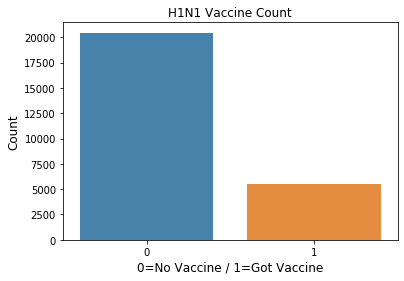


#### age_group
#### 55 - 64 Years


```python
df_a['age_group'].value_counts(normalize=True).round(3)
```


    65+ Years        0.250
    55 - 64 Years    0.209
    18 - 34 Years    0.198
    45 - 54 Years    0.198
    35 - 44 Years    0.146
    Name: age_group, dtype: float64


```python
#df_a.groupby('h1n1_vaccine')[['h1n1_vaccine','age_group','education']].count()
age_counts=df_a.groupby(['h1n1_vaccine','age_group'])[['h1n1_vaccine']].count()
age_counts.columns=['h1n1_by_age']
age_counts['Percentage'] = 100 * age_counts['h1n1_by_age']  / age_counts['h1n1_by_age'].sum()
age_counts.reset_index(inplace=True)
age_counts
```


<div>
<style scoped>
    .dataframe tbody tr th:only-of-type {
        vertical-align: middle;
    }

    .dataframe tbody tr th {
        vertical-align: top;
    }

    .dataframe thead th {
        text-align: right;
    }
</style>
<table border="1" class="dataframe">
  <thead>
    <tr style="text-align: right;">
      <th></th>
      <th>h1n1_vaccine</th>
      <th>age_group</th>
      <th>h1n1_by_age</th>
      <th>Percentage</th>
    </tr>
  </thead>
  <tbody>
    <tr>
      <td>0</td>
      <td>0</td>
      <td>18 - 34 Years</td>
      <td>4168</td>
      <td>16.040023</td>
    </tr>
    <tr>
      <td>1</td>
      <td>0</td>
      <td>35 - 44 Years</td>
      <td>3032</td>
      <td>11.668270</td>
    </tr>
    <tr>
      <td>2</td>
      <td>0</td>
      <td>45 - 54 Years</td>
      <td>4142</td>
      <td>15.939965</td>
    </tr>
    <tr>
      <td>3</td>
      <td>0</td>
      <td>55 - 64 Years</td>
      <td>4090</td>
      <td>15.739850</td>
    </tr>
    <tr>
      <td>4</td>
      <td>0</td>
      <td>65+ Years</td>
      <td>5017</td>
      <td>19.307293</td>
    </tr>
    <tr>
      <td>5</td>
      <td>1</td>
      <td>18 - 34 Years</td>
      <td>974</td>
      <td>3.748316</td>
    </tr>
    <tr>
      <td>6</td>
      <td>1</td>
      <td>35 - 44 Years</td>
      <td>752</td>
      <td>2.893977</td>
    </tr>
    <tr>
      <td>7</td>
      <td>1</td>
      <td>45 - 54 Years</td>
      <td>998</td>
      <td>3.840677</td>
    </tr>
    <tr>
      <td>8</td>
      <td>1</td>
      <td>55 - 64 Years</td>
      <td>1331</td>
      <td>5.122186</td>
    </tr>
    <tr>
      <td>9</td>
      <td>1</td>
      <td>65+ Years</td>
      <td>1481</td>
      <td>5.699442</td>
    </tr>
  </tbody>
</table>
</div>


```python
plt.figure(figsize=[8,6])
sns.barplot(alpha=0.9, data=age_counts, x='age_group',y='h1n1_by_age',hue='h1n1_vaccine');
```


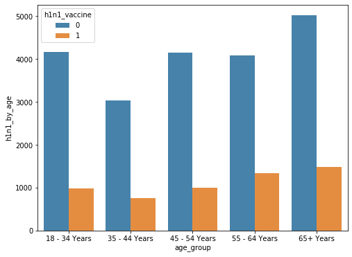


```python
fifty_over = age_counts.loc[age_counts['age_group'] == '55 - 64 Years']
fifty_over
```


<div>
<style scoped>
    .dataframe tbody tr th:only-of-type {
        vertical-align: middle;
    }

    .dataframe tbody tr th {
        vertical-align: top;
    }

    .dataframe thead th {
        text-align: right;
    }
</style>
<table border="1" class="dataframe">
  <thead>
    <tr style="text-align: right;">
      <th></th>
      <th>h1n1_vaccine</th>
      <th>age_group</th>
      <th>h1n1_by_age</th>
      <th>Percentage</th>
    </tr>
  </thead>
  <tbody>
    <tr>
      <td>3</td>
      <td>0</td>
      <td>55 - 64 Years</td>
      <td>4090</td>
      <td>15.739850</td>
    </tr>
    <tr>
      <td>8</td>
      <td>1</td>
      <td>55 - 64 Years</td>
      <td>1331</td>
      <td>5.122186</td>
    </tr>
  </tbody>
</table>
</div>


```python
#fifty_over.groupby(level=[3, 8]).apply(lambda g: g / g.sum())
fifty_over['h1n1_by_age'] / fifty_over['h1n1_by_age'].sum()
```


    3    0.754473
    8    0.245527
    Name: h1n1_by_age, dtype: float64


```python
#fifty_over['Percent_of_grp'] = 100 * fifty_over['h1n1_by_age']  / fifty_over['h1n1_by_age'].sum()
#(26707, 37)
fifty_over['h1n1_by_age'].sum()
```


    5421


```python

fiftyfive_sixtyfour = df_a[df_a['age_group'] == '55 - 64 Years']
fiftyfive_count = fiftyfive_sixtyfour['h1n1_vaccine'].value_counts()
sns.barplot(fiftyfive_count.index, fiftyfive_count.values, alpha=0.9)
plt.title('H1N1 Vaccine Count 55-64 Group')
plt.ylabel('Count', fontsize=12)
plt.xlabel('0=No Vaccine / 1=Got Vaccine', fontsize=12)
plt.show()
```


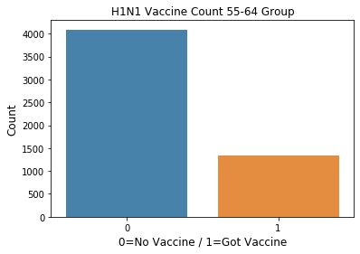


#### 65+ Years


```python
sixty_five = age_counts.loc[age_counts['age_group'] == '65+ Years']
sixty_five
```


<div>
<style scoped>
    .dataframe tbody tr th:only-of-type {
        vertical-align: middle;
    }

    .dataframe tbody tr th {
        vertical-align: top;
    }

    .dataframe thead th {
        text-align: right;
    }
</style>
<table border="1" class="dataframe">
  <thead>
    <tr style="text-align: right;">
      <th></th>
      <th>h1n1_vaccine</th>
      <th>age_group</th>
      <th>h1n1_by_age</th>
      <th>Percentage</th>
    </tr>
  </thead>
  <tbody>
    <tr>
      <td>4</td>
      <td>0</td>
      <td>65+ Years</td>
      <td>5017</td>
      <td>19.307293</td>
    </tr>
    <tr>
      <td>9</td>
      <td>1</td>
      <td>65+ Years</td>
      <td>1481</td>
      <td>5.699442</td>
    </tr>
  </tbody>
</table>
</div>


```python
sixty_five['h1n1_by_age'] / sixty_five['h1n1_by_age'].sum()
```


    4    0.772084
    9    0.227916
    Name: h1n1_by_age, dtype: float64


```python
sixty_five['h1n1_by_age'].sum()
```


    6498


#### Education


```python
df_a['education'].value_counts(normalize=True).round(3)
```


    College Graduate    0.381
    Some College        0.265
    12 Years            0.216
    < 12 Years          0.087
    Grad School +       0.051
    Name: education, dtype: float64


```python
educ_counts=df_a.groupby(['h1n1_vaccine','education'])[['h1n1_vaccine']].count()
educ_counts.columns=['h1n1_by_education']
#edu_counts['Percentage'] = 100 * edu_counts['h1n1_by_education']  / edu_counts['h1n1_by_education'].sum()
educ_counts['Percentage'] = 100 * educ_counts['h1n1_by_education']  / educ_counts['h1n1_by_education'].sum()
educ_counts.reset_index(inplace=True)
educ_counts
```


<div>
<style scoped>
    .dataframe tbody tr th:only-of-type {
        vertical-align: middle;
    }

    .dataframe tbody tr th {
        vertical-align: top;
    }

    .dataframe thead th {
        text-align: right;
    }
</style>
<table border="1" class="dataframe">
  <thead>
    <tr style="text-align: right;">
      <th></th>
      <th>h1n1_vaccine</th>
      <th>education</th>
      <th>h1n1_by_education</th>
      <th>Percentage</th>
    </tr>
  </thead>
  <tbody>
    <tr>
      <td>0</td>
      <td>0</td>
      <td>12 Years</td>
      <td>4587</td>
      <td>17.652492</td>
    </tr>
    <tr>
      <td>1</td>
      <td>0</td>
      <td>&lt; 12 Years</td>
      <td>1870</td>
      <td>7.196459</td>
    </tr>
    <tr>
      <td>2</td>
      <td>0</td>
      <td>College Graduate</td>
      <td>7461</td>
      <td>28.712719</td>
    </tr>
    <tr>
      <td>3</td>
      <td>0</td>
      <td>Grad School +</td>
      <td>1079</td>
      <td>4.152396</td>
    </tr>
    <tr>
      <td>4</td>
      <td>0</td>
      <td>Some College</td>
      <td>5452</td>
      <td>20.981335</td>
    </tr>
    <tr>
      <td>5</td>
      <td>1</td>
      <td>12 Years</td>
      <td>1035</td>
      <td>3.983067</td>
    </tr>
    <tr>
      <td>6</td>
      <td>1</td>
      <td>&lt; 12 Years</td>
      <td>378</td>
      <td>1.454685</td>
    </tr>
    <tr>
      <td>7</td>
      <td>1</td>
      <td>College Graduate</td>
      <td>2436</td>
      <td>9.374639</td>
    </tr>
    <tr>
      <td>8</td>
      <td>1</td>
      <td>Grad School +</td>
      <td>253</td>
      <td>0.973639</td>
    </tr>
    <tr>
      <td>9</td>
      <td>1</td>
      <td>Some College</td>
      <td>1434</td>
      <td>5.518568</td>
    </tr>
  </tbody>
</table>
</div>


```python
plt.figure(figsize=[8,6])
sns.barplot(alpha=0.9, data=educ_counts, x='education',y='h1n1_by_education',hue='h1n1_vaccine');
```


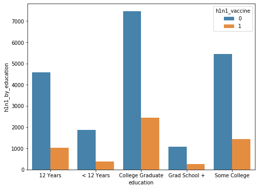


#### Gender


```python
df_a.groupby('h1n1_vaccine')['sex'].count()
```


    h1n1_vaccine
    0    20449
    1     5536
    Name: sex, dtype: int64


```python
df_a['sex'].value_counts()
```


    Female    15449
    Male      10536
    Name: sex, dtype: int64


```python
#group[h1n1]
df_a['sex'].value_counts(normalize=True)
```


    Female    0.594535
    Male      0.405465
    Name: sex, dtype: float64


```python
#P['Percentage'] = 100 * P['Title']  / P['Title'].sum()
gender_count=df_a.groupby(['h1n1_vaccine','sex'])[['sex']].count()
gender_count.columns=['h1n1_by_gender']
gender_count['Percentage'] = 100 * gender_count['h1n1_by_gender']  / gender_count['h1n1_by_gender'].sum()
gender_count.reset_index(inplace=True)
gender_count
```


<div>
<style scoped>
    .dataframe tbody tr th:only-of-type {
        vertical-align: middle;
    }

    .dataframe tbody tr th {
        vertical-align: top;
    }

    .dataframe thead th {
        text-align: right;
    }
</style>
<table border="1" class="dataframe">
  <thead>
    <tr style="text-align: right;">
      <th></th>
      <th>h1n1_vaccine</th>
      <th>sex</th>
      <th>h1n1_by_gender</th>
      <th>Percentage</th>
    </tr>
  </thead>
  <tbody>
    <tr>
      <td>0</td>
      <td>0</td>
      <td>Female</td>
      <td>12044</td>
      <td>46.349817</td>
    </tr>
    <tr>
      <td>1</td>
      <td>0</td>
      <td>Male</td>
      <td>8405</td>
      <td>32.345584</td>
    </tr>
    <tr>
      <td>2</td>
      <td>1</td>
      <td>Female</td>
      <td>3405</td>
      <td>13.103714</td>
    </tr>
    <tr>
      <td>3</td>
      <td>1</td>
      <td>Male</td>
      <td>2131</td>
      <td>8.200885</td>
    </tr>
  </tbody>
</table>
</div>


```python
plt.figure(figsize=[8,6])
sns.barplot(alpha=0.9, data=gender_count, x='sex',y='h1n1_by_gender',hue='h1n1_vaccine')
```


    <matplotlib.axes._subplots.AxesSubplot at 0x1a1905c940>


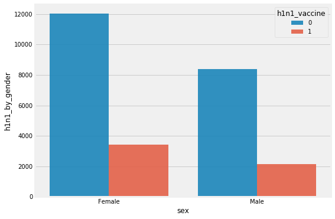


```python
gender_grp = gender_count['sex'] 
gender_grp
```


    0    Female
    1      Male
    2    Female
    3      Male
    Name: sex, dtype: object


```python
#fifty_over['h1n1_by_age'] / fifty_over['h1n1_by_age'].sum()
#fifty_over = age_counts.loc[age_counts['age_group'] == '55 - 64 Years']
gen_cat = gender_count.loc[(gender_count['sex'] == 'Male') | (gender_count['sex'] == 'Female')]
gen_cat.drop('Percentage',axis=1,inplace=True)
```


```python
gen_cat
```


<div>
<style scoped>
    .dataframe tbody tr th:only-of-type {
        vertical-align: middle;
    }

    .dataframe tbody tr th {
        vertical-align: top;
    }

    .dataframe thead th {
        text-align: right;
    }
</style>
<table border="1" class="dataframe">
  <thead>
    <tr style="text-align: right;">
      <th></th>
      <th>h1n1_vaccine</th>
      <th>sex</th>
      <th>h1n1_by_gender</th>
    </tr>
  </thead>
  <tbody>
    <tr>
      <td>0</td>
      <td>0</td>
      <td>Female</td>
      <td>12044</td>
    </tr>
    <tr>
      <td>1</td>
      <td>0</td>
      <td>Male</td>
      <td>8405</td>
    </tr>
    <tr>
      <td>2</td>
      <td>1</td>
      <td>Female</td>
      <td>3405</td>
    </tr>
    <tr>
      <td>3</td>
      <td>1</td>
      <td>Male</td>
      <td>2131</td>
    </tr>
  </tbody>
</table>
</div>


##### Female


```python
female = gen_cat.loc[gen_cat['sex']=='Female']
female
```


<div>
<style scoped>
    .dataframe tbody tr th:only-of-type {
        vertical-align: middle;
    }

    .dataframe tbody tr th {
        vertical-align: top;
    }

    .dataframe thead th {
        text-align: right;
    }
</style>
<table border="1" class="dataframe">
  <thead>
    <tr style="text-align: right;">
      <th></th>
      <th>h1n1_vaccine</th>
      <th>sex</th>
      <th>h1n1_by_gender</th>
    </tr>
  </thead>
  <tbody>
    <tr>
      <td>0</td>
      <td>0</td>
      <td>Female</td>
      <td>12044</td>
    </tr>
    <tr>
      <td>2</td>
      <td>1</td>
      <td>Female</td>
      <td>3405</td>
    </tr>
  </tbody>
</table>
</div>


```python
print(female['h1n1_by_gender'] / female['h1n1_by_gender'].sum())
print('\n')
print('There are {} females in group'.format(female['h1n1_by_gender'].sum()))
```

    0    0.779597
    2    0.220403
    Name: h1n1_by_gender, dtype: float64
    
    
    There are 15449 females in group


##### Male


```python
male = gen_cat.loc[gen_cat['sex']=='Male']
male
```


<div>
<style scoped>
    .dataframe tbody tr th:only-of-type {
        vertical-align: middle;
    }

    .dataframe tbody tr th {
        vertical-align: top;
    }

    .dataframe thead th {
        text-align: right;
    }
</style>
<table border="1" class="dataframe">
  <thead>
    <tr style="text-align: right;">
      <th></th>
      <th>h1n1_vaccine</th>
      <th>sex</th>
      <th>h1n1_by_gender</th>
    </tr>
  </thead>
  <tbody>
    <tr>
      <td>1</td>
      <td>0</td>
      <td>Male</td>
      <td>8405</td>
    </tr>
    <tr>
      <td>3</td>
      <td>1</td>
      <td>Male</td>
      <td>2131</td>
    </tr>
  </tbody>
</table>
</div>


```python
print(male['h1n1_by_gender'] / male['h1n1_by_gender'].sum())
print('\n')
print('There are {} males in group'.format(male['h1n1_by_gender'].sum()))
```

    1    0.797741
    3    0.202259
    Name: h1n1_by_gender, dtype: float64
    
    
    There are 10536 males in group


#### H1N1 Vaccine v. Seasonal Vaccine


```python
#df_a[['h1n1_vaccine','seasonal_vaccine']]
print(df_a['h1n1_vaccine'].value_counts(normalize=True))
print('\n')
print(df_a['seasonal_vaccine'].value_counts(normalize=True))
```

    0    0.786954
    1    0.213046
    Name: h1n1_vaccine, dtype: float64
    
    
    0    0.535078
    1    0.464922
    Name: seasonal_vaccine, dtype: float64


```python
# h1n1 = df_a['h1n1_vaccine'].value_counts()
# #sns.set(style="darkgrid")
# sns.barplot(h1n1.index, h1n1.values, alpha=0.9)
fig, axs = plt.subplots(ncols=2)
#sns.regplot(x='value', y='wage', data=df_melt, ax=axs[0])
h1n1_count = df_a['h1n1_vaccine'].value_counts()
sns.barplot(h1n1_count.index,h1n1_count.values, alpha=0.9,ax=axs[0])
axs[0].set_title('H1N1 Vaccine')

seasonal_count = df_a['seasonal_vaccine'].value_counts()
sns.barplot(seasonal_count.index,seasonal_count.values, alpha=0.9,ax=axs[1])
axs[1].set_title('Seasonal Vaccine')
fig.tight_layout()
```


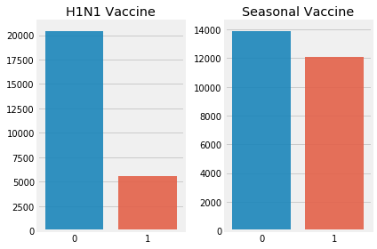


### One-Hot Encoding


```python
obj_cols = df_a.select_dtypes('object')
obj_cols.head()
```


<div>
<style scoped>
    .dataframe tbody tr th:only-of-type {
        vertical-align: middle;
    }

    .dataframe tbody tr th {
        vertical-align: top;
    }

    .dataframe thead th {
        text-align: right;
    }
</style>
<table border="1" class="dataframe">
  <thead>
    <tr style="text-align: right;">
      <th></th>
      <th>age_group</th>
      <th>education</th>
      <th>race</th>
      <th>sex</th>
      <th>income_poverty</th>
      <th>marital_status</th>
      <th>rent_or_own</th>
      <th>employment_status</th>
      <th>hhs_geo_region</th>
      <th>census_msa</th>
      <th>employment_industry</th>
      <th>employment_occupation</th>
    </tr>
  </thead>
  <tbody>
    <tr>
      <td>0</td>
      <td>55 - 64 Years</td>
      <td>&lt; 12 Years</td>
      <td>White</td>
      <td>Female</td>
      <td>Below Poverty</td>
      <td>Not Married</td>
      <td>Own</td>
      <td>Not in Labor Force</td>
      <td>oxchjgsf</td>
      <td>Non-MSA</td>
      <td>Not in Labor Force</td>
      <td>Not in Labor Force</td>
    </tr>
    <tr>
      <td>1</td>
      <td>35 - 44 Years</td>
      <td>12 Years</td>
      <td>White</td>
      <td>Male</td>
      <td>Below Poverty</td>
      <td>Not Married</td>
      <td>Rent</td>
      <td>Employed</td>
      <td>bhuqouqj</td>
      <td>MSA, Not Principle  City</td>
      <td>pxcmvdjn</td>
      <td>xgwztkwe</td>
    </tr>
    <tr>
      <td>2</td>
      <td>18 - 34 Years</td>
      <td>College Graduate</td>
      <td>White</td>
      <td>Male</td>
      <td>&lt;= $75,000, Above Poverty</td>
      <td>Not Married</td>
      <td>Own</td>
      <td>Employed</td>
      <td>qufhixun</td>
      <td>MSA, Not Principle  City</td>
      <td>rucpziij</td>
      <td>xtkaffoo</td>
    </tr>
    <tr>
      <td>3</td>
      <td>65+ Years</td>
      <td>12 Years</td>
      <td>White</td>
      <td>Female</td>
      <td>Below Poverty</td>
      <td>Not Married</td>
      <td>Rent</td>
      <td>Not in Labor Force</td>
      <td>lrircsnp</td>
      <td>MSA, Principle City</td>
      <td>Not in Labor Force</td>
      <td>Not in Labor Force</td>
    </tr>
    <tr>
      <td>4</td>
      <td>45 - 54 Years</td>
      <td>Some College</td>
      <td>White</td>
      <td>Female</td>
      <td>&lt;= $75,000, Above Poverty</td>
      <td>Married</td>
      <td>Own</td>
      <td>Employed</td>
      <td>qufhixun</td>
      <td>MSA, Not Principle  City</td>
      <td>wxleyezf</td>
      <td>emcorrxb</td>
    </tr>
  </tbody>
</table>
</div>


```python
obj_cols.columns
```


    Index(['age_group', 'education', 'race', 'sex', 'income_poverty',
           'marital_status', 'rent_or_own', 'employment_status', 'hhs_geo_region',
           'census_msa', 'employment_industry', 'employment_occupation'],
          dtype='object')


```python
obj_feats = ['age_group', 'education', 'race', 'sex', 'income_poverty',
       'marital_status', 'rent_or_own', 'employment_status', 'hhs_geo_region',
       'census_msa', 'employment_industry', 'employment_occupation']
obj_dummies = pd.get_dummies(df_a[obj_feats],drop_first=True)#
```


```python
obj_dummies.head()
```


<div>
<style scoped>
    .dataframe tbody tr th:only-of-type {
        vertical-align: middle;
    }

    .dataframe tbody tr th {
        vertical-align: top;
    }

    .dataframe thead th {
        text-align: right;
    }
</style>
<table border="1" class="dataframe">
  <thead>
    <tr style="text-align: right;">
      <th></th>
      <th>age_group_35 - 44 Years</th>
      <th>age_group_45 - 54 Years</th>
      <th>age_group_55 - 64 Years</th>
      <th>age_group_65+ Years</th>
      <th>education_&lt; 12 Years</th>
      <th>education_College Graduate</th>
      <th>education_Grad School +</th>
      <th>education_Some College</th>
      <th>race_Hispanic</th>
      <th>race_Other or Multiple</th>
      <th>race_White</th>
      <th>sex_Male</th>
      <th>income_poverty_&gt; $75,000</th>
      <th>income_poverty_Below Poverty</th>
      <th>income_poverty_Not in Labor Force</th>
      <th>marital_status_Neither</th>
      <th>marital_status_Not Married</th>
      <th>rent_or_own_Own</th>
      <th>rent_or_own_Rent</th>
      <th>employment_status_Not in Labor Force</th>
      <th>employment_status_Unemployed</th>
      <th>hhs_geo_region_bhuqouqj</th>
      <th>hhs_geo_region_dqpwygqj</th>
      <th>hhs_geo_region_fpwskwrf</th>
      <th>hhs_geo_region_kbazzjca</th>
      <th>hhs_geo_region_lrircsnp</th>
      <th>hhs_geo_region_lzgpxyit</th>
      <th>hhs_geo_region_mlyzmhmf</th>
      <th>hhs_geo_region_oxchjgsf</th>
      <th>hhs_geo_region_qufhixun</th>
      <th>census_msa_MSA, Principle City</th>
      <th>census_msa_Non-MSA</th>
      <th>employment_industry_arjwrbjb</th>
      <th>employment_industry_atmlpfrs</th>
      <th>employment_industry_cfqqtusy</th>
      <th>employment_industry_dotnnunm</th>
      <th>employment_industry_fcxhlnwr</th>
      <th>employment_industry_haxffmxo</th>
      <th>employment_industry_ldnlellj</th>
      <th>employment_industry_mcubkhph</th>
      <th>employment_industry_mfikgejo</th>
      <th>employment_industry_msuufmds</th>
      <th>employment_industry_nduyfdeo</th>
      <th>employment_industry_phxvnwax</th>
      <th>employment_industry_pxcmvdjn</th>
      <th>employment_industry_qnlwzans</th>
      <th>employment_industry_rucpziij</th>
      <th>employment_industry_saaquncn</th>
      <th>employment_industry_vjjrobsf</th>
      <th>employment_industry_wlfvacwt</th>
      <th>employment_industry_wxleyezf</th>
      <th>employment_industry_xicduogh</th>
      <th>employment_industry_xqicxuve</th>
      <th>employment_occupation_bxpfxfdn</th>
      <th>employment_occupation_ccgxvspp</th>
      <th>employment_occupation_cmhcxjea</th>
      <th>employment_occupation_dcjcmpih</th>
      <th>employment_occupation_dlvbwzss</th>
      <th>employment_occupation_emcorrxb</th>
      <th>employment_occupation_haliazsg</th>
      <th>employment_occupation_hfxkjkmi</th>
      <th>employment_occupation_hodpvpew</th>
      <th>employment_occupation_kldqjyjy</th>
      <th>employment_occupation_mxkfnird</th>
      <th>employment_occupation_oijqvulv</th>
      <th>employment_occupation_pvmttkik</th>
      <th>employment_occupation_qxajmpny</th>
      <th>employment_occupation_rcertsgn</th>
      <th>employment_occupation_tfqavkke</th>
      <th>employment_occupation_ukymxvdu</th>
      <th>employment_occupation_uqqtjvyb</th>
      <th>employment_occupation_vlluhbov</th>
      <th>employment_occupation_xgwztkwe</th>
      <th>employment_occupation_xqwwgdyp</th>
      <th>employment_occupation_xtkaffoo</th>
      <th>employment_occupation_xzmlyyjv</th>
    </tr>
  </thead>
  <tbody>
    <tr>
      <td>0</td>
      <td>0</td>
      <td>0</td>
      <td>1</td>
      <td>0</td>
      <td>1</td>
      <td>0</td>
      <td>0</td>
      <td>0</td>
      <td>0</td>
      <td>0</td>
      <td>1</td>
      <td>0</td>
      <td>0</td>
      <td>1</td>
      <td>0</td>
      <td>0</td>
      <td>1</td>
      <td>1</td>
      <td>0</td>
      <td>1</td>
      <td>0</td>
      <td>0</td>
      <td>0</td>
      <td>0</td>
      <td>0</td>
      <td>0</td>
      <td>0</td>
      <td>0</td>
      <td>1</td>
      <td>0</td>
      <td>0</td>
      <td>1</td>
      <td>0</td>
      <td>0</td>
      <td>0</td>
      <td>0</td>
      <td>0</td>
      <td>0</td>
      <td>0</td>
      <td>0</td>
      <td>0</td>
      <td>0</td>
      <td>0</td>
      <td>0</td>
      <td>0</td>
      <td>0</td>
      <td>0</td>
      <td>0</td>
      <td>0</td>
      <td>0</td>
      <td>0</td>
      <td>0</td>
      <td>0</td>
      <td>0</td>
      <td>0</td>
      <td>0</td>
      <td>0</td>
      <td>0</td>
      <td>0</td>
      <td>0</td>
      <td>0</td>
      <td>0</td>
      <td>0</td>
      <td>0</td>
      <td>0</td>
      <td>0</td>
      <td>0</td>
      <td>0</td>
      <td>0</td>
      <td>0</td>
      <td>0</td>
      <td>0</td>
      <td>0</td>
      <td>0</td>
      <td>0</td>
      <td>0</td>
    </tr>
    <tr>
      <td>1</td>
      <td>1</td>
      <td>0</td>
      <td>0</td>
      <td>0</td>
      <td>0</td>
      <td>0</td>
      <td>0</td>
      <td>0</td>
      <td>0</td>
      <td>0</td>
      <td>1</td>
      <td>1</td>
      <td>0</td>
      <td>1</td>
      <td>0</td>
      <td>0</td>
      <td>1</td>
      <td>0</td>
      <td>1</td>
      <td>0</td>
      <td>0</td>
      <td>1</td>
      <td>0</td>
      <td>0</td>
      <td>0</td>
      <td>0</td>
      <td>0</td>
      <td>0</td>
      <td>0</td>
      <td>0</td>
      <td>0</td>
      <td>0</td>
      <td>0</td>
      <td>0</td>
      <td>0</td>
      <td>0</td>
      <td>0</td>
      <td>0</td>
      <td>0</td>
      <td>0</td>
      <td>0</td>
      <td>0</td>
      <td>0</td>
      <td>0</td>
      <td>1</td>
      <td>0</td>
      <td>0</td>
      <td>0</td>
      <td>0</td>
      <td>0</td>
      <td>0</td>
      <td>0</td>
      <td>0</td>
      <td>0</td>
      <td>0</td>
      <td>0</td>
      <td>0</td>
      <td>0</td>
      <td>0</td>
      <td>0</td>
      <td>0</td>
      <td>0</td>
      <td>0</td>
      <td>0</td>
      <td>0</td>
      <td>0</td>
      <td>0</td>
      <td>0</td>
      <td>0</td>
      <td>0</td>
      <td>0</td>
      <td>0</td>
      <td>1</td>
      <td>0</td>
      <td>0</td>
      <td>0</td>
    </tr>
    <tr>
      <td>2</td>
      <td>0</td>
      <td>0</td>
      <td>0</td>
      <td>0</td>
      <td>0</td>
      <td>1</td>
      <td>0</td>
      <td>0</td>
      <td>0</td>
      <td>0</td>
      <td>1</td>
      <td>1</td>
      <td>0</td>
      <td>0</td>
      <td>0</td>
      <td>0</td>
      <td>1</td>
      <td>1</td>
      <td>0</td>
      <td>0</td>
      <td>0</td>
      <td>0</td>
      <td>0</td>
      <td>0</td>
      <td>0</td>
      <td>0</td>
      <td>0</td>
      <td>0</td>
      <td>0</td>
      <td>1</td>
      <td>0</td>
      <td>0</td>
      <td>0</td>
      <td>0</td>
      <td>0</td>
      <td>0</td>
      <td>0</td>
      <td>0</td>
      <td>0</td>
      <td>0</td>
      <td>0</td>
      <td>0</td>
      <td>0</td>
      <td>0</td>
      <td>0</td>
      <td>0</td>
      <td>1</td>
      <td>0</td>
      <td>0</td>
      <td>0</td>
      <td>0</td>
      <td>0</td>
      <td>0</td>
      <td>0</td>
      <td>0</td>
      <td>0</td>
      <td>0</td>
      <td>0</td>
      <td>0</td>
      <td>0</td>
      <td>0</td>
      <td>0</td>
      <td>0</td>
      <td>0</td>
      <td>0</td>
      <td>0</td>
      <td>0</td>
      <td>0</td>
      <td>0</td>
      <td>0</td>
      <td>0</td>
      <td>0</td>
      <td>0</td>
      <td>0</td>
      <td>1</td>
      <td>0</td>
    </tr>
    <tr>
      <td>3</td>
      <td>0</td>
      <td>0</td>
      <td>0</td>
      <td>1</td>
      <td>0</td>
      <td>0</td>
      <td>0</td>
      <td>0</td>
      <td>0</td>
      <td>0</td>
      <td>1</td>
      <td>0</td>
      <td>0</td>
      <td>1</td>
      <td>0</td>
      <td>0</td>
      <td>1</td>
      <td>0</td>
      <td>1</td>
      <td>1</td>
      <td>0</td>
      <td>0</td>
      <td>0</td>
      <td>0</td>
      <td>0</td>
      <td>1</td>
      <td>0</td>
      <td>0</td>
      <td>0</td>
      <td>0</td>
      <td>1</td>
      <td>0</td>
      <td>0</td>
      <td>0</td>
      <td>0</td>
      <td>0</td>
      <td>0</td>
      <td>0</td>
      <td>0</td>
      <td>0</td>
      <td>0</td>
      <td>0</td>
      <td>0</td>
      <td>0</td>
      <td>0</td>
      <td>0</td>
      <td>0</td>
      <td>0</td>
      <td>0</td>
      <td>0</td>
      <td>0</td>
      <td>0</td>
      <td>0</td>
      <td>0</td>
      <td>0</td>
      <td>0</td>
      <td>0</td>
      <td>0</td>
      <td>0</td>
      <td>0</td>
      <td>0</td>
      <td>0</td>
      <td>0</td>
      <td>0</td>
      <td>0</td>
      <td>0</td>
      <td>0</td>
      <td>0</td>
      <td>0</td>
      <td>0</td>
      <td>0</td>
      <td>0</td>
      <td>0</td>
      <td>0</td>
      <td>0</td>
      <td>0</td>
    </tr>
    <tr>
      <td>4</td>
      <td>0</td>
      <td>1</td>
      <td>0</td>
      <td>0</td>
      <td>0</td>
      <td>0</td>
      <td>0</td>
      <td>1</td>
      <td>0</td>
      <td>0</td>
      <td>1</td>
      <td>0</td>
      <td>0</td>
      <td>0</td>
      <td>0</td>
      <td>0</td>
      <td>0</td>
      <td>1</td>
      <td>0</td>
      <td>0</td>
      <td>0</td>
      <td>0</td>
      <td>0</td>
      <td>0</td>
      <td>0</td>
      <td>0</td>
      <td>0</td>
      <td>0</td>
      <td>0</td>
      <td>1</td>
      <td>0</td>
      <td>0</td>
      <td>0</td>
      <td>0</td>
      <td>0</td>
      <td>0</td>
      <td>0</td>
      <td>0</td>
      <td>0</td>
      <td>0</td>
      <td>0</td>
      <td>0</td>
      <td>0</td>
      <td>0</td>
      <td>0</td>
      <td>0</td>
      <td>0</td>
      <td>0</td>
      <td>0</td>
      <td>0</td>
      <td>1</td>
      <td>0</td>
      <td>0</td>
      <td>0</td>
      <td>0</td>
      <td>0</td>
      <td>0</td>
      <td>0</td>
      <td>1</td>
      <td>0</td>
      <td>0</td>
      <td>0</td>
      <td>0</td>
      <td>0</td>
      <td>0</td>
      <td>0</td>
      <td>0</td>
      <td>0</td>
      <td>0</td>
      <td>0</td>
      <td>0</td>
      <td>0</td>
      <td>0</td>
      <td>0</td>
      <td>0</td>
      <td>0</td>
    </tr>
  </tbody>
</table>
</div>


```python
result_df = pd.concat([df_a,obj_dummies], axis=1)
```


```python
result_df.head()
```


<div>
<style scoped>
    .dataframe tbody tr th:only-of-type {
        vertical-align: middle;
    }

    .dataframe tbody tr th {
        vertical-align: top;
    }

    .dataframe thead th {
        text-align: right;
    }
</style>
<table border="1" class="dataframe">
  <thead>
    <tr style="text-align: right;">
      <th></th>
      <th>h1n1_concern</th>
      <th>h1n1_knowledge</th>
      <th>behavioral_antiviral_meds</th>
      <th>behavioral_avoidance</th>
      <th>behavioral_face_mask</th>
      <th>behavioral_wash_hands</th>
      <th>behavioral_large_gatherings</th>
      <th>behavioral_outside_home</th>
      <th>behavioral_touch_face</th>
      <th>doctor_recc_h1n1</th>
      <th>doctor_recc_seasonal</th>
      <th>chronic_med_condition</th>
      <th>child_under_6_months</th>
      <th>health_worker</th>
      <th>health_insurance</th>
      <th>opinion_h1n1_vacc_effective</th>
      <th>opinion_h1n1_risk</th>
      <th>opinion_h1n1_sick_from_vacc</th>
      <th>opinion_seas_vacc_effective</th>
      <th>opinion_seas_risk</th>
      <th>opinion_seas_sick_from_vacc</th>
      <th>age_group</th>
      <th>education</th>
      <th>race</th>
      <th>sex</th>
      <th>income_poverty</th>
      <th>marital_status</th>
      <th>rent_or_own</th>
      <th>employment_status</th>
      <th>hhs_geo_region</th>
      <th>census_msa</th>
      <th>household_adults</th>
      <th>household_children</th>
      <th>employment_industry</th>
      <th>employment_occupation</th>
      <th>h1n1_vaccine</th>
      <th>seasonal_vaccine</th>
      <th>age_group_35 - 44 Years</th>
      <th>age_group_45 - 54 Years</th>
      <th>age_group_55 - 64 Years</th>
      <th>age_group_65+ Years</th>
      <th>education_&lt; 12 Years</th>
      <th>education_College Graduate</th>
      <th>education_Grad School +</th>
      <th>education_Some College</th>
      <th>race_Hispanic</th>
      <th>race_Other or Multiple</th>
      <th>race_White</th>
      <th>sex_Male</th>
      <th>income_poverty_&gt; $75,000</th>
      <th>income_poverty_Below Poverty</th>
      <th>income_poverty_Not in Labor Force</th>
      <th>marital_status_Neither</th>
      <th>marital_status_Not Married</th>
      <th>rent_or_own_Own</th>
      <th>rent_or_own_Rent</th>
      <th>employment_status_Not in Labor Force</th>
      <th>employment_status_Unemployed</th>
      <th>hhs_geo_region_bhuqouqj</th>
      <th>hhs_geo_region_dqpwygqj</th>
      <th>hhs_geo_region_fpwskwrf</th>
      <th>hhs_geo_region_kbazzjca</th>
      <th>hhs_geo_region_lrircsnp</th>
      <th>hhs_geo_region_lzgpxyit</th>
      <th>hhs_geo_region_mlyzmhmf</th>
      <th>hhs_geo_region_oxchjgsf</th>
      <th>hhs_geo_region_qufhixun</th>
      <th>census_msa_MSA, Principle City</th>
      <th>census_msa_Non-MSA</th>
      <th>employment_industry_arjwrbjb</th>
      <th>employment_industry_atmlpfrs</th>
      <th>employment_industry_cfqqtusy</th>
      <th>employment_industry_dotnnunm</th>
      <th>employment_industry_fcxhlnwr</th>
      <th>employment_industry_haxffmxo</th>
      <th>employment_industry_ldnlellj</th>
      <th>employment_industry_mcubkhph</th>
      <th>employment_industry_mfikgejo</th>
      <th>employment_industry_msuufmds</th>
      <th>employment_industry_nduyfdeo</th>
      <th>employment_industry_phxvnwax</th>
      <th>employment_industry_pxcmvdjn</th>
      <th>employment_industry_qnlwzans</th>
      <th>employment_industry_rucpziij</th>
      <th>employment_industry_saaquncn</th>
      <th>employment_industry_vjjrobsf</th>
      <th>employment_industry_wlfvacwt</th>
      <th>employment_industry_wxleyezf</th>
      <th>employment_industry_xicduogh</th>
      <th>employment_industry_xqicxuve</th>
      <th>employment_occupation_bxpfxfdn</th>
      <th>employment_occupation_ccgxvspp</th>
      <th>employment_occupation_cmhcxjea</th>
      <th>employment_occupation_dcjcmpih</th>
      <th>employment_occupation_dlvbwzss</th>
      <th>employment_occupation_emcorrxb</th>
      <th>employment_occupation_haliazsg</th>
      <th>employment_occupation_hfxkjkmi</th>
      <th>employment_occupation_hodpvpew</th>
      <th>employment_occupation_kldqjyjy</th>
      <th>employment_occupation_mxkfnird</th>
      <th>employment_occupation_oijqvulv</th>
      <th>employment_occupation_pvmttkik</th>
      <th>employment_occupation_qxajmpny</th>
      <th>employment_occupation_rcertsgn</th>
      <th>employment_occupation_tfqavkke</th>
      <th>employment_occupation_ukymxvdu</th>
      <th>employment_occupation_uqqtjvyb</th>
      <th>employment_occupation_vlluhbov</th>
      <th>employment_occupation_xgwztkwe</th>
      <th>employment_occupation_xqwwgdyp</th>
      <th>employment_occupation_xtkaffoo</th>
      <th>employment_occupation_xzmlyyjv</th>
    </tr>
  </thead>
  <tbody>
    <tr>
      <td>0</td>
      <td>1.0</td>
      <td>0.0</td>
      <td>0.0</td>
      <td>0.0</td>
      <td>0.0</td>
      <td>0.0</td>
      <td>0.0</td>
      <td>1.0</td>
      <td>1.0</td>
      <td>0.0</td>
      <td>0.0</td>
      <td>0.0</td>
      <td>0.0</td>
      <td>0.0</td>
      <td>1.0</td>
      <td>3.0</td>
      <td>1.0</td>
      <td>2.0</td>
      <td>2.0</td>
      <td>1.0</td>
      <td>2.0</td>
      <td>55 - 64 Years</td>
      <td>&lt; 12 Years</td>
      <td>White</td>
      <td>Female</td>
      <td>Below Poverty</td>
      <td>Not Married</td>
      <td>Own</td>
      <td>Not in Labor Force</td>
      <td>oxchjgsf</td>
      <td>Non-MSA</td>
      <td>0.0</td>
      <td>0.0</td>
      <td>Not in Labor Force</td>
      <td>Not in Labor Force</td>
      <td>0</td>
      <td>0</td>
      <td>0</td>
      <td>0</td>
      <td>1</td>
      <td>0</td>
      <td>1</td>
      <td>0</td>
      <td>0</td>
      <td>0</td>
      <td>0</td>
      <td>0</td>
      <td>1</td>
      <td>0</td>
      <td>0</td>
      <td>1</td>
      <td>0</td>
      <td>0</td>
      <td>1</td>
      <td>1</td>
      <td>0</td>
      <td>1</td>
      <td>0</td>
      <td>0</td>
      <td>0</td>
      <td>0</td>
      <td>0</td>
      <td>0</td>
      <td>0</td>
      <td>0</td>
      <td>1</td>
      <td>0</td>
      <td>0</td>
      <td>1</td>
      <td>0</td>
      <td>0</td>
      <td>0</td>
      <td>0</td>
      <td>0</td>
      <td>0</td>
      <td>0</td>
      <td>0</td>
      <td>0</td>
      <td>0</td>
      <td>0</td>
      <td>0</td>
      <td>0</td>
      <td>0</td>
      <td>0</td>
      <td>0</td>
      <td>0</td>
      <td>0</td>
      <td>0</td>
      <td>0</td>
      <td>0</td>
      <td>0</td>
      <td>0</td>
      <td>0</td>
      <td>0</td>
      <td>0</td>
      <td>0</td>
      <td>0</td>
      <td>0</td>
      <td>0</td>
      <td>0</td>
      <td>0</td>
      <td>0</td>
      <td>0</td>
      <td>0</td>
      <td>0</td>
      <td>0</td>
      <td>0</td>
      <td>0</td>
      <td>0</td>
      <td>0</td>
      <td>0</td>
      <td>0</td>
      <td>0</td>
    </tr>
    <tr>
      <td>1</td>
      <td>3.0</td>
      <td>2.0</td>
      <td>0.0</td>
      <td>1.0</td>
      <td>0.0</td>
      <td>1.0</td>
      <td>0.0</td>
      <td>1.0</td>
      <td>1.0</td>
      <td>0.0</td>
      <td>0.0</td>
      <td>0.0</td>
      <td>0.0</td>
      <td>0.0</td>
      <td>1.0</td>
      <td>5.0</td>
      <td>4.0</td>
      <td>4.0</td>
      <td>4.0</td>
      <td>2.0</td>
      <td>4.0</td>
      <td>35 - 44 Years</td>
      <td>12 Years</td>
      <td>White</td>
      <td>Male</td>
      <td>Below Poverty</td>
      <td>Not Married</td>
      <td>Rent</td>
      <td>Employed</td>
      <td>bhuqouqj</td>
      <td>MSA, Not Principle  City</td>
      <td>0.0</td>
      <td>0.0</td>
      <td>pxcmvdjn</td>
      <td>xgwztkwe</td>
      <td>0</td>
      <td>1</td>
      <td>1</td>
      <td>0</td>
      <td>0</td>
      <td>0</td>
      <td>0</td>
      <td>0</td>
      <td>0</td>
      <td>0</td>
      <td>0</td>
      <td>0</td>
      <td>1</td>
      <td>1</td>
      <td>0</td>
      <td>1</td>
      <td>0</td>
      <td>0</td>
      <td>1</td>
      <td>0</td>
      <td>1</td>
      <td>0</td>
      <td>0</td>
      <td>1</td>
      <td>0</td>
      <td>0</td>
      <td>0</td>
      <td>0</td>
      <td>0</td>
      <td>0</td>
      <td>0</td>
      <td>0</td>
      <td>0</td>
      <td>0</td>
      <td>0</td>
      <td>0</td>
      <td>0</td>
      <td>0</td>
      <td>0</td>
      <td>0</td>
      <td>0</td>
      <td>0</td>
      <td>0</td>
      <td>0</td>
      <td>0</td>
      <td>0</td>
      <td>1</td>
      <td>0</td>
      <td>0</td>
      <td>0</td>
      <td>0</td>
      <td>0</td>
      <td>0</td>
      <td>0</td>
      <td>0</td>
      <td>0</td>
      <td>0</td>
      <td>0</td>
      <td>0</td>
      <td>0</td>
      <td>0</td>
      <td>0</td>
      <td>0</td>
      <td>0</td>
      <td>0</td>
      <td>0</td>
      <td>0</td>
      <td>0</td>
      <td>0</td>
      <td>0</td>
      <td>0</td>
      <td>0</td>
      <td>0</td>
      <td>0</td>
      <td>1</td>
      <td>0</td>
      <td>0</td>
      <td>0</td>
    </tr>
    <tr>
      <td>2</td>
      <td>1.0</td>
      <td>1.0</td>
      <td>0.0</td>
      <td>1.0</td>
      <td>0.0</td>
      <td>0.0</td>
      <td>0.0</td>
      <td>0.0</td>
      <td>0.0</td>
      <td>0.0</td>
      <td>0.0</td>
      <td>1.0</td>
      <td>0.0</td>
      <td>0.0</td>
      <td>0.0</td>
      <td>3.0</td>
      <td>1.0</td>
      <td>1.0</td>
      <td>4.0</td>
      <td>1.0</td>
      <td>2.0</td>
      <td>18 - 34 Years</td>
      <td>College Graduate</td>
      <td>White</td>
      <td>Male</td>
      <td>&lt;= $75,000, Above Poverty</td>
      <td>Not Married</td>
      <td>Own</td>
      <td>Employed</td>
      <td>qufhixun</td>
      <td>MSA, Not Principle  City</td>
      <td>2.0</td>
      <td>0.0</td>
      <td>rucpziij</td>
      <td>xtkaffoo</td>
      <td>0</td>
      <td>0</td>
      <td>0</td>
      <td>0</td>
      <td>0</td>
      <td>0</td>
      <td>0</td>
      <td>1</td>
      <td>0</td>
      <td>0</td>
      <td>0</td>
      <td>0</td>
      <td>1</td>
      <td>1</td>
      <td>0</td>
      <td>0</td>
      <td>0</td>
      <td>0</td>
      <td>1</td>
      <td>1</td>
      <td>0</td>
      <td>0</td>
      <td>0</td>
      <td>0</td>
      <td>0</td>
      <td>0</td>
      <td>0</td>
      <td>0</td>
      <td>0</td>
      <td>0</td>
      <td>0</td>
      <td>1</td>
      <td>0</td>
      <td>0</td>
      <td>0</td>
      <td>0</td>
      <td>0</td>
      <td>0</td>
      <td>0</td>
      <td>0</td>
      <td>0</td>
      <td>0</td>
      <td>0</td>
      <td>0</td>
      <td>0</td>
      <td>0</td>
      <td>0</td>
      <td>0</td>
      <td>1</td>
      <td>0</td>
      <td>0</td>
      <td>0</td>
      <td>0</td>
      <td>0</td>
      <td>0</td>
      <td>0</td>
      <td>0</td>
      <td>0</td>
      <td>0</td>
      <td>0</td>
      <td>0</td>
      <td>0</td>
      <td>0</td>
      <td>0</td>
      <td>0</td>
      <td>0</td>
      <td>0</td>
      <td>0</td>
      <td>0</td>
      <td>0</td>
      <td>0</td>
      <td>0</td>
      <td>0</td>
      <td>0</td>
      <td>0</td>
      <td>0</td>
      <td>1</td>
      <td>0</td>
    </tr>
    <tr>
      <td>3</td>
      <td>1.0</td>
      <td>1.0</td>
      <td>0.0</td>
      <td>1.0</td>
      <td>0.0</td>
      <td>1.0</td>
      <td>1.0</td>
      <td>0.0</td>
      <td>0.0</td>
      <td>0.0</td>
      <td>1.0</td>
      <td>1.0</td>
      <td>0.0</td>
      <td>0.0</td>
      <td>0.0</td>
      <td>3.0</td>
      <td>3.0</td>
      <td>5.0</td>
      <td>5.0</td>
      <td>4.0</td>
      <td>1.0</td>
      <td>65+ Years</td>
      <td>12 Years</td>
      <td>White</td>
      <td>Female</td>
      <td>Below Poverty</td>
      <td>Not Married</td>
      <td>Rent</td>
      <td>Not in Labor Force</td>
      <td>lrircsnp</td>
      <td>MSA, Principle City</td>
      <td>0.0</td>
      <td>0.0</td>
      <td>Not in Labor Force</td>
      <td>Not in Labor Force</td>
      <td>0</td>
      <td>1</td>
      <td>0</td>
      <td>0</td>
      <td>0</td>
      <td>1</td>
      <td>0</td>
      <td>0</td>
      <td>0</td>
      <td>0</td>
      <td>0</td>
      <td>0</td>
      <td>1</td>
      <td>0</td>
      <td>0</td>
      <td>1</td>
      <td>0</td>
      <td>0</td>
      <td>1</td>
      <td>0</td>
      <td>1</td>
      <td>1</td>
      <td>0</td>
      <td>0</td>
      <td>0</td>
      <td>0</td>
      <td>0</td>
      <td>1</td>
      <td>0</td>
      <td>0</td>
      <td>0</td>
      <td>0</td>
      <td>1</td>
      <td>0</td>
      <td>0</td>
      <td>0</td>
      <td>0</td>
      <td>0</td>
      <td>0</td>
      <td>0</td>
      <td>0</td>
      <td>0</td>
      <td>0</td>
      <td>0</td>
      <td>0</td>
      <td>0</td>
      <td>0</td>
      <td>0</td>
      <td>0</td>
      <td>0</td>
      <td>0</td>
      <td>0</td>
      <td>0</td>
      <td>0</td>
      <td>0</td>
      <td>0</td>
      <td>0</td>
      <td>0</td>
      <td>0</td>
      <td>0</td>
      <td>0</td>
      <td>0</td>
      <td>0</td>
      <td>0</td>
      <td>0</td>
      <td>0</td>
      <td>0</td>
      <td>0</td>
      <td>0</td>
      <td>0</td>
      <td>0</td>
      <td>0</td>
      <td>0</td>
      <td>0</td>
      <td>0</td>
      <td>0</td>
      <td>0</td>
      <td>0</td>
    </tr>
    <tr>
      <td>4</td>
      <td>2.0</td>
      <td>1.0</td>
      <td>0.0</td>
      <td>1.0</td>
      <td>0.0</td>
      <td>1.0</td>
      <td>1.0</td>
      <td>0.0</td>
      <td>1.0</td>
      <td>0.0</td>
      <td>0.0</td>
      <td>0.0</td>
      <td>0.0</td>
      <td>0.0</td>
      <td>0.0</td>
      <td>3.0</td>
      <td>3.0</td>
      <td>2.0</td>
      <td>3.0</td>
      <td>1.0</td>
      <td>4.0</td>
      <td>45 - 54 Years</td>
      <td>Some College</td>
      <td>White</td>
      <td>Female</td>
      <td>&lt;= $75,000, Above Poverty</td>
      <td>Married</td>
      <td>Own</td>
      <td>Employed</td>
      <td>qufhixun</td>
      <td>MSA, Not Principle  City</td>
      <td>1.0</td>
      <td>0.0</td>
      <td>wxleyezf</td>
      <td>emcorrxb</td>
      <td>0</td>
      <td>0</td>
      <td>0</td>
      <td>1</td>
      <td>0</td>
      <td>0</td>
      <td>0</td>
      <td>0</td>
      <td>0</td>
      <td>1</td>
      <td>0</td>
      <td>0</td>
      <td>1</td>
      <td>0</td>
      <td>0</td>
      <td>0</td>
      <td>0</td>
      <td>0</td>
      <td>0</td>
      <td>1</td>
      <td>0</td>
      <td>0</td>
      <td>0</td>
      <td>0</td>
      <td>0</td>
      <td>0</td>
      <td>0</td>
      <td>0</td>
      <td>0</td>
      <td>0</td>
      <td>0</td>
      <td>1</td>
      <td>0</td>
      <td>0</td>
      <td>0</td>
      <td>0</td>
      <td>0</td>
      <td>0</td>
      <td>0</td>
      <td>0</td>
      <td>0</td>
      <td>0</td>
      <td>0</td>
      <td>0</td>
      <td>0</td>
      <td>0</td>
      <td>0</td>
      <td>0</td>
      <td>0</td>
      <td>0</td>
      <td>0</td>
      <td>0</td>
      <td>1</td>
      <td>0</td>
      <td>0</td>
      <td>0</td>
      <td>0</td>
      <td>0</td>
      <td>0</td>
      <td>0</td>
      <td>1</td>
      <td>0</td>
      <td>0</td>
      <td>0</td>
      <td>0</td>
      <td>0</td>
      <td>0</td>
      <td>0</td>
      <td>0</td>
      <td>0</td>
      <td>0</td>
      <td>0</td>
      <td>0</td>
      <td>0</td>
      <td>0</td>
      <td>0</td>
      <td>0</td>
      <td>0</td>
    </tr>
  </tbody>
</table>
</div>


```python
result_df.isna().sum()
```


    h1n1_concern                      0
    h1n1_knowledge                    0
    behavioral_antiviral_meds         0
    behavioral_avoidance              0
    behavioral_face_mask              0
                                     ..
    employment_occupation_vlluhbov    0
    employment_occupation_xgwztkwe    0
    employment_occupation_xqwwgdyp    0
    employment_occupation_xtkaffoo    0
    employment_occupation_xzmlyyjv    0
    Length: 113, dtype: int64


```python
cols = ['age_group', 'education', 'race', 'sex', 'income_poverty',
       'marital_status', 'rent_or_own', 'employment_status', 'hhs_geo_region',
       'census_msa', 'employment_industry', 'employment_occupation']
df_dummies = result_df.drop(cols, axis=1) 
```


```python
df_dummies.head()
```


<div>
<style scoped>
    .dataframe tbody tr th:only-of-type {
        vertical-align: middle;
    }

    .dataframe tbody tr th {
        vertical-align: top;
    }

    .dataframe thead th {
        text-align: right;
    }
</style>
<table border="1" class="dataframe">
  <thead>
    <tr style="text-align: right;">
      <th></th>
      <th>h1n1_concern</th>
      <th>h1n1_knowledge</th>
      <th>behavioral_antiviral_meds</th>
      <th>behavioral_avoidance</th>
      <th>behavioral_face_mask</th>
      <th>behavioral_wash_hands</th>
      <th>behavioral_large_gatherings</th>
      <th>behavioral_outside_home</th>
      <th>behavioral_touch_face</th>
      <th>doctor_recc_h1n1</th>
      <th>doctor_recc_seasonal</th>
      <th>chronic_med_condition</th>
      <th>child_under_6_months</th>
      <th>health_worker</th>
      <th>health_insurance</th>
      <th>opinion_h1n1_vacc_effective</th>
      <th>opinion_h1n1_risk</th>
      <th>opinion_h1n1_sick_from_vacc</th>
      <th>opinion_seas_vacc_effective</th>
      <th>opinion_seas_risk</th>
      <th>opinion_seas_sick_from_vacc</th>
      <th>household_adults</th>
      <th>household_children</th>
      <th>h1n1_vaccine</th>
      <th>seasonal_vaccine</th>
      <th>age_group_35 - 44 Years</th>
      <th>age_group_45 - 54 Years</th>
      <th>age_group_55 - 64 Years</th>
      <th>age_group_65+ Years</th>
      <th>education_&lt; 12 Years</th>
      <th>education_College Graduate</th>
      <th>education_Grad School +</th>
      <th>education_Some College</th>
      <th>race_Hispanic</th>
      <th>race_Other or Multiple</th>
      <th>race_White</th>
      <th>sex_Male</th>
      <th>income_poverty_&gt; $75,000</th>
      <th>income_poverty_Below Poverty</th>
      <th>income_poverty_Not in Labor Force</th>
      <th>marital_status_Neither</th>
      <th>marital_status_Not Married</th>
      <th>rent_or_own_Own</th>
      <th>rent_or_own_Rent</th>
      <th>employment_status_Not in Labor Force</th>
      <th>employment_status_Unemployed</th>
      <th>hhs_geo_region_bhuqouqj</th>
      <th>hhs_geo_region_dqpwygqj</th>
      <th>hhs_geo_region_fpwskwrf</th>
      <th>hhs_geo_region_kbazzjca</th>
      <th>hhs_geo_region_lrircsnp</th>
      <th>hhs_geo_region_lzgpxyit</th>
      <th>hhs_geo_region_mlyzmhmf</th>
      <th>hhs_geo_region_oxchjgsf</th>
      <th>hhs_geo_region_qufhixun</th>
      <th>census_msa_MSA, Principle City</th>
      <th>census_msa_Non-MSA</th>
      <th>employment_industry_arjwrbjb</th>
      <th>employment_industry_atmlpfrs</th>
      <th>employment_industry_cfqqtusy</th>
      <th>employment_industry_dotnnunm</th>
      <th>employment_industry_fcxhlnwr</th>
      <th>employment_industry_haxffmxo</th>
      <th>employment_industry_ldnlellj</th>
      <th>employment_industry_mcubkhph</th>
      <th>employment_industry_mfikgejo</th>
      <th>employment_industry_msuufmds</th>
      <th>employment_industry_nduyfdeo</th>
      <th>employment_industry_phxvnwax</th>
      <th>employment_industry_pxcmvdjn</th>
      <th>employment_industry_qnlwzans</th>
      <th>employment_industry_rucpziij</th>
      <th>employment_industry_saaquncn</th>
      <th>employment_industry_vjjrobsf</th>
      <th>employment_industry_wlfvacwt</th>
      <th>employment_industry_wxleyezf</th>
      <th>employment_industry_xicduogh</th>
      <th>employment_industry_xqicxuve</th>
      <th>employment_occupation_bxpfxfdn</th>
      <th>employment_occupation_ccgxvspp</th>
      <th>employment_occupation_cmhcxjea</th>
      <th>employment_occupation_dcjcmpih</th>
      <th>employment_occupation_dlvbwzss</th>
      <th>employment_occupation_emcorrxb</th>
      <th>employment_occupation_haliazsg</th>
      <th>employment_occupation_hfxkjkmi</th>
      <th>employment_occupation_hodpvpew</th>
      <th>employment_occupation_kldqjyjy</th>
      <th>employment_occupation_mxkfnird</th>
      <th>employment_occupation_oijqvulv</th>
      <th>employment_occupation_pvmttkik</th>
      <th>employment_occupation_qxajmpny</th>
      <th>employment_occupation_rcertsgn</th>
      <th>employment_occupation_tfqavkke</th>
      <th>employment_occupation_ukymxvdu</th>
      <th>employment_occupation_uqqtjvyb</th>
      <th>employment_occupation_vlluhbov</th>
      <th>employment_occupation_xgwztkwe</th>
      <th>employment_occupation_xqwwgdyp</th>
      <th>employment_occupation_xtkaffoo</th>
      <th>employment_occupation_xzmlyyjv</th>
    </tr>
  </thead>
  <tbody>
    <tr>
      <td>0</td>
      <td>1.0</td>
      <td>0.0</td>
      <td>0.0</td>
      <td>0.0</td>
      <td>0.0</td>
      <td>0.0</td>
      <td>0.0</td>
      <td>1.0</td>
      <td>1.0</td>
      <td>0.0</td>
      <td>0.0</td>
      <td>0.0</td>
      <td>0.0</td>
      <td>0.0</td>
      <td>1.0</td>
      <td>3.0</td>
      <td>1.0</td>
      <td>2.0</td>
      <td>2.0</td>
      <td>1.0</td>
      <td>2.0</td>
      <td>0.0</td>
      <td>0.0</td>
      <td>0</td>
      <td>0</td>
      <td>0</td>
      <td>0</td>
      <td>1</td>
      <td>0</td>
      <td>1</td>
      <td>0</td>
      <td>0</td>
      <td>0</td>
      <td>0</td>
      <td>0</td>
      <td>1</td>
      <td>0</td>
      <td>0</td>
      <td>1</td>
      <td>0</td>
      <td>0</td>
      <td>1</td>
      <td>1</td>
      <td>0</td>
      <td>1</td>
      <td>0</td>
      <td>0</td>
      <td>0</td>
      <td>0</td>
      <td>0</td>
      <td>0</td>
      <td>0</td>
      <td>0</td>
      <td>1</td>
      <td>0</td>
      <td>0</td>
      <td>1</td>
      <td>0</td>
      <td>0</td>
      <td>0</td>
      <td>0</td>
      <td>0</td>
      <td>0</td>
      <td>0</td>
      <td>0</td>
      <td>0</td>
      <td>0</td>
      <td>0</td>
      <td>0</td>
      <td>0</td>
      <td>0</td>
      <td>0</td>
      <td>0</td>
      <td>0</td>
      <td>0</td>
      <td>0</td>
      <td>0</td>
      <td>0</td>
      <td>0</td>
      <td>0</td>
      <td>0</td>
      <td>0</td>
      <td>0</td>
      <td>0</td>
      <td>0</td>
      <td>0</td>
      <td>0</td>
      <td>0</td>
      <td>0</td>
      <td>0</td>
      <td>0</td>
      <td>0</td>
      <td>0</td>
      <td>0</td>
      <td>0</td>
      <td>0</td>
      <td>0</td>
      <td>0</td>
      <td>0</td>
      <td>0</td>
      <td>0</td>
    </tr>
    <tr>
      <td>1</td>
      <td>3.0</td>
      <td>2.0</td>
      <td>0.0</td>
      <td>1.0</td>
      <td>0.0</td>
      <td>1.0</td>
      <td>0.0</td>
      <td>1.0</td>
      <td>1.0</td>
      <td>0.0</td>
      <td>0.0</td>
      <td>0.0</td>
      <td>0.0</td>
      <td>0.0</td>
      <td>1.0</td>
      <td>5.0</td>
      <td>4.0</td>
      <td>4.0</td>
      <td>4.0</td>
      <td>2.0</td>
      <td>4.0</td>
      <td>0.0</td>
      <td>0.0</td>
      <td>0</td>
      <td>1</td>
      <td>1</td>
      <td>0</td>
      <td>0</td>
      <td>0</td>
      <td>0</td>
      <td>0</td>
      <td>0</td>
      <td>0</td>
      <td>0</td>
      <td>0</td>
      <td>1</td>
      <td>1</td>
      <td>0</td>
      <td>1</td>
      <td>0</td>
      <td>0</td>
      <td>1</td>
      <td>0</td>
      <td>1</td>
      <td>0</td>
      <td>0</td>
      <td>1</td>
      <td>0</td>
      <td>0</td>
      <td>0</td>
      <td>0</td>
      <td>0</td>
      <td>0</td>
      <td>0</td>
      <td>0</td>
      <td>0</td>
      <td>0</td>
      <td>0</td>
      <td>0</td>
      <td>0</td>
      <td>0</td>
      <td>0</td>
      <td>0</td>
      <td>0</td>
      <td>0</td>
      <td>0</td>
      <td>0</td>
      <td>0</td>
      <td>0</td>
      <td>1</td>
      <td>0</td>
      <td>0</td>
      <td>0</td>
      <td>0</td>
      <td>0</td>
      <td>0</td>
      <td>0</td>
      <td>0</td>
      <td>0</td>
      <td>0</td>
      <td>0</td>
      <td>0</td>
      <td>0</td>
      <td>0</td>
      <td>0</td>
      <td>0</td>
      <td>0</td>
      <td>0</td>
      <td>0</td>
      <td>0</td>
      <td>0</td>
      <td>0</td>
      <td>0</td>
      <td>0</td>
      <td>0</td>
      <td>0</td>
      <td>0</td>
      <td>1</td>
      <td>0</td>
      <td>0</td>
      <td>0</td>
    </tr>
    <tr>
      <td>2</td>
      <td>1.0</td>
      <td>1.0</td>
      <td>0.0</td>
      <td>1.0</td>
      <td>0.0</td>
      <td>0.0</td>
      <td>0.0</td>
      <td>0.0</td>
      <td>0.0</td>
      <td>0.0</td>
      <td>0.0</td>
      <td>1.0</td>
      <td>0.0</td>
      <td>0.0</td>
      <td>0.0</td>
      <td>3.0</td>
      <td>1.0</td>
      <td>1.0</td>
      <td>4.0</td>
      <td>1.0</td>
      <td>2.0</td>
      <td>2.0</td>
      <td>0.0</td>
      <td>0</td>
      <td>0</td>
      <td>0</td>
      <td>0</td>
      <td>0</td>
      <td>0</td>
      <td>0</td>
      <td>1</td>
      <td>0</td>
      <td>0</td>
      <td>0</td>
      <td>0</td>
      <td>1</td>
      <td>1</td>
      <td>0</td>
      <td>0</td>
      <td>0</td>
      <td>0</td>
      <td>1</td>
      <td>1</td>
      <td>0</td>
      <td>0</td>
      <td>0</td>
      <td>0</td>
      <td>0</td>
      <td>0</td>
      <td>0</td>
      <td>0</td>
      <td>0</td>
      <td>0</td>
      <td>0</td>
      <td>1</td>
      <td>0</td>
      <td>0</td>
      <td>0</td>
      <td>0</td>
      <td>0</td>
      <td>0</td>
      <td>0</td>
      <td>0</td>
      <td>0</td>
      <td>0</td>
      <td>0</td>
      <td>0</td>
      <td>0</td>
      <td>0</td>
      <td>0</td>
      <td>0</td>
      <td>1</td>
      <td>0</td>
      <td>0</td>
      <td>0</td>
      <td>0</td>
      <td>0</td>
      <td>0</td>
      <td>0</td>
      <td>0</td>
      <td>0</td>
      <td>0</td>
      <td>0</td>
      <td>0</td>
      <td>0</td>
      <td>0</td>
      <td>0</td>
      <td>0</td>
      <td>0</td>
      <td>0</td>
      <td>0</td>
      <td>0</td>
      <td>0</td>
      <td>0</td>
      <td>0</td>
      <td>0</td>
      <td>0</td>
      <td>0</td>
      <td>0</td>
      <td>1</td>
      <td>0</td>
    </tr>
    <tr>
      <td>3</td>
      <td>1.0</td>
      <td>1.0</td>
      <td>0.0</td>
      <td>1.0</td>
      <td>0.0</td>
      <td>1.0</td>
      <td>1.0</td>
      <td>0.0</td>
      <td>0.0</td>
      <td>0.0</td>
      <td>1.0</td>
      <td>1.0</td>
      <td>0.0</td>
      <td>0.0</td>
      <td>0.0</td>
      <td>3.0</td>
      <td>3.0</td>
      <td>5.0</td>
      <td>5.0</td>
      <td>4.0</td>
      <td>1.0</td>
      <td>0.0</td>
      <td>0.0</td>
      <td>0</td>
      <td>1</td>
      <td>0</td>
      <td>0</td>
      <td>0</td>
      <td>1</td>
      <td>0</td>
      <td>0</td>
      <td>0</td>
      <td>0</td>
      <td>0</td>
      <td>0</td>
      <td>1</td>
      <td>0</td>
      <td>0</td>
      <td>1</td>
      <td>0</td>
      <td>0</td>
      <td>1</td>
      <td>0</td>
      <td>1</td>
      <td>1</td>
      <td>0</td>
      <td>0</td>
      <td>0</td>
      <td>0</td>
      <td>0</td>
      <td>1</td>
      <td>0</td>
      <td>0</td>
      <td>0</td>
      <td>0</td>
      <td>1</td>
      <td>0</td>
      <td>0</td>
      <td>0</td>
      <td>0</td>
      <td>0</td>
      <td>0</td>
      <td>0</td>
      <td>0</td>
      <td>0</td>
      <td>0</td>
      <td>0</td>
      <td>0</td>
      <td>0</td>
      <td>0</td>
      <td>0</td>
      <td>0</td>
      <td>0</td>
      <td>0</td>
      <td>0</td>
      <td>0</td>
      <td>0</td>
      <td>0</td>
      <td>0</td>
      <td>0</td>
      <td>0</td>
      <td>0</td>
      <td>0</td>
      <td>0</td>
      <td>0</td>
      <td>0</td>
      <td>0</td>
      <td>0</td>
      <td>0</td>
      <td>0</td>
      <td>0</td>
      <td>0</td>
      <td>0</td>
      <td>0</td>
      <td>0</td>
      <td>0</td>
      <td>0</td>
      <td>0</td>
      <td>0</td>
      <td>0</td>
      <td>0</td>
    </tr>
    <tr>
      <td>4</td>
      <td>2.0</td>
      <td>1.0</td>
      <td>0.0</td>
      <td>1.0</td>
      <td>0.0</td>
      <td>1.0</td>
      <td>1.0</td>
      <td>0.0</td>
      <td>1.0</td>
      <td>0.0</td>
      <td>0.0</td>
      <td>0.0</td>
      <td>0.0</td>
      <td>0.0</td>
      <td>0.0</td>
      <td>3.0</td>
      <td>3.0</td>
      <td>2.0</td>
      <td>3.0</td>
      <td>1.0</td>
      <td>4.0</td>
      <td>1.0</td>
      <td>0.0</td>
      <td>0</td>
      <td>0</td>
      <td>0</td>
      <td>1</td>
      <td>0</td>
      <td>0</td>
      <td>0</td>
      <td>0</td>
      <td>0</td>
      <td>1</td>
      <td>0</td>
      <td>0</td>
      <td>1</td>
      <td>0</td>
      <td>0</td>
      <td>0</td>
      <td>0</td>
      <td>0</td>
      <td>0</td>
      <td>1</td>
      <td>0</td>
      <td>0</td>
      <td>0</td>
      <td>0</td>
      <td>0</td>
      <td>0</td>
      <td>0</td>
      <td>0</td>
      <td>0</td>
      <td>0</td>
      <td>0</td>
      <td>1</td>
      <td>0</td>
      <td>0</td>
      <td>0</td>
      <td>0</td>
      <td>0</td>
      <td>0</td>
      <td>0</td>
      <td>0</td>
      <td>0</td>
      <td>0</td>
      <td>0</td>
      <td>0</td>
      <td>0</td>
      <td>0</td>
      <td>0</td>
      <td>0</td>
      <td>0</td>
      <td>0</td>
      <td>0</td>
      <td>0</td>
      <td>1</td>
      <td>0</td>
      <td>0</td>
      <td>0</td>
      <td>0</td>
      <td>0</td>
      <td>0</td>
      <td>0</td>
      <td>1</td>
      <td>0</td>
      <td>0</td>
      <td>0</td>
      <td>0</td>
      <td>0</td>
      <td>0</td>
      <td>0</td>
      <td>0</td>
      <td>0</td>
      <td>0</td>
      <td>0</td>
      <td>0</td>
      <td>0</td>
      <td>0</td>
      <td>0</td>
      <td>0</td>
      <td>0</td>
    </tr>
  </tbody>
</table>
</div>


```python
df_dummies.shape
```


    (25985, 101)


```python
#Normalize-normalize all features to a consistent scale of 0 to 1.
X = df_dummies.drop('h1n1_vaccine',axis=1).copy() #df_dummies_1.drop('h1n1_vaccine',axis=1).copy()
y = df_dummies['h1n1_vaccine']
```


```python
from sklearn.model_selection import train_test_split
```


```python
X_train, X_test, y_train, y_test = train_test_split(X, y, test_size=0.33, random_state=42)
```


```python
pd.Series(y_train).value_counts(normalize=True)
```


    0    0.787926
    1    0.212074
    Name: h1n1_vaccine, dtype: float64


### Logistic Regression


```python
from sklearn.linear_model import LogisticRegression
#accuracy-how to judge model's performance

regr = LogisticRegression(fit_intercept=False,C=1e5, solver='liblinear')
regr.fit(X_train, y_train)

y_hat_test = regr.predict(X_test)
```


```python
from sklearn.metrics import confusion_matrix, plot_confusion_matrix, classification_report
```


```python
# #TN FP
# #FN TP
cm = confusion_matrix(y_test, y_hat_test)
cm
```


    array([[6389,  343],
           [ 845,  999]])


#### Function to Evaluate Logisitic Regression Model
Function output consists of Classification Report, Confusion Matrix and ROC Curve.<br>


```python
def evaluate_classification(y_true, y_pred,X_true, clf): 
    import sklearn.metrics as metrics
    """
    Evaluates logistic regression model
    args: 
        y_true: is y_test variable
        y_pred: is y_hat test which is for prediction
        X_true: is the X_test variable
        clf: is the model being input into function
    """
    print(confusion_matrix(y_test, y_hat_test))
    
    ## Classification Report / Scores 
    print(metrics.classification_report(y_true,y_pred))
 
    #creating figure for plots
    fig, ax = plt.subplots(figsize=(10,5),ncols=2)
    metrics.plot_confusion_matrix(clf,X_true,y_true,cmap="Blues",
                                  normalize='true',ax=ax[0])
    #create Confusion Matrix 
    ax[0].set(title='Confusion Matrix')
    #gets ROC score
    y_score = clf.predict_proba(X_true)[:,1]

    fpr,tpr,thresh = metrics.roc_curve(y_true,y_score)
    # print(f"ROC-area-under-the-curve= {}")
    roc_auc = round(metrics.auc(fpr,tpr),3)
    ax[1].plot(fpr,tpr,color='darkorange',label=f'ROC Curve (AUC={roc_auc})')
    ax[1].plot([0,1],[0,1],ls=':')
    ax[1].legend()
    ax[1].grid()
    ax[1].set(ylabel='True Positive Rate',xlabel='False Positive Rate',
          title='Receiver operating characteristic (ROC) Curve')
    plt.tight_layout()  
```


```python
evaluate_classification(y_test,y_hat_test,X_test,regr)    
```

    [[6389  343]
     [ 845  999]]
                  precision    recall  f1-score   support
    
               0       0.88      0.95      0.91      6732
               1       0.74      0.54      0.63      1844
    
        accuracy                           0.86      8576
       macro avg       0.81      0.75      0.77      8576
    weighted avg       0.85      0.86      0.85      8576
    


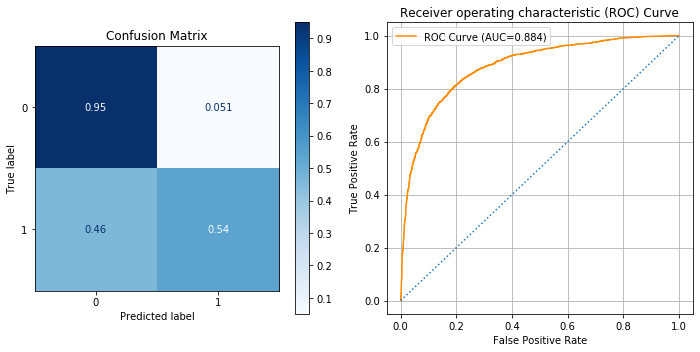


#### Logisitc Regression / Scaled Data


```python
from sklearn.preprocessing import MinMaxScaler, StandardScaler

scaler = MinMaxScaler()
X_train_sca = pd.DataFrame(scaler.fit_transform(X_train), columns=X_train.columns, index=X_train.index)
X_test_sca = pd.DataFrame(scaler.transform(X_test),columns=X_test.columns, index=X_test.index)
```


```python
#scaled data between 0 and 1
X_train_sca.describe().round(2).loc[['min','max']]
```


<div>
<style scoped>
    .dataframe tbody tr th:only-of-type {
        vertical-align: middle;
    }

    .dataframe tbody tr th {
        vertical-align: top;
    }

    .dataframe thead th {
        text-align: right;
    }
</style>
<table border="1" class="dataframe">
  <thead>
    <tr style="text-align: right;">
      <th></th>
      <th>h1n1_concern</th>
      <th>h1n1_knowledge</th>
      <th>behavioral_antiviral_meds</th>
      <th>behavioral_avoidance</th>
      <th>behavioral_face_mask</th>
      <th>behavioral_wash_hands</th>
      <th>behavioral_large_gatherings</th>
      <th>behavioral_outside_home</th>
      <th>behavioral_touch_face</th>
      <th>doctor_recc_h1n1</th>
      <th>doctor_recc_seasonal</th>
      <th>chronic_med_condition</th>
      <th>child_under_6_months</th>
      <th>health_worker</th>
      <th>health_insurance</th>
      <th>opinion_h1n1_vacc_effective</th>
      <th>opinion_h1n1_risk</th>
      <th>opinion_h1n1_sick_from_vacc</th>
      <th>opinion_seas_vacc_effective</th>
      <th>opinion_seas_risk</th>
      <th>opinion_seas_sick_from_vacc</th>
      <th>household_adults</th>
      <th>household_children</th>
      <th>seasonal_vaccine</th>
      <th>age_group_35 - 44 Years</th>
      <th>age_group_45 - 54 Years</th>
      <th>age_group_55 - 64 Years</th>
      <th>age_group_65+ Years</th>
      <th>education_&lt; 12 Years</th>
      <th>education_College Graduate</th>
      <th>education_Grad School +</th>
      <th>education_Some College</th>
      <th>race_Hispanic</th>
      <th>race_Other or Multiple</th>
      <th>race_White</th>
      <th>sex_Male</th>
      <th>income_poverty_&gt; $75,000</th>
      <th>income_poverty_Below Poverty</th>
      <th>income_poverty_Not in Labor Force</th>
      <th>marital_status_Neither</th>
      <th>marital_status_Not Married</th>
      <th>rent_or_own_Own</th>
      <th>rent_or_own_Rent</th>
      <th>employment_status_Not in Labor Force</th>
      <th>employment_status_Unemployed</th>
      <th>hhs_geo_region_bhuqouqj</th>
      <th>hhs_geo_region_dqpwygqj</th>
      <th>hhs_geo_region_fpwskwrf</th>
      <th>hhs_geo_region_kbazzjca</th>
      <th>hhs_geo_region_lrircsnp</th>
      <th>hhs_geo_region_lzgpxyit</th>
      <th>hhs_geo_region_mlyzmhmf</th>
      <th>hhs_geo_region_oxchjgsf</th>
      <th>hhs_geo_region_qufhixun</th>
      <th>census_msa_MSA, Principle City</th>
      <th>census_msa_Non-MSA</th>
      <th>employment_industry_arjwrbjb</th>
      <th>employment_industry_atmlpfrs</th>
      <th>employment_industry_cfqqtusy</th>
      <th>employment_industry_dotnnunm</th>
      <th>employment_industry_fcxhlnwr</th>
      <th>employment_industry_haxffmxo</th>
      <th>employment_industry_ldnlellj</th>
      <th>employment_industry_mcubkhph</th>
      <th>employment_industry_mfikgejo</th>
      <th>employment_industry_msuufmds</th>
      <th>employment_industry_nduyfdeo</th>
      <th>employment_industry_phxvnwax</th>
      <th>employment_industry_pxcmvdjn</th>
      <th>employment_industry_qnlwzans</th>
      <th>employment_industry_rucpziij</th>
      <th>employment_industry_saaquncn</th>
      <th>employment_industry_vjjrobsf</th>
      <th>employment_industry_wlfvacwt</th>
      <th>employment_industry_wxleyezf</th>
      <th>employment_industry_xicduogh</th>
      <th>employment_industry_xqicxuve</th>
      <th>employment_occupation_bxpfxfdn</th>
      <th>employment_occupation_ccgxvspp</th>
      <th>employment_occupation_cmhcxjea</th>
      <th>employment_occupation_dcjcmpih</th>
      <th>employment_occupation_dlvbwzss</th>
      <th>employment_occupation_emcorrxb</th>
      <th>employment_occupation_haliazsg</th>
      <th>employment_occupation_hfxkjkmi</th>
      <th>employment_occupation_hodpvpew</th>
      <th>employment_occupation_kldqjyjy</th>
      <th>employment_occupation_mxkfnird</th>
      <th>employment_occupation_oijqvulv</th>
      <th>employment_occupation_pvmttkik</th>
      <th>employment_occupation_qxajmpny</th>
      <th>employment_occupation_rcertsgn</th>
      <th>employment_occupation_tfqavkke</th>
      <th>employment_occupation_ukymxvdu</th>
      <th>employment_occupation_uqqtjvyb</th>
      <th>employment_occupation_vlluhbov</th>
      <th>employment_occupation_xgwztkwe</th>
      <th>employment_occupation_xqwwgdyp</th>
      <th>employment_occupation_xtkaffoo</th>
      <th>employment_occupation_xzmlyyjv</th>
    </tr>
  </thead>
  <tbody>
    <tr>
      <td>min</td>
      <td>0.0</td>
      <td>0.0</td>
      <td>0.0</td>
      <td>0.0</td>
      <td>0.0</td>
      <td>0.0</td>
      <td>0.0</td>
      <td>0.0</td>
      <td>0.0</td>
      <td>0.0</td>
      <td>0.0</td>
      <td>0.0</td>
      <td>0.0</td>
      <td>0.0</td>
      <td>0.0</td>
      <td>0.0</td>
      <td>0.0</td>
      <td>0.0</td>
      <td>0.0</td>
      <td>0.0</td>
      <td>0.0</td>
      <td>0.0</td>
      <td>0.0</td>
      <td>0.0</td>
      <td>0.0</td>
      <td>0.0</td>
      <td>0.0</td>
      <td>0.0</td>
      <td>0.0</td>
      <td>0.0</td>
      <td>0.0</td>
      <td>0.0</td>
      <td>0.0</td>
      <td>0.0</td>
      <td>0.0</td>
      <td>0.0</td>
      <td>0.0</td>
      <td>0.0</td>
      <td>0.0</td>
      <td>0.0</td>
      <td>0.0</td>
      <td>0.0</td>
      <td>0.0</td>
      <td>0.0</td>
      <td>0.0</td>
      <td>0.0</td>
      <td>0.0</td>
      <td>0.0</td>
      <td>0.0</td>
      <td>0.0</td>
      <td>0.0</td>
      <td>0.0</td>
      <td>0.0</td>
      <td>0.0</td>
      <td>0.0</td>
      <td>0.0</td>
      <td>0.0</td>
      <td>0.0</td>
      <td>0.0</td>
      <td>0.0</td>
      <td>0.0</td>
      <td>0.0</td>
      <td>0.0</td>
      <td>0.0</td>
      <td>0.0</td>
      <td>0.0</td>
      <td>0.0</td>
      <td>0.0</td>
      <td>0.0</td>
      <td>0.0</td>
      <td>0.0</td>
      <td>0.0</td>
      <td>0.0</td>
      <td>0.0</td>
      <td>0.0</td>
      <td>0.0</td>
      <td>0.0</td>
      <td>0.0</td>
      <td>0.0</td>
      <td>0.0</td>
      <td>0.0</td>
      <td>0.0</td>
      <td>0.0</td>
      <td>0.0</td>
      <td>0.0</td>
      <td>0.0</td>
      <td>0.0</td>
      <td>0.0</td>
      <td>0.0</td>
      <td>0.0</td>
      <td>0.0</td>
      <td>0.0</td>
      <td>0.0</td>
      <td>0.0</td>
      <td>0.0</td>
      <td>0.0</td>
      <td>0.0</td>
      <td>0.0</td>
      <td>0.0</td>
      <td>0.0</td>
    </tr>
    <tr>
      <td>max</td>
      <td>1.0</td>
      <td>1.0</td>
      <td>1.0</td>
      <td>1.0</td>
      <td>1.0</td>
      <td>1.0</td>
      <td>1.0</td>
      <td>1.0</td>
      <td>1.0</td>
      <td>1.0</td>
      <td>1.0</td>
      <td>1.0</td>
      <td>1.0</td>
      <td>1.0</td>
      <td>1.0</td>
      <td>1.0</td>
      <td>1.0</td>
      <td>1.0</td>
      <td>1.0</td>
      <td>1.0</td>
      <td>1.0</td>
      <td>1.0</td>
      <td>1.0</td>
      <td>1.0</td>
      <td>1.0</td>
      <td>1.0</td>
      <td>1.0</td>
      <td>1.0</td>
      <td>1.0</td>
      <td>1.0</td>
      <td>1.0</td>
      <td>1.0</td>
      <td>1.0</td>
      <td>1.0</td>
      <td>1.0</td>
      <td>1.0</td>
      <td>1.0</td>
      <td>1.0</td>
      <td>1.0</td>
      <td>1.0</td>
      <td>1.0</td>
      <td>1.0</td>
      <td>1.0</td>
      <td>1.0</td>
      <td>1.0</td>
      <td>1.0</td>
      <td>1.0</td>
      <td>1.0</td>
      <td>1.0</td>
      <td>1.0</td>
      <td>1.0</td>
      <td>1.0</td>
      <td>1.0</td>
      <td>1.0</td>
      <td>1.0</td>
      <td>1.0</td>
      <td>1.0</td>
      <td>1.0</td>
      <td>1.0</td>
      <td>1.0</td>
      <td>1.0</td>
      <td>1.0</td>
      <td>1.0</td>
      <td>1.0</td>
      <td>1.0</td>
      <td>1.0</td>
      <td>1.0</td>
      <td>1.0</td>
      <td>1.0</td>
      <td>1.0</td>
      <td>1.0</td>
      <td>1.0</td>
      <td>1.0</td>
      <td>1.0</td>
      <td>1.0</td>
      <td>1.0</td>
      <td>1.0</td>
      <td>1.0</td>
      <td>1.0</td>
      <td>1.0</td>
      <td>1.0</td>
      <td>1.0</td>
      <td>1.0</td>
      <td>1.0</td>
      <td>1.0</td>
      <td>1.0</td>
      <td>1.0</td>
      <td>1.0</td>
      <td>1.0</td>
      <td>1.0</td>
      <td>1.0</td>
      <td>1.0</td>
      <td>1.0</td>
      <td>1.0</td>
      <td>1.0</td>
      <td>1.0</td>
      <td>1.0</td>
      <td>1.0</td>
      <td>1.0</td>
      <td>1.0</td>
    </tr>
  </tbody>
</table>
</div>


```python
#max isn't always 1 w/test
X_test_sca.describe().round(2).loc[['min','max']]
```


<div>
<style scoped>
    .dataframe tbody tr th:only-of-type {
        vertical-align: middle;
    }

    .dataframe tbody tr th {
        vertical-align: top;
    }

    .dataframe thead th {
        text-align: right;
    }
</style>
<table border="1" class="dataframe">
  <thead>
    <tr style="text-align: right;">
      <th></th>
      <th>h1n1_concern</th>
      <th>h1n1_knowledge</th>
      <th>behavioral_antiviral_meds</th>
      <th>behavioral_avoidance</th>
      <th>behavioral_face_mask</th>
      <th>behavioral_wash_hands</th>
      <th>behavioral_large_gatherings</th>
      <th>behavioral_outside_home</th>
      <th>behavioral_touch_face</th>
      <th>doctor_recc_h1n1</th>
      <th>doctor_recc_seasonal</th>
      <th>chronic_med_condition</th>
      <th>child_under_6_months</th>
      <th>health_worker</th>
      <th>health_insurance</th>
      <th>opinion_h1n1_vacc_effective</th>
      <th>opinion_h1n1_risk</th>
      <th>opinion_h1n1_sick_from_vacc</th>
      <th>opinion_seas_vacc_effective</th>
      <th>opinion_seas_risk</th>
      <th>opinion_seas_sick_from_vacc</th>
      <th>household_adults</th>
      <th>household_children</th>
      <th>seasonal_vaccine</th>
      <th>age_group_35 - 44 Years</th>
      <th>age_group_45 - 54 Years</th>
      <th>age_group_55 - 64 Years</th>
      <th>age_group_65+ Years</th>
      <th>education_&lt; 12 Years</th>
      <th>education_College Graduate</th>
      <th>education_Grad School +</th>
      <th>education_Some College</th>
      <th>race_Hispanic</th>
      <th>race_Other or Multiple</th>
      <th>race_White</th>
      <th>sex_Male</th>
      <th>income_poverty_&gt; $75,000</th>
      <th>income_poverty_Below Poverty</th>
      <th>income_poverty_Not in Labor Force</th>
      <th>marital_status_Neither</th>
      <th>marital_status_Not Married</th>
      <th>rent_or_own_Own</th>
      <th>rent_or_own_Rent</th>
      <th>employment_status_Not in Labor Force</th>
      <th>employment_status_Unemployed</th>
      <th>hhs_geo_region_bhuqouqj</th>
      <th>hhs_geo_region_dqpwygqj</th>
      <th>hhs_geo_region_fpwskwrf</th>
      <th>hhs_geo_region_kbazzjca</th>
      <th>hhs_geo_region_lrircsnp</th>
      <th>hhs_geo_region_lzgpxyit</th>
      <th>hhs_geo_region_mlyzmhmf</th>
      <th>hhs_geo_region_oxchjgsf</th>
      <th>hhs_geo_region_qufhixun</th>
      <th>census_msa_MSA, Principle City</th>
      <th>census_msa_Non-MSA</th>
      <th>employment_industry_arjwrbjb</th>
      <th>employment_industry_atmlpfrs</th>
      <th>employment_industry_cfqqtusy</th>
      <th>employment_industry_dotnnunm</th>
      <th>employment_industry_fcxhlnwr</th>
      <th>employment_industry_haxffmxo</th>
      <th>employment_industry_ldnlellj</th>
      <th>employment_industry_mcubkhph</th>
      <th>employment_industry_mfikgejo</th>
      <th>employment_industry_msuufmds</th>
      <th>employment_industry_nduyfdeo</th>
      <th>employment_industry_phxvnwax</th>
      <th>employment_industry_pxcmvdjn</th>
      <th>employment_industry_qnlwzans</th>
      <th>employment_industry_rucpziij</th>
      <th>employment_industry_saaquncn</th>
      <th>employment_industry_vjjrobsf</th>
      <th>employment_industry_wlfvacwt</th>
      <th>employment_industry_wxleyezf</th>
      <th>employment_industry_xicduogh</th>
      <th>employment_industry_xqicxuve</th>
      <th>employment_occupation_bxpfxfdn</th>
      <th>employment_occupation_ccgxvspp</th>
      <th>employment_occupation_cmhcxjea</th>
      <th>employment_occupation_dcjcmpih</th>
      <th>employment_occupation_dlvbwzss</th>
      <th>employment_occupation_emcorrxb</th>
      <th>employment_occupation_haliazsg</th>
      <th>employment_occupation_hfxkjkmi</th>
      <th>employment_occupation_hodpvpew</th>
      <th>employment_occupation_kldqjyjy</th>
      <th>employment_occupation_mxkfnird</th>
      <th>employment_occupation_oijqvulv</th>
      <th>employment_occupation_pvmttkik</th>
      <th>employment_occupation_qxajmpny</th>
      <th>employment_occupation_rcertsgn</th>
      <th>employment_occupation_tfqavkke</th>
      <th>employment_occupation_ukymxvdu</th>
      <th>employment_occupation_uqqtjvyb</th>
      <th>employment_occupation_vlluhbov</th>
      <th>employment_occupation_xgwztkwe</th>
      <th>employment_occupation_xqwwgdyp</th>
      <th>employment_occupation_xtkaffoo</th>
      <th>employment_occupation_xzmlyyjv</th>
    </tr>
  </thead>
  <tbody>
    <tr>
      <td>min</td>
      <td>0.0</td>
      <td>0.0</td>
      <td>0.0</td>
      <td>0.0</td>
      <td>0.0</td>
      <td>0.0</td>
      <td>0.0</td>
      <td>0.0</td>
      <td>0.0</td>
      <td>0.0</td>
      <td>0.0</td>
      <td>0.0</td>
      <td>0.0</td>
      <td>0.0</td>
      <td>0.0</td>
      <td>0.0</td>
      <td>0.0</td>
      <td>0.0</td>
      <td>0.0</td>
      <td>0.0</td>
      <td>0.0</td>
      <td>0.0</td>
      <td>0.0</td>
      <td>0.0</td>
      <td>0.0</td>
      <td>0.0</td>
      <td>0.0</td>
      <td>0.0</td>
      <td>0.0</td>
      <td>0.0</td>
      <td>0.0</td>
      <td>0.0</td>
      <td>0.0</td>
      <td>0.0</td>
      <td>0.0</td>
      <td>0.0</td>
      <td>0.0</td>
      <td>0.0</td>
      <td>0.0</td>
      <td>0.0</td>
      <td>0.0</td>
      <td>0.0</td>
      <td>0.0</td>
      <td>0.0</td>
      <td>0.0</td>
      <td>0.0</td>
      <td>0.0</td>
      <td>0.0</td>
      <td>0.0</td>
      <td>0.0</td>
      <td>0.0</td>
      <td>0.0</td>
      <td>0.0</td>
      <td>0.0</td>
      <td>0.0</td>
      <td>0.0</td>
      <td>0.0</td>
      <td>0.0</td>
      <td>0.0</td>
      <td>0.0</td>
      <td>0.0</td>
      <td>0.0</td>
      <td>0.0</td>
      <td>0.0</td>
      <td>0.0</td>
      <td>0.0</td>
      <td>0.0</td>
      <td>0.0</td>
      <td>0.0</td>
      <td>0.0</td>
      <td>0.0</td>
      <td>0.0</td>
      <td>0.0</td>
      <td>0.0</td>
      <td>0.0</td>
      <td>0.0</td>
      <td>0.0</td>
      <td>0.0</td>
      <td>0.0</td>
      <td>0.0</td>
      <td>0.0</td>
      <td>0.0</td>
      <td>0.0</td>
      <td>0.0</td>
      <td>0.0</td>
      <td>0.0</td>
      <td>0.0</td>
      <td>0.0</td>
      <td>0.0</td>
      <td>0.0</td>
      <td>0.0</td>
      <td>0.0</td>
      <td>0.0</td>
      <td>0.0</td>
      <td>0.0</td>
      <td>0.0</td>
      <td>0.0</td>
      <td>0.0</td>
      <td>0.0</td>
      <td>0.0</td>
    </tr>
    <tr>
      <td>max</td>
      <td>1.0</td>
      <td>1.0</td>
      <td>1.0</td>
      <td>1.0</td>
      <td>1.0</td>
      <td>1.0</td>
      <td>1.0</td>
      <td>1.0</td>
      <td>1.0</td>
      <td>1.0</td>
      <td>1.0</td>
      <td>1.0</td>
      <td>1.0</td>
      <td>1.0</td>
      <td>1.0</td>
      <td>1.0</td>
      <td>1.0</td>
      <td>1.0</td>
      <td>1.0</td>
      <td>1.0</td>
      <td>1.0</td>
      <td>1.0</td>
      <td>1.0</td>
      <td>1.0</td>
      <td>1.0</td>
      <td>1.0</td>
      <td>1.0</td>
      <td>1.0</td>
      <td>1.0</td>
      <td>1.0</td>
      <td>1.0</td>
      <td>1.0</td>
      <td>1.0</td>
      <td>1.0</td>
      <td>1.0</td>
      <td>1.0</td>
      <td>1.0</td>
      <td>1.0</td>
      <td>1.0</td>
      <td>1.0</td>
      <td>1.0</td>
      <td>1.0</td>
      <td>1.0</td>
      <td>1.0</td>
      <td>1.0</td>
      <td>1.0</td>
      <td>1.0</td>
      <td>1.0</td>
      <td>1.0</td>
      <td>1.0</td>
      <td>1.0</td>
      <td>1.0</td>
      <td>1.0</td>
      <td>1.0</td>
      <td>1.0</td>
      <td>1.0</td>
      <td>1.0</td>
      <td>1.0</td>
      <td>1.0</td>
      <td>1.0</td>
      <td>1.0</td>
      <td>1.0</td>
      <td>1.0</td>
      <td>1.0</td>
      <td>1.0</td>
      <td>1.0</td>
      <td>1.0</td>
      <td>1.0</td>
      <td>1.0</td>
      <td>1.0</td>
      <td>1.0</td>
      <td>1.0</td>
      <td>1.0</td>
      <td>1.0</td>
      <td>1.0</td>
      <td>1.0</td>
      <td>1.0</td>
      <td>1.0</td>
      <td>1.0</td>
      <td>1.0</td>
      <td>1.0</td>
      <td>1.0</td>
      <td>1.0</td>
      <td>1.0</td>
      <td>1.0</td>
      <td>1.0</td>
      <td>1.0</td>
      <td>1.0</td>
      <td>1.0</td>
      <td>1.0</td>
      <td>1.0</td>
      <td>1.0</td>
      <td>1.0</td>
      <td>1.0</td>
      <td>1.0</td>
      <td>1.0</td>
      <td>1.0</td>
      <td>1.0</td>
      <td>1.0</td>
      <td>1.0</td>
    </tr>
  </tbody>
</table>
</div>


```python
#fit_intercept=False sets the y-intercept to 0. 
#fit_intercept=True, the y-intercept will be determined by the line of best fit.

#an L2 regularization of C=1 is applied by default.
#by having large C, it's having small parameter added to equation
#C-1/lmbda. Large C 

#maximum number of iterations using max_iter parameter, where we typically increase when we have a very large amount of train data, 
#    the default value is max_iter =100.
#sma;; small data sets liblinear.  'sag' and 'saga' for larger ones.
regr = LogisticRegression(fit_intercept= True, C=1.0, max_iter=1000)# solver='liblinear',C=1e12
regr.fit(X_train_sca, y_train)

y_hat_test = regr.predict(X_test_sca)
```


```python
#precision- how accurate model ws at accuratly predicting true psotive values.
#    How many of class 1 were actually class 1.
#    precision-cost of acting is high and acting on a postive is costly
#    allocating resoucrs for prisoners who are at risk for recidivism.
#recall- what percentage of the classes were actaully captured by the model.
#    Recall-out of the number of true postives,how many of them did it find
#    how good is my model in finding class that I acutlly care about.
#    recall-when true postives/opporunties is small and don't want to miss one.
#    telling someone they don't have cancer when they do is fatal.
#ROC Curve-# of TP vs. # of FP
evaluate_classification(y_test,y_hat_test,X_test_sca,regr)    
```

    [[6402  330]
     [ 814 1030]]
                  precision    recall  f1-score   support
    
               0       0.89      0.95      0.92      6732
               1       0.76      0.56      0.64      1844
    
        accuracy                           0.87      8576
       macro avg       0.82      0.75      0.78      8576
    weighted avg       0.86      0.87      0.86      8576
    


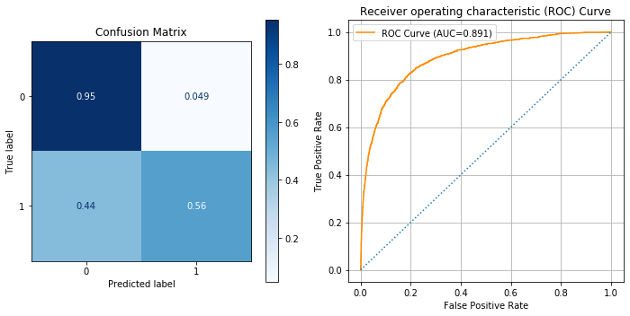


#### Logistic Regression / Class Imbalance
This model addresses class imbalance issue with scaled data.<br>


```python
regr = LogisticRegression(fit_intercept= True, C=1.0, max_iter=1000,class_weight='balanced')#C=1e5, solver='liblinear')
regr.fit(X_train_sca, y_train)

y_hat_test = regr.predict(X_test_sca)
```


```python
#21% of observations were class 1
y_train.value_counts(normalize=True)
```


    0    0.787926
    1    0.212074
    Name: h1n1_vaccine, dtype: float64


```python
#solution
#solution: class weight parameter for scikit leanr models
pd.Series(y_test).value_counts()
```


    0    6732
    1    1844
    Name: h1n1_vaccine, dtype: int64


### Best Logistic Regression Model
with scaled data and class imbalance issue addressed.<br>


```python
evaluate_classification(y_test,y_hat_test,X_test_sca,regr)  
```

    [[5490 1242]
     [ 347 1497]]
                  precision    recall  f1-score   support
    
               0       0.94      0.82      0.87      6732
               1       0.55      0.81      0.65      1844
    
        accuracy                           0.81      8576
       macro avg       0.74      0.81      0.76      8576
    weighted avg       0.86      0.81      0.83      8576
    


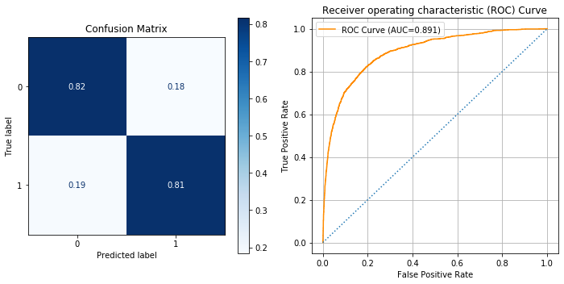


#### Correlation between Features and Target


```python
col_coef= pd.Series(regr.coef_[0], index=X_train.columns).sort_values(ascending=False)
col_coef
```


    opinion_h1n1_vacc_effective       2.261389
    doctor_recc_h1n1                  2.244236
    seasonal_vaccine                  1.983218
    opinion_h1n1_risk                 1.594569
    health_insurance                  1.416293
                                        ...   
    employment_industry_pxcmvdjn     -0.431597
    employment_occupation_qxajmpny   -0.444996
    employment_industry_atmlpfrs     -0.450249
    employment_industry_dotnnunm     -0.523329
    doctor_recc_seasonal             -1.073092
    Length: 100, dtype: float64


```python
#abolute value
def feature_correlation(logreg, X_train):
    """
    logreg: object of instance of model
    X_train: Xtrain
    """
    col_coef_1= pd.DataFrame(logreg.coef_[0], index=X_train.columns,columns=['coef_cols'])
    col_coef_1['abs_coef'] = np.abs(col_coef_1['coef_cols'])
    col_coef_1.sort_values(by='abs_coef',ascending=True,inplace=True)
    return col_coef_1
```


```python
feature_correlation(regr, X_train)
```


<div>
<style scoped>
    .dataframe tbody tr th:only-of-type {
        vertical-align: middle;
    }

    .dataframe tbody tr th {
        vertical-align: top;
    }

    .dataframe thead th {
        text-align: right;
    }
</style>
<table border="1" class="dataframe">
  <thead>
    <tr style="text-align: right;">
      <th></th>
      <th>coef_cols</th>
      <th>abs_coef</th>
    </tr>
  </thead>
  <tbody>
    <tr>
      <td>employment_industry_fcxhlnwr</td>
      <td>-0.001441</td>
      <td>0.001441</td>
    </tr>
    <tr>
      <td>behavioral_avoidance</td>
      <td>-0.006639</td>
      <td>0.006639</td>
    </tr>
    <tr>
      <td>age_group_55 - 64 Years</td>
      <td>-0.011699</td>
      <td>0.011699</td>
    </tr>
    <tr>
      <td>behavioral_wash_hands</td>
      <td>-0.011830</td>
      <td>0.011830</td>
    </tr>
    <tr>
      <td>household_children</td>
      <td>-0.013548</td>
      <td>0.013548</td>
    </tr>
    <tr>
      <td>...</td>
      <td>...</td>
      <td>...</td>
    </tr>
    <tr>
      <td>health_insurance</td>
      <td>1.416293</td>
      <td>1.416293</td>
    </tr>
    <tr>
      <td>opinion_h1n1_risk</td>
      <td>1.594569</td>
      <td>1.594569</td>
    </tr>
    <tr>
      <td>seasonal_vaccine</td>
      <td>1.983218</td>
      <td>1.983218</td>
    </tr>
    <tr>
      <td>doctor_recc_h1n1</td>
      <td>2.244236</td>
      <td>2.244236</td>
    </tr>
    <tr>
      <td>opinion_h1n1_vacc_effective</td>
      <td>2.261389</td>
      <td>2.261389</td>
    </tr>
  </tbody>
</table>
<p>100 rows × 2 columns</p>
</div>


```python
def plot_feat_corr(logreg,figsize=(10,10)):
    """
    function checks correlation between features and target.
    """
    col_coef_1= pd.DataFrame(logreg.coef_[0], index=X_train.columns,columns=['coef_cols'])
    col_coef_1['abs_coef'] = np.abs(col_coef_1['coef_cols'])
    col_coef_1.sort_values(by='abs_coef',ascending=True,inplace=True)
    ax = col_coef_1['coef_cols'].tail(10).plot(kind='barh');
    ax.set_title('Correlation of Features')
    return ax #col_coef_1, 
```


```python
plot_feat_corr(regr);
```


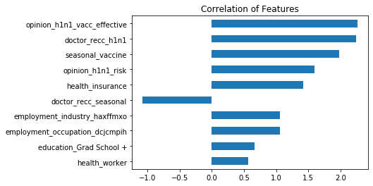


#### Evaluate Model Function with Correlation Graph


```python
#mine
import sklearn.metrics as metrics

def evaluate_classification_model(y_true, y_pred,X_true,clf):
    """
    Evaluates logistic regression model
    args: 
        y_true: is y_test variable
        y_pred: is y_hat test which is for prediction
        X_true: is the X_test variable
        clf: is the model being input into function
    """
    ## Classification Report / Scores 
    print(metrics.classification_report(y_true,y_pred))

    #create plots
    fig, ax = plt.subplots(figsize=(10,4),ncols=2)
    metrics.plot_confusion_matrix(clf,X_true,y_true,cmap="Blues",
                                  normalize='true',ax=ax[0])
    #plot for confusion matrix 
    ax[0].set(title='Confusion Matrix')
    y_score = clf.predict_proba(X_true)[:,1]

    fpr,tpr,thresh = metrics.roc_curve(y_true,y_score)
    # ROC plot(f"ROC-area-under-the-curve= {}")
    roc_auc = round(metrics.auc(fpr,tpr),3)
    ax[1].plot(fpr,tpr,color='darkorange',label=f'ROC Curve (AUC={roc_auc})')
    ax[1].plot([0,1],[0,1],ls=':')
    ax[1].legend()
    ax[1].grid()
    ax[1].set(ylabel='True Positive Rate',xlabel='False Positive Rate',
          title='Receiver operating characteristic (ROC) Curve')
    plt.tight_layout()
    plt.show()

    #correlation plot
    df_corr = plot_feat_corr(clf)
    return df_corr

```


```python
#mine
evaluate_classification_model(y_test,y_hat_test,X_test_sca,regr)  
```

                  precision    recall  f1-score   support
    
               0       0.94      0.82      0.87      6732
               1       0.55      0.81      0.65      1844
    
        accuracy                           0.81      8576
       macro avg       0.74      0.81      0.76      8576
    weighted avg       0.86      0.81      0.83      8576
    


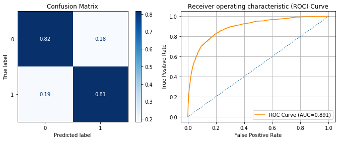


    <matplotlib.axes._subplots.AxesSubplot at 0x1a1fb8c5f8>


Logsitic Regression Model with Features that are higly postively or negatively correlated with target.<br>
Model has default parameters.<br>


```python
cols = ['opinion_h1n1_vacc_effective', 'doctor_recc_h1n1', 'seasonal_vaccine', 'opinion_h1n1_risk','health_insurance', 'doctor_recc_seasonal',                   
'employment_industry_haxffmxo', 'employment_occupation_dcjcmpih','education_Grad School +','health_worker'] 

df_cor = df_dummies[cols]
X_1 = df_cor
X_train_1, X_test_1, y_train_1, y_test_1 = train_test_split(X_1, y, test_size=0.33, random_state=42)
```


```python
df_cor.head()
```


<div>
<style scoped>
    .dataframe tbody tr th:only-of-type {
        vertical-align: middle;
    }

    .dataframe tbody tr th {
        vertical-align: top;
    }

    .dataframe thead th {
        text-align: right;
    }
</style>
<table border="1" class="dataframe">
  <thead>
    <tr style="text-align: right;">
      <th></th>
      <th>opinion_h1n1_vacc_effective</th>
      <th>doctor_recc_h1n1</th>
      <th>seasonal_vaccine</th>
      <th>opinion_h1n1_risk</th>
      <th>health_insurance</th>
      <th>doctor_recc_seasonal</th>
      <th>employment_industry_haxffmxo</th>
      <th>employment_occupation_dcjcmpih</th>
      <th>education_Grad School +</th>
      <th>health_worker</th>
    </tr>
  </thead>
  <tbody>
    <tr>
      <td>0</td>
      <td>3.0</td>
      <td>0.0</td>
      <td>0</td>
      <td>1.0</td>
      <td>1.0</td>
      <td>0.0</td>
      <td>0</td>
      <td>0</td>
      <td>0</td>
      <td>0.0</td>
    </tr>
    <tr>
      <td>1</td>
      <td>5.0</td>
      <td>0.0</td>
      <td>1</td>
      <td>4.0</td>
      <td>1.0</td>
      <td>0.0</td>
      <td>0</td>
      <td>0</td>
      <td>0</td>
      <td>0.0</td>
    </tr>
    <tr>
      <td>2</td>
      <td>3.0</td>
      <td>0.0</td>
      <td>0</td>
      <td>1.0</td>
      <td>0.0</td>
      <td>0.0</td>
      <td>0</td>
      <td>0</td>
      <td>0</td>
      <td>0.0</td>
    </tr>
    <tr>
      <td>3</td>
      <td>3.0</td>
      <td>0.0</td>
      <td>1</td>
      <td>3.0</td>
      <td>0.0</td>
      <td>1.0</td>
      <td>0</td>
      <td>0</td>
      <td>0</td>
      <td>0.0</td>
    </tr>
    <tr>
      <td>4</td>
      <td>3.0</td>
      <td>0.0</td>
      <td>0</td>
      <td>3.0</td>
      <td>0.0</td>
      <td>0.0</td>
      <td>0</td>
      <td>0</td>
      <td>0</td>
      <td>0.0</td>
    </tr>
  </tbody>
</table>
</div>


```python
regr_1 = LogisticRegression()#C=1e5, solver='liblinear')
regr_1.fit(X_train_1, y_train_1)

y_hat_test_1 = regr_1.predict(X_test_1)

```


```python
evaluate_classification(y_test_1,y_hat_test_1,X_test_1,regr_1)  
```

    [[5490 1242]
     [ 347 1497]]
                  precision    recall  f1-score   support
    
               0       0.88      0.95      0.92      6732
               1       0.76      0.54      0.63      1844
    
        accuracy                           0.86      8576
       macro avg       0.82      0.75      0.78      8576
    weighted avg       0.86      0.86      0.86      8576
    


```python
plt.figure(figsize=(14,14))
cor = df_cor.corr()
sns.heatmap(cor, annot=True, cmap=plt.cm.Reds)
plt.show()
```


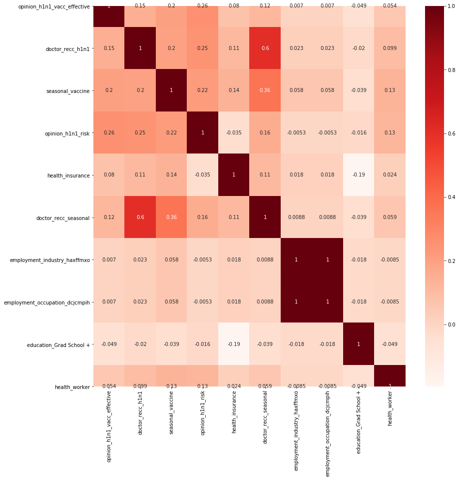


### Logistic Regression with SMOTE
SMOTE used to address imbalance issue.


```python
#oversampling minority class
y_train.value_counts()
```


    0    13717
    1     3692
    Name: h1n1_vaccine, dtype: int64


```python
#before-adjusting weight that our model uses, to make up for class imbalance.
#resampling our minority class to make it have as many observations as our majoirty class.
#going to tak class you ahve less of and generate new observations for and did it. New data won't skew data 
#only smote training data
#modle will learin in a more blanced way
#just wantto make sureit learns.
from imblearn.over_sampling import SMOTE
smote = SMOTE()

X_train_smote, y_train_smote = smote.fit_sample(X_train_sca,y_train)
pd.Series(y_train_smote).value_counts()
```

    /Users/davidtorres/opt/anaconda3/envs/learn-env/lib/python3.6/site-packages/sklearn/externals/six.py:31: FutureWarning: The module is deprecated in version 0.21 and will be removed in version 0.23 since we've dropped support for Python 2.7. Please rely on the official version of six (https://pypi.org/project/six/).
      "(https://pypi.org/project/six/).", FutureWarning)
    /Users/davidtorres/opt/anaconda3/envs/learn-env/lib/python3.6/site-packages/sklearn/utils/deprecation.py:144: FutureWarning: The sklearn.neighbors.base module is  deprecated in version 0.22 and will be removed in version 0.24. The corresponding classes / functions should instead be imported from sklearn.neighbors. Anything that cannot be imported from sklearn.neighbors is now part of the private API.
      warnings.warn(message, FutureWarning)
    /Users/davidtorres/opt/anaconda3/envs/learn-env/lib/python3.6/site-packages/sklearn/utils/deprecation.py:87: FutureWarning: Function safe_indexing is deprecated; safe_indexing is deprecated in version 0.22 and will be removed in version 0.24.
      warnings.warn(msg, category=FutureWarning)


    1    13717
    0    13717
    dtype: int64


```python
regr = LogisticRegression(fit_intercept= True, C=1.0, max_iter=1000)
regr.fit(X_train_smote, y_train_smote)

y_hat_test = regr.predict(X_test_sca)

```


```python
evaluate_classification(y_test,y_hat_test,X_test_sca,regr) 
```

    [[5557 1175]
     [ 376 1468]]
                  precision    recall  f1-score   support
    
               0       0.94      0.83      0.88      6732
               1       0.56      0.80      0.65      1844
    
        accuracy                           0.82      8576
       macro avg       0.75      0.81      0.77      8576
    weighted avg       0.85      0.82      0.83      8576
    


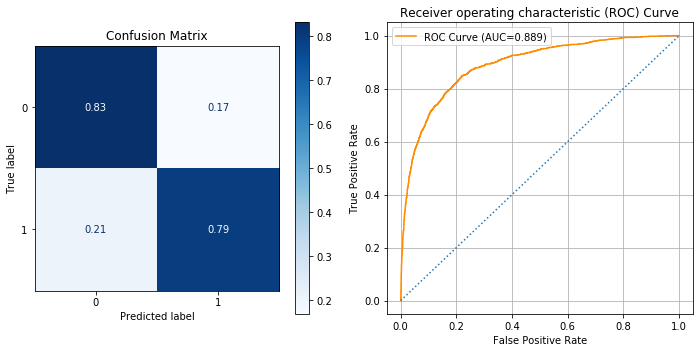


### Logistic Regression with GridSearchCV


```python
# Create regularization penalty space
penalty = ['l1', 'l2']

# Create regularization hyperparameter space
C = np.logspace(0, 4, 10)

# Create hyperparameter options
hyperparameters = dict(C=C, penalty=penalty)
```


```python
from sklearn.model_selection import GridSearchCV

regr = LogisticRegression(class_weight='balanced',C=1e5, solver='liblinear')
regr.fit(X_train_sca, y_train)

test_preds = regr.predict(X_test_sca)
grid = GridSearchCV(regr,hyperparameters, scoring='f1',verbose=1,return_train_score=True)
#grid is model
grid.fit(X_train_sca,y_train)
```

    Fitting 5 folds for each of 20 candidates, totalling 100 fits


    [Parallel(n_jobs=1)]: Using backend SequentialBackend with 1 concurrent workers.
    [Parallel(n_jobs=1)]: Done 100 out of 100 | elapsed:  3.6min finished


    GridSearchCV(cv=None, error_score=nan,
                 estimator=LogisticRegression(C=100000.0, class_weight='balanced',
                                              dual=False, fit_intercept=True,
                                              intercept_scaling=1, l1_ratio=None,
                                              max_iter=100, multi_class='auto',
                                              n_jobs=None, penalty='l2',
                                              random_state=None, solver='liblinear',
                                              tol=0.0001, verbose=0,
                                              warm_start=False),
                 iid='deprecated', n_jobs=None,
                 param_grid={'C': array([1.00000000e+00, 2.78255940e+00, 7.74263683e+00, 2.15443469e+01,
           5.99484250e+01, 1.66810054e+02, 4.64158883e+02, 1.29154967e+03,
           3.59381366e+03, 1.00000000e+04]),
                             'penalty': ['l1', 'l2']},
                 pre_dispatch='2*n_jobs', refit=True, return_train_score=True,
                 scoring='f1', verbose=1)


```python
grid.best_params_
```


    {'C': 1.0, 'penalty': 'l1'}


```python
regr = grid.best_estimator_
```


```python
y_hat_test = regr.predict(X_test_sca)
evaluate_classification(y_test, y_hat_test,X_test_sca, regr)
```

    [[5486 1246]
     [ 348 1496]]
                  precision    recall  f1-score   support
    
               0       0.94      0.81      0.87      6732
               1       0.55      0.81      0.65      1844
    
        accuracy                           0.81      8576
       macro avg       0.74      0.81      0.76      8576
    weighted avg       0.86      0.81      0.83      8576
    


### DecisionTreeClassifier


```python
from sklearn.tree import DecisionTreeClassifier 
from sklearn import metrics
from sklearn.tree import export_graphviz
from IPython.display import Image  
from sklearn.tree import export_graphviz
from pydotplus import graph_from_dot_data
```


```python
def plot_importance(tree, top_n=10,figsize=(10,10)):
    df_importance = pd.Series(tree.feature_importances_,index=X_train.columns)
    df_importance.sort_values(ascending=True).tail(top_n).plot(
        kind='barh',figsize=figsize)
    return df_importance
#plot_importance(tree);
```


```python
import sklearn.metrics as metrics

def evaluate_model(y_true, y_pred,X_true,clf):
    
    ## Classification Report / Scores 
    print(metrics.classification_report(y_true,y_pred))

    fig, ax = plt.subplots(figsize=(10,4),ncols=2)
    metrics.plot_confusion_matrix(clf,X_true,y_true,cmap="Greens",
                                  normalize='true',ax=ax[0])
    ax[0].set(title='Confusion Matrix')
    y_score = clf.predict_proba(X_true)[:,1]

    fpr,tpr,thresh = metrics.roc_curve(y_true,y_score)
    # print(f"ROC-area-under-the-curve= {}")
    roc_auc = round(metrics.auc(fpr,tpr),3)
    ax[1].plot(fpr,tpr,color='darkorange',label=f'ROC Curve (AUC={roc_auc})')
    ax[1].plot([0,1],[0,1],ls=':')
    ax[1].legend()
    ax[1].grid()
    ax[1].set(ylabel='True Positive Rate',xlabel='False Positive Rate',
          title='Receiver operating characteristic (ROC) Curve')
    plt.tight_layout()
    plt.show()
    try: 
        df_important = plot_importance(clf)
    except:
        df_important = None
    
#     return df_important
#evaluate_model(y_test,y_hat_test,X_test,tree)
```


```python
## visualize the decision tree
#if you have one-hot enocded column, less than .05 is 0 and greater 1
def visualize_tree(tree,feature_names=None,class_names=['0','1'],format_='png',
                   kws={},save_filename=None):
    """Visualizes a sklearn tree using sklearn.tree.export_graphviz"""
    from sklearn.tree import export_graphviz
    from IPython.display import SVG
    import graphviz #import Source
    from IPython.display import display
    
    if feature_names is None:
        feature_names=X_train.columns

    tree_viz_kws =  dict(out_file=None,rounded=True, rotate=False, filled = True)
    tree_viz_kws.update(kws)

    # tree.export_graphviz(dt) #if you wish to save the output to a dot file instead
    tree_data=export_graphviz(tree,feature_names=feature_names, 
                                   class_names=class_names,**tree_viz_kws)
    graph = graphviz.Source(tree_data,format=format_)#'png')
    display(graph)
    if save_filename is not None:
        graph.render(save_filename)

#     display(SVG(graph.pipe(format=format_)))#'svg')))
```

### DecisionTree max_depth=5
The maximum depth of the tree. If None, then nodes are expanded until all leaves are pure or until all leaves contain less than min_samples_split samples.<br>


```python
tree = DecisionTreeClassifier(class_weight='balanced',max_depth=5)

tree.fit(X_train, y_train)
y_hat_test = tree.predict(X_test)
```


```python
#The most imprtant features
df_import = pd.Series(tree.feature_importances_, index = X_train.columns,name='Importance')
df_import.sort_values()
```


    h1n1_concern                    0.000000
    employment_industry_saaquncn    0.000000
    employment_industry_rucpziij    0.000000
    employment_industry_qnlwzans    0.000000
    employment_industry_pxcmvdjn    0.000000
                                      ...   
    opinion_h1n1_risk               0.063274
    doctor_recc_seasonal            0.077223
    health_insurance                0.098338
    doctor_recc_h1n1                0.209989
    seasonal_vaccine                0.498232
    Name: Importance, Length: 100, dtype: float64


```python
# opinion_h1n1_vacc_effective             2.261389
# doctor_recc_h1n1                        2.244236
# seasonal_vaccine                        1.983218
# opinion_h1n1_risk                       1.594569
# he
evaluate_model(y_test,y_hat_test,X_test,tree)
```

                  precision    recall  f1-score   support
    
               0       0.94      0.81      0.87      6732
               1       0.54      0.80      0.64      1844
    
        accuracy                           0.81      8576
       macro avg       0.74      0.81      0.76      8576
    weighted avg       0.85      0.81      0.82      8576
    


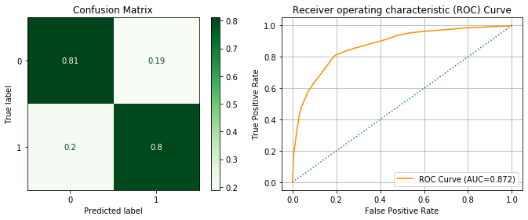


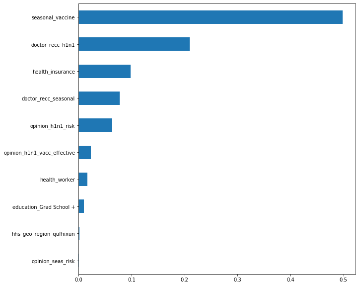


```python
visualize_tree(tree)
```


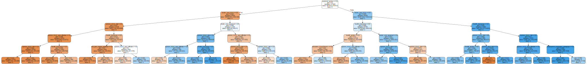


#### DecisionTree with max_depth default


```python
tree_clf = DecisionTreeClassifier(class_weight='balanced',criterion='gini')
tree_clf.fit(X_train_sca,y_train)
y_hat_test = tree_clf.predict(X_test_sca)
```


```python
evaluate_model(y_test,y_hat_test,X_test_sca,tree_clf)
```

                  precision    recall  f1-score   support
    
               0       0.87      0.88      0.87      6732
               1       0.54      0.53      0.54      1844
    
        accuracy                           0.80      8576
       macro avg       0.71      0.71      0.71      8576
    weighted avg       0.80      0.80      0.80      8576
    


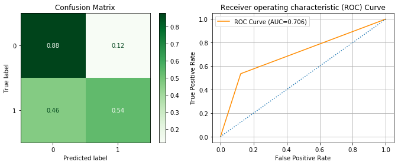


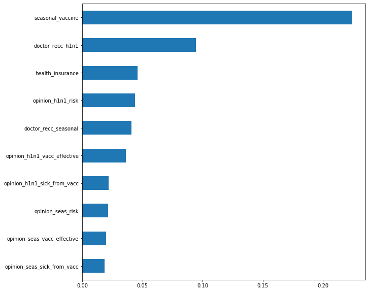


```python
visualize_tree(tree_clf)
```


### GridSearch with DecisionTree


```python
# max-depth
# min_samples_leaf: The smallest number of samples that can be in a leaf (node)
# min_samples_split: The smallest number of samples in a leaf (node) before splitting it
# max_features: Most features to consider when splitting

#GridSearch and Randomized Search
#XGboost is a model
```


```python
params = dict(max_features = list(range(1, X_train.shape[1])),
min_samples_leaf = np.linspace(0.1, 0.5, 5, endpoint=True),
min_samples_split = np.linspace(0.1, 1.0, 10, endpoint=True),
max_depth = np.linspace(1, 32, 32, endpoint=True))
print(params)
```

    {'max_features': [1, 2, 3, 4, 5, 6, 7, 8, 9, 10, 11, 12, 13, 14, 15, 16, 17, 18, 19, 20, 21, 22, 23, 24, 25, 26, 27, 28, 29, 30, 31, 32, 33, 34, 35, 36, 37, 38, 39, 40, 41, 42, 43, 44, 45, 46, 47, 48, 49, 50, 51, 52, 53, 54, 55, 56, 57, 58, 59, 60, 61, 62, 63, 64, 65, 66, 67, 68, 69, 70, 71, 72, 73, 74, 75, 76, 77, 78, 79, 80, 81, 82, 83, 84, 85, 86, 87, 88, 89, 90, 91, 92, 93, 94, 95, 96, 97, 98, 99], 'min_samples_leaf': array([0.1, 0.2, 0.3, 0.4, 0.5]), 'min_samples_split': array([0.1, 0.2, 0.3, 0.4, 0.5, 0.6, 0.7, 0.8, 0.9, 1. ]), 'max_depth': array([ 1.,  2.,  3.,  4.,  5.,  6.,  7.,  8.,  9., 10., 11., 12., 13.,
           14., 15., 16., 17., 18., 19., 20., 21., 22., 23., 24., 25., 26.,
           27., 28., 29., 30., 31., 32.])}


Started at 2020-04-29 13:55:17.541076-04:00<br>
Total Time = 0:00:13.757412<br>
0.8206689143873503<br>
{'min_samples_split': 0.1, 'min_samples_leaf': 0.1, 'max_features': 82, 'max_depth': 26.0}<br>


```python
from sklearn.model_selection import GridSearchCV, RandomizedSearchCV
import datetime as dt 
import tzlocal

start = dt.datetime.now(tz=tzlocal.get_localzone())
print(f"Started at {start}")
clf = DecisionTreeClassifier()
#gridsearch = GridSearchCV(clf,params,scoring='roc_auc',cv=3)
gridsearch = RandomizedSearchCV(clf,params,scoring='roc_auc',cv=3, n_iter=100,n_jobs=3)
gridsearch.fit(X_train,y_train)

end = dt.datetime.now(tz=tzlocal.get_localzone())

print(f'Total Time = {end-start}')

print(gridsearch.best_score_)
print(gridsearch.best_params_)
```

    Started at 2020-05-12 14:30:09.765020-04:00
    Total Time = 0:00:18.136735
    0.8198275484229912
    {'min_samples_split': 0.2, 'min_samples_leaf': 0.1, 'max_features': 90, 'max_depth': 19.0}


```python
clf_best = gridsearch.best_estimator_
#metrics.plot_confusion_matrix(clf_best,X_test,y_test,cmap='Blues',normalize='true')
```


```python
y_hat_test = clf_best.predict(X_test)
evaluate_model(y_test,y_hat_test,X_test,clf_best)
```

                  precision    recall  f1-score   support
    
               0       0.87      0.88      0.88      6732
               1       0.55      0.52      0.53      1844
    
        accuracy                           0.80      8576
       macro avg       0.71      0.70      0.70      8576
    weighted avg       0.80      0.80      0.80      8576
    


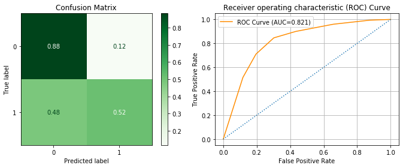


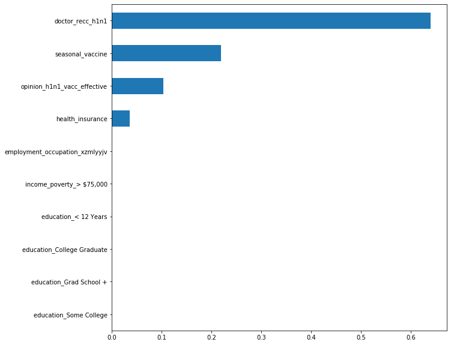


```python
visualize_tree(clf_best, save_filename='vanilla tree')
```


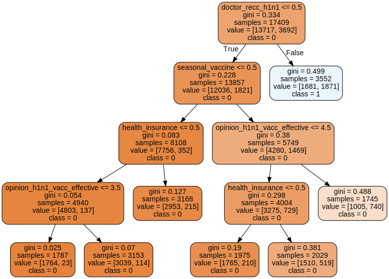


## Conclusion and Recommendations¶
In light of pandemic and upcoming flu season Summit Medical wants to increase H1N1 Flu vaccination rates for as many groups as possible.   Overall rates are low.
I ran models of the data in order to provide you with facts, insights and recommendations to improve H1N1 rates.<br>
Reported numbers for elderly are very low.<br>
The following research and/or outreach may assist in increasing the H1N1 vaccination rates:<br> 
Research people’s attitudes on effectiveness and risks of vaccine. I read in 2018 that the flu vaccine/H1N1 vaccine for that year wasn’t very good in providing immunity. What impact has this had on subsequent vaccinations rates?
Whether patient has health insurance is important. Increase efforts for low-cost or free vaccinations.<br>
If doctors recommended seasonal vaccine, it negatively impacted people’s decisions’ to get H1N1. Research if patients only want 1 vaccine or the other?
Outreach to Doctors/Medical professionals. Are they recommending both H1N1 vaccine and seasonal flu vaccines to patients or just the seasonal? This is impacting patients’ decision to get H1N1.
Research if population understands difference between H1N1 vaccine and seasonal flu vaccine. Does the population think that they’re the same vaccine. Is there a different shot for each vaccine?


```python

```
